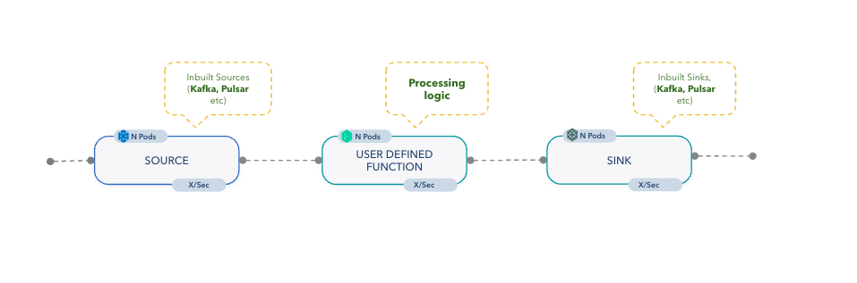

# Numaflow

Welcome to Numaflow! A Kubernetes-native, serverless platform for stream processing or real-time data processing. Numaflow decouples event sources and sinks from the processing logic, allowing each component to independently auto-scale based on demand. With out-of-the-box sources and sinks, and built-in observability, developers can focus on their processing logic without worrying about event consumption, writing boilerplate code, or operational complexities. Each step of the pipeline can be written in any programming language, offering unparalleled flexibility in using the best programming language for each step and ease of using the languages you are most familiar with.

Numaflow, created by the Intuit Argo team to address community needs for continuous stream processing, leverages their expertise to deliver a scalable and robust, serverless platform for real-time data processing.

## Key Features

- Kubernetes-native: If you know Kubernetes, you already know how to use Numaflow.
- Serverless: Focus on your code and let the system scale up and down based on demand.
- Language agnostic: Use your favorite programming language.
- Exactly-Once semantics: At-least-once by default, with exactly-once semantics for unbounded, near real-time data sources — no data loss or duplication, even across pod restarts.
- Auto-scaling with back-pressure: Each vertex automatically scales from zero to whatever is needed.

## Use Cases

- Streaming ML inference: Perform real-time predictions on streaming data, e.g., anomaly detection, fraud detection.
- Event driven agents: Power autonomous AI agents that react to events in real time, e.g., agents triggered by data changes or messages instead of polling.
- Real time analytics: Analyze data instantly, e.g., social media analytics, observability data processing.
- Event driven applications: Process events as they happen, e.g., updating inventory and sending customer notifications in e-commerce.

## Case Studies

- **CSIT (Singapore)**: Runs concurrent real-time data processing pipelines on Numaflow to turn fast-moving operational data into timely signals. [Read more](https://medium.com/csit-tech-blog/real-time-data-processing-with-numaflow-10bb67bfa5b7)
- **NTT Research**: Built high-performance AI/ML pipelines using accelerator chaining and Kubernetes-native Dynamic Resource Allocation to assign accelerators per vertex. [Read more](https://blog.numaproj.io/effortlessly-build-high-performance-ai-ml-pipelines-with-accelerator-chaining-and-k8s-native-tech-11ba8216a179)

See [USERS.md](USERS.md) for the full list of organizations using Numaflow in production.

## Roadmap

- Per Message Nack support with redelivery options (1.9)
- Avoid `numa` restarts on UDF crashes (1.9)
- Remove `monitor` container and move its functionality to `numa` (1.9)
- Buffer ownership changes to eventually support LWf (1.9)
- LWF (Lowest-Watermark First) ISB reader (1.10)
- Support to stream responses from sink (1.10)
- Monovertex streaming (1.10)

## Demo

## Resources

- [QUICK_START](docs/quick-start.md)
- [EXAMPLES](examples)
- [DEVELOPMENT](docs/development/development.md)
- [CONTRIBUTING](https://github.com/numaproj/numaproj/blob/main/CONTRIBUTING.md)
