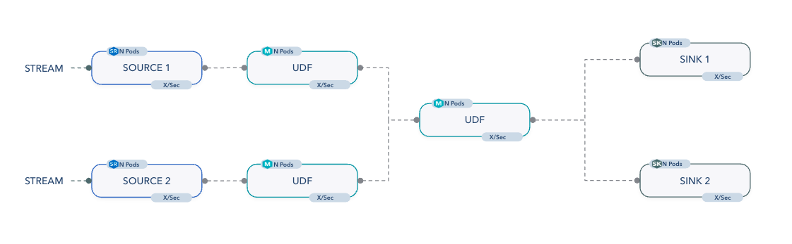

# Numaflow

Welcome to Numaflow! A Kubernetes-native, serverless platform for running scalable and reliable event-driven applications. Numaflow decouples event sources and sinks from the processing logic, allowing each component to independently auto-scale based on demand. With out-of-the-box sources and sinks, and built-in observability, developers can focus on their processing logic without worrying about event consumption, writing boilerplate code, or operational complexities. Each step of the pipeline can be written in any programming language, offering unparalleled flexibility in using the best programming language for each step and ease of using the languages you are most familiar with.

Numaflow, created by the Intuit Argo team to address community needs for continuous event processing, leverages their expertise to deliver a scalable and robust, serverless platform for event-driven applications.

## Use Cases

- Event driven applications: Process events as they happen, e.g., updating inventory and sending customer notifications in e-commerce.
- Real time analytics: Analyze data instantly, e.g., social media analytics, observability data processing.
- Inference on streaming data: Perform real-time predictions, e.g., anomaly detection.
- Workflows running in a streaming manner.

## Key Features

- Kubernetes-native: If you know Kubernetes, you already know how to use Numaflow.
- Serverless: Focus on your code and let the system scale up and down based on demand.
- Language agnostic: Use your favorite programming language.
- Exactly-Once semantics: No input element is duplicated or lost even as pods are rescheduled or restarted.
- Auto-scaling with back-pressure: Each vertex automatically scales from zero to whatever is needed.

## Data Integrity Guarantees

- Minimally provide at-least-once semantics
- Provide exactly-once semantics for unbounded and near real-time data sources
- Preserving order is not required

## Roadmap

- Map Streaming (1.3)

## Demo

## Resources

- [QUICK_START](docs/quick-start.md)
- [EXAMPLES](examples)
- [DEVELOPMENT](docs/development/development.md)
- [CONTRIBUTING](https://github.com/numaproj/numaproj/blob/main/CONTRIBUTING.md)
