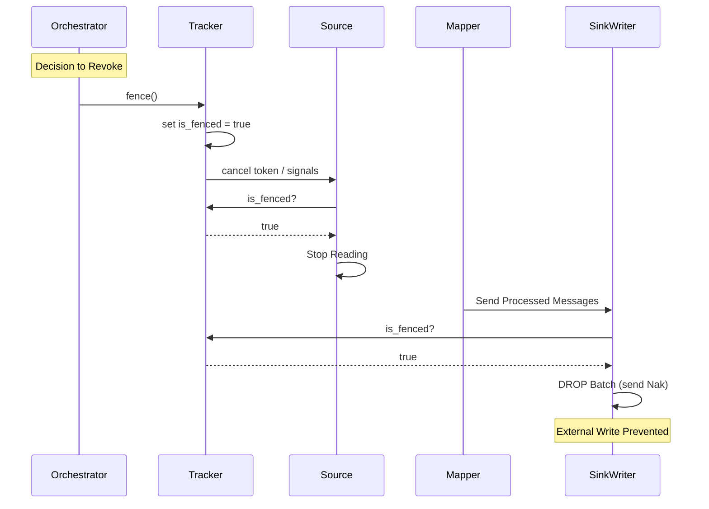

# Enhanced MonoVertex Phase 1 Specification: Nervous System Hardening

**Version:** 1.0
**Date:** 2025-12-18
**Status:** Implemented

## 1. Overview
The "Nervous System" phase focused on hardening the ownership and transport layers of the Enhanced MonoVertex. The primary goal was to prevent "zombie" processes (revoked vertices) from corrupting data or state by enforcing strict identity verification and immediate revocation.

## 2. Gap Analysis & Resolution

| Critical Gap | Risk | Resolution |
| :--- | :--- | :--- |
| **Loose SHM Protocol** | Receiver could read partial/corrupt data; no epoch validation. | **SHM header enforcement** with Magic bytes, Version, and GenerationID. |
| **Identity Amnesia** | Components (Source/Map) unaware of their unique `generation_id`. | **Identity Injection** via config and propagation in `Message` metadata. |
| **Graceful-Only Shutdown** | Revoked vertices finished processing bounds, risking split-brain. | **Immediate Fencing** via `Tracker` kill-switch and Sink-side enforcement. |

## 3. Architecture Changes

### 3.1 SHM Protocol Hardening
A strict wire format was introduced for the Shared Memory ring buffer to ensure data integrity and ownership validation.

**New Header Layout (Rust representation):**
#### 1. Header Format (Fixed 32 Bytes)
| Offset | Field | Type | Description |
|---|---|---|---|
| 0 | Magic | `u32` | `0x5F4E4D46` ("_NMF") |
| 4 | Version | `u16` | Protocol Version (1) |
| 6 | Length | `u32` | Payload Length (Little Endian) |
| 10 | EpochID | `u64` | Monotonically increasing ID |
| 18 | GenID | `u64` | Producer Generation Injection |
| 26 | PartID | `u32` | Partition ID (Ownership) |
| 30 | Flags | `u16` | Status flags (Bit 0: Valid) |
*   **Header**: Fixed 32-byte layout. `magic` (u32), `version` (u16), `length` (u32), `epoch_id` (u64), `generation_id` (u64), `partition_id` (u32), `flags` (u16).
*   **Alignment**: 32-byte header ensures 8-byte alignment for u64 fields.

**Behavior:**
- **Write Protocol (Two-Phase)**:
    1.  Write Header with `flags = 0` (Invalid).
    2.  Write Payload.
    3.  Memory Barrier (Release).
    4.  Update Header `flags = 1` (Published).
    5.  Advance Ring Buffer Head.
- **Read Protocol**:
    1.  Read Header.
    2.  Check `magic`, `version`, and `flags == 1`.
    3.  Validate `generation_id` matches session.
    4.  *Action on GenID Mismatch*: **Stop Consuming**, **Stop Producing**, **Trigger Tracker Fence**, and **Surface Terminal Error**.

### 3.2 Identity Injection
The concept of `generation_id` (a monotonic integer representing the lifespan of a vertex assignment) was threaded through the entire stack.

**Component Updates:**
- **PipelineConfig**: Parses `NUMAFLOW_GENERATION_ID` env var.
- **Source**: Accepts `generation_id` in constructor; stamps all read `Message`s with it.
- **Mapper**: Propagates the vertex's `generation_id` to all output messages, replacing the default `0`.
- **Message Struct**: Added `generation_id` field to internal metadata.

### 3.3 Revocation Signal (Fencing)
A mechanism for immediate, non-negotiable termination of processing was added to handle revocation events (e.g., K8s pod deletion, partition revocation/rebalance, extensive lag, reassignment).

**Mechanism:**
1.  **Tracker**: Central authority for message lifecycle. Added `is_fenced` (AtomicBool) and `cln_token` (CancellationToken).
2.  **Fence Trigger**: `tracker.fence()` sets `is_fenced = true` and cancels the global token.
3.  **Enforcement Points**:
    *   **Source**: Checks `is_fenced()` before reading next batch. if true, breaks loop immediately.
    *   **SinkWriter**: Checks `is_fenced()` before writing to downstream/external sink. If true, **drops** the batch, marks messages as failed (Nak), and prevents external side-effects. **Critical:** Nak must ensure upstream Source does *not* commit the offset. If this guarantee cannot be met, the process MUST Fail Fast (exit).

## 4. Component Interactions

## 5. Verification
The following tests verify the correctness of these changes:

*   **`monovertex::forwarder::tests::test_.*`**: Verifies `generation_id` is propagated correctly from Source to Sink.
*   **`sinker::sink::tests::test_streaming_write_fenced`**: Verifies that when `tracker.fence()` is called, the `SinkWriter` actively drops in-flight messages and does not invoke the underlying Sink Actor.

## 6. Future Work (Phase 2 & 3)
- **Persist GenID**: Include `generation_id` in the Commit Record (RocksDB) to fence off zombie writers at the persistence layer.
- **Remote checks**: Validate `generation_id` against a remote lease/lock (e.g. in controlling-plane) for split-brain protection.
