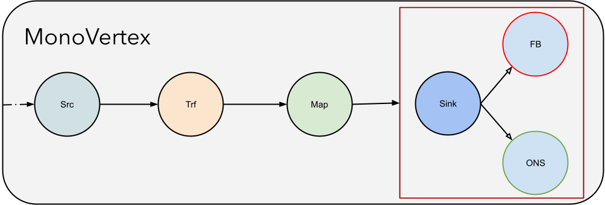

# MonoVertex

MonoVertex is a simplified version of the [Pipeline](./pipeline.md). The major design idea behind MonoVertex is to simplify data-processing
in those cases where independently autoscaling vertices are not required. This means there will only be a single vertex 
called the MonoVertex, which is capable of running the [Source](../user-guide/sources/overview.md), the [Sink](../user-guide/sinks/overview.md)
(with [Fallback Sink](../user-guide/sinks/fallback.md) if need be), and optionally the [Transformer](../user-guide/sources/transformer/overview.md) or [Map UDF](../user-guide/user-defined-functions/map/map.md)
together. There is no concept of Edges in MonoVertex since there is only one [Vertex](vertex.md). The MonoVertex runs the same containers run by the 
[Pipeline](./pipeline.md), this means the users can switch between MonoVertex and [Pipeline](./pipeline.md) by just 
changing the spec. MonoVertex’s [autoscaling](../specifications/autoscaling.md) is similar to the Source vertex of a [Pipeline](./pipeline.md), 
where the vertex scales out if the pending at the Source is increasing, and scales down when the pending at the Source drops.

The major benefits of MonoVertex are as follows:

* Very high TPS can be supported because there are no ISBs (RAFT consensus) in between.
* Extremely low latency because there is no network hops between the Vertices (only one Vertex).
* Low Operational overhead, no need to maintain ISBs.

_MonoVertex - Condensed Pipeline with just one Vertex_



## Use cases of MonoVertex

There are a few scenarios where MonoVertex is the best fit, which can be best described as use-cases where “the user is
reading from the Source, doing simple transformations, and writing to a Sink”. You don't need to scale these Source,
Sink, or Map vertices by themselves. If the Sink can't keep up, you just need to add more pods. This brings a new set
of Source, Transformer, and a Sink (optionally with a backup sink). The same goes for if the Source cannot keep up
(pending is increasing), we just need to add more pods.

### A Brief History

MonoVertex was developed because we found that, there are a decent amount of applications that read from 
Sources like Kafka, Pulsar, etc., and write to a User-Defined Sink (DBs, etc). Often, the transformation itself was not 
required because the User-Defined Sink can do the transformation before persisting the data in to the Sink.  The extra hop 
through the ISB was not helping but just making things slower by adding more delays. Throughput was also getting limited to 
about 50K unless larger ISBs were used.

### When not to use MonoVertex

The rule of thumb is, if you are just reading from the source and writing to a sink (with some transformation), then 
you might be able to get away with MonoVertex. For all other use cases, use the full Pipeline Semantics. Below are a 
few examples where you cannot use MonoVertex.

 * If you are using the [Reduce](../user-guide/user-defined-functions/reduce/reduce.md) feature, then the full [Pipeline](./pipeline.md)
  semantics is required. This is because of the need for shuffling of data.
 * There are cases where you want to autoscale intermediate process nodes, especially in the case of ML workloads.
 * If there is a need for custom placement of vertices (e.g., GPU nodes for Inference), then the complete pipeline spec is required.
 * If you want to use the [Join](../user-guide/reference/join-vertex.md) feature, then MonoVertex will not work.

## Anatomy of MonoVertex

MonoVertex supports the same Sources, Map UDF, Sinks, and Transformers which are used in the Pipeline spec.

```yaml
apiVersion: numaflow.numaproj.io/v1alpha1
kind: MonoVertex
metadata:
  name: simple-mono-vertex
spec:
  source:
    # same as the Pipeline Source
    # ...
    transformer: # transformer is an optional container to do any transformation to the incoming data before passing to the sink
    # same as the Pipeline Transformer
    # ...
  udf: # optional Map: same as the Pipeline Map
  # ...
  sink:
  # same as the Pipeline Sink
  # ...
```

Please keep in mind that, moving from a MonoVertex to Pipeline does not require code change, only spec change.

## Example

A [simple example](https://raw.githubusercontent.com/numaproj/numaflow/stable/examples/21-simple-mono-vertex.yaml) using 
user-defined source, transformer, and sink.
