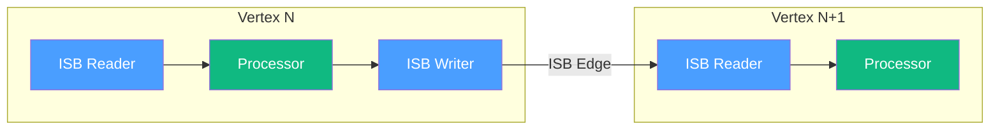
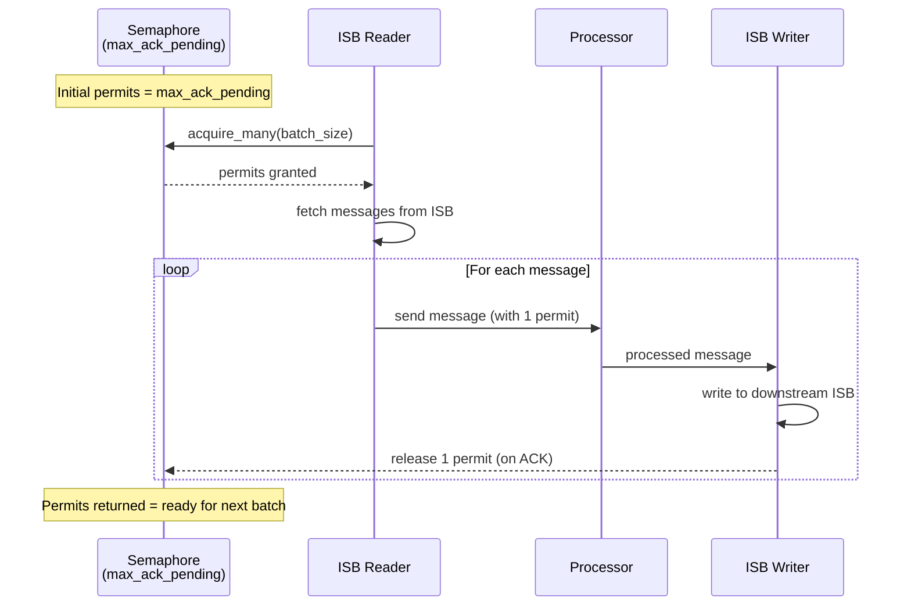
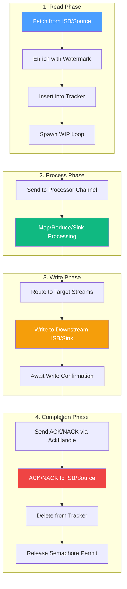
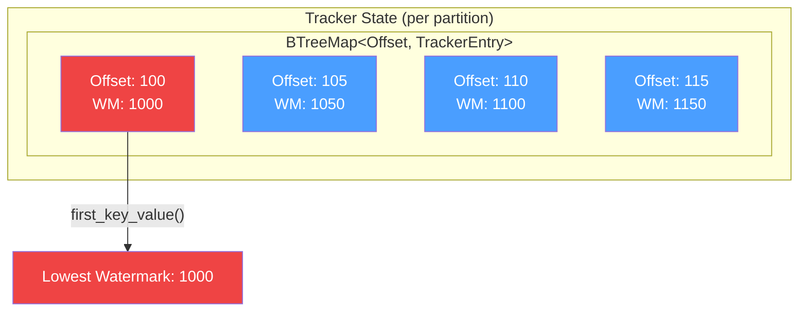
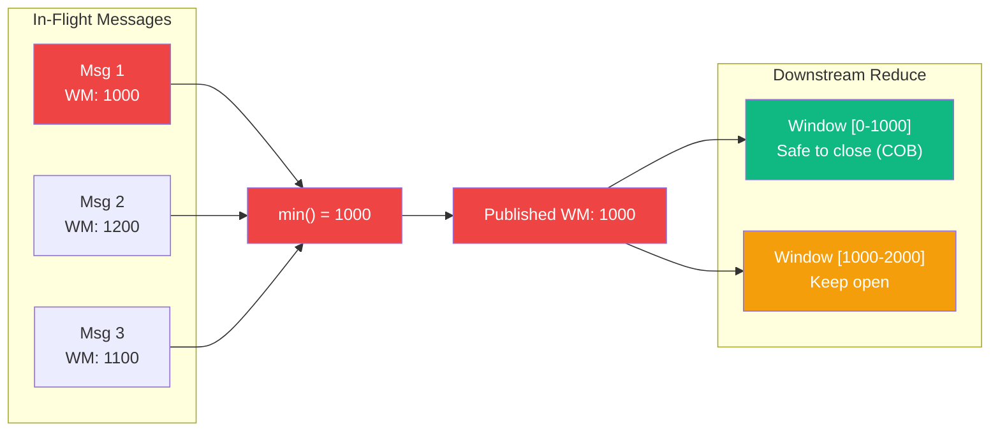
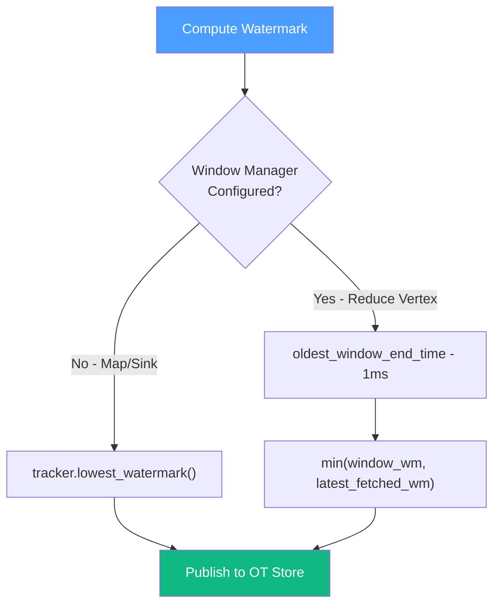
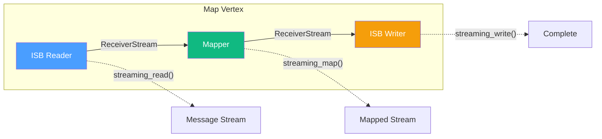
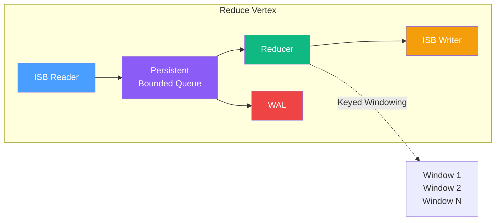

# Streaming Dataflow in Numaflow

This document explains how Numaflow's Rust data-plane moves data in a streaming fashion, ensuring at-least-once semantics 
and correct [watermark](watermarks.md) propagation for reduce operations. You can read why we changed to streaming in 
our [blog post](https://blog.numaproj.io/rewriting-numaflows-data-plane-a-foundation-for-the-future-a64fd2470cf0).

## Overview

Numaflow processes data as a continuous stream rather than discrete batches (a major change in 1.6). 
The key design principles are:

1. **Always maintain active work** - Keep `batch_size` messages in-flight at all times for maximum throughput and reduce 
   tail latency.
2. **Track the smallest offset** - Never advance watermarks past unprocessed data, ensuring reduce correctness (oldest work
   yet to be completed)
3. **Backpressure via semaphores** - Prevent memory exhaustion while maximizing parallelism (throttling read if 
   processing or write is pending)



## Core Components

### ISB Reader
Reads messages from the Inter-Step Buffer (e.g., JetStream), enriches them with watermarks, and tracks them until fully 
processed, and written/forwarded to the next Vertex.

### ISB Writer  
Writes processed messages to downstream ISB streams, handles routing based on tags/conditions, and publishes watermarks.

### Tracker
Maintains a sorted map (BTreeMap) of all in-flight messages per partition. Used to:

- Track message completion for ACK/NAK
- Compute the lowest watermark among all in-flight messages
- Handle serving callbacks

### Watermark Computation
Ensures temporal correctness by tracking event-time progress and publishing watermarks to downstream vertices.

## Maintaining Active Work with Semaphores

The reader maintains a bounded number of in-flight messages using a semaphore. This provides:

1. **Constant throughput** - Always `batch_size` messages being processed
2. **Backpressure** - Prevents unbounded memory growth
3. **Graceful shutdown** - Wait for all permits to return before exiting



### How It Works

1. **Reader acquires permits** - before fetching messages (`acquire_many(batch_size)`)
2. **Each message carries a permit** - split from the batch permit
3. **Permit released on ACK** - when downstream confirms receipt
4. **Backpressure automatic** - if processing is slow, reader blocks on permit acquisition

```rust
// Semaphore controls max in-flight messages
let semaphore = Arc::new(Semaphore::new(max_ack_pending));

loop {
    // Block until we can process more messages
    let permits = semaphore.acquire_many_owned(batch_size).await?;
    
    // Fetch and process batch
    let batch = self.fetch_messages(batch_size).await;
    
    for message in batch {
        // Each message gets 1 permit, released on ACK
        let permit = permits.split(1);
        self.process_message(message, permit).await;
    }
}
```

## Message Lifecycle

A message flows through several stages from read to acknowledgment:



### Key Points

1. **Watermark enriched at read time** - Each message gets the watermark for its offset
2. **Tracker insertion before processing** - Ensures we never lose track of a message
3. **WIP (Work-In-Progress) loop** - Periodically marks message as still being processed
4. **ACK/NACK triggers cleanup** - Removes from tracker and releases permit


## Offset Tracking for Reduce Correctness

The Tracker maintains a **BTreeMap** of offsets per partition. This sorted structure is critical for watermark correctness:



### Why BTreeMap?

1. **Sorted by offset** - Oldest message is always `first_key_value()`
2. **O(log n) operations** - Efficient insert/delete
3. **Minimum watermark** - The first entry's watermark is the oldest in-flight

### The Lowest Watermark Guarantee

```rust
/// Returns the lowest watermark among all tracked offsets.
pub async fn lowest_watermark(&self) -> DateTime<Utc> {
    let state = self.state.read().await;
    state.entries
        .values()
        .filter_map(|partition_entries| {
            partition_entries
                .first_key_value()  // Oldest offset per partition
                .and_then(|(_, entry)| entry.watermark)
        })
        .min()  // Minimum across all partitions
}
```

### Why This Matters for Reduce

Reduce operations group data by time windows. If we wrongly advance the watermark past unprocessed data, we will
wrongly invoke close-of-book (COB) for windows and will lead to incorrect results, like:

1. **Windows close prematurely** - Data arrives after window is closed
2. **Late data is dropped** - Correctness is violated
3. **Results are wrong** - Aggregations miss data

By always publishing the **lowest watermark** among in-flight messages:



**The watermark is a promise**: "No more data with `event-time < watermark` will arrive."

## Watermark Publishing

Watermarks are published to downstream vertices via OT (Offset-Timeline) stores in JetStream KV.

### Computing the Watermark

The watermark to publish depends on the vertex type:



### For Map/Sink Vertices

Use the tracker's lowest watermark - the minimum watermark among all in-flight messages.

### For Reduce Vertices

Use the oldest open window's `end time - 1ms`. This ensures:

- Windows aren't closed until all their data is processed
- Late data within allowed lateness is handled correctly

### Idle Watermark Handling

When no data is flowing, we still need to advance watermarks:

1. **Detect idle state** - No messages read for a period
2. **Fetch head WMB** - Get the latest watermark marker from upstream
3. **Publish idle watermark** - Allow downstream to make progress

## Streaming Flow Patterns

### Map Forwarder



All components are connected via Tokio channels [`ReceiverStream`](https://docs.rs/tokio-stream/latest/tokio_stream/wrappers/struct.ReceiverStream.html), 
enabling true streaming without batch boundaries.

### Reduce Forwarder



### Summary

The streaming architecture ensures that:

1. **Throughput is maximized** - Always `batch_size` messages in flight
2. **Memory is bounded** - Semaphore prevents unbounded growth
3. **Reduce is correct** - Watermarks never advance past unprocessed data
4. **Recovery is possible** - Tracker + WIP loop enables at-least-once or "almost" exactly-once
5. **WAL** - WAL is used for recovery in case of pod restarts for Reduce vertices.
