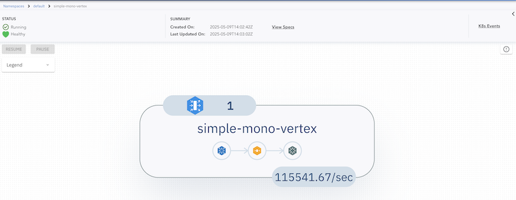

# MonoVertex

A [MonoVertex](../core-concepts/monovertex.md) is the simplest way to run Numaflow. It is a single vertex that reads from a [Source](../user-guide/sources/overview.md), optionally transforms or maps the data, and writes to a [Sink](../user-guide/sinks/overview.md). Because there is only one vertex and no edges, a MonoVertex needs no [Inter-Step Buffer Service](../core-concepts/inter-step-buffer-service.md).

This page builds up in two steps:

1. [A simple MonoVertex](#a-simple-monovertex) - a built-in source and sink, no custom code.
2. [A MonoVertex with your own code](#a-monovertex-with-your-own-code) - a user-defined source, transformer, map, and sink.

> This page assumes you have already completed [Prerequisites & Installation](prerequisites-and-installation.md).

## A Simple MonoVertex

We start with the smallest possible MonoVertex: a built-in [generator](../user-guide/sources/generator.md) source that produces messages, wired directly to a built-in [log](../user-guide/sinks/log.md) sink that prints them. No custom containers are involved.

### Deploy the MonoVertex

```shell
kubectl apply -f https://raw.githubusercontent.com/numaproj/numaflow/main/examples/20-simple-mono-vertex-builtin.yaml
```

### Verify the Deployment

List the deployed MonoVertices:

```shell
kubectl get monovertex # or "mvtx" as a short name
```

You should see an output similar to this:

```shell
NAME                         PHASE     DESIRED   CURRENT   READY   AGE   REASON   MESSAGE
simple-mono-vertex-builtin   Running   1         1         1       38s
```

Inspect the status by listing the pods. Note that the pod names in your environment may differ from the example below:

```shell
# Wait for pods to be ready
kubectl get pods

NAME                                                READY   STATUS    RESTARTS   AGE
simple-mono-vertex-builtin-mv-0-w7fmq               2/2     Running   0          2m30s
simple-mono-vertex-builtin-mv-daemon-55bff65db5-x   1/1     Running   0          2m30s
```

### View the Logs

The log sink runs inside the MonoVertex pod's `numa` container. Follow its logs. Replace `xxxxx` with the appropriate pod name from the output above:

```shell
kubectl logs -f simple-mono-vertex-builtin-mv-0-xxxxx -c numa
```

You should see the generated messages being printed:

```shell
2025/05/09 11:23:38 (sink)  Payload -  {"value":1746789818182898304}  Keys -  [key-0-0]  EventTime -  1746789818182  Headers -    ID -  0-0
2025/05/09 11:23:38 (sink)  Payload -  {"value":1746789818182898304}  Keys -  [key-0-0]  EventTime -  1746789818182  Headers -    ID -  1-0
```

### Access the Numaflow UI

Numaflow includes a built-in user interface for monitoring your workloads. If your local Kubernetes cluster does not include a metrics server by default (e.g., Kind), install it using the following commands:

```shell
kubectl apply -f https://github.com/kubernetes-sigs/metrics-server/releases/latest/download/components.yaml
kubectl patch -n kube-system deployment metrics-server --type=json -p '[{"op":"add","path":"/spec/template/spec/containers/0/args/-","value":"--kubelet-insecure-tls"}]'
```

To access the UI, port-forward the Numaflow server:

```shell
kubectl -n numaflow-system port-forward deployment/numaflow-server 8443:8443
```

Visit [https://localhost:8443/](https://localhost:8443/) to view the UI.

> **Note**: For more details about the UI features and built-in debugging tools, check out the [UI section](../user-guide/UI/overview.md).

### Delete the MonoVertex

```shell
kubectl delete -f https://raw.githubusercontent.com/numaproj/numaflow/main/examples/20-simple-mono-vertex-builtin.yaml
```

## A MonoVertex with Your Own Code

The built-in source and sink are handy for a first run, but real workloads usually read from your own systems and run your own logic. This next example uses:

- a [User-Defined Source (UDSource)](../user-guide/sources/user-defined-sources.md),
- an optional [Transformer](../user-guide/sources/transformer/overview.md),
- a [Map UDF](../user-guide/user-defined-functions/map/map.md) that runs your own processing logic, and
- a [User-Defined Sink (UDSink)](../user-guide/sinks/user-defined-sinks.md) with a [Fallback Sink](../user-guide/sinks/fallback.md).

A sink can also declare an [OnSuccess Sink](../user-guide/sinks/on-success.md) to route successfully-processed messages to a second destination (for example, an audit or acknowledgement stream). It is optional and not part of this example; for a complete MonoVertex that wires up a fallback sink, an onSuccess sink, and message routing together, see the [`23-mono-vertex-bypass.yaml`](https://github.com/numaproj/numaflow/blob/main/examples/23-mono-vertex-bypass.yaml) example.

Each of these is just a container image. In this example the map step uses a pre-built `map-cat` image (it forwards each message unchanged); to run your own logic you swap in your own image built with one of the [Numaflow SDKs](../user-guide/sdks/overview.md).

### Deploy the MonoVertex

```shell
kubectl apply -f https://raw.githubusercontent.com/numaproj/numaflow/main/examples/21-simple-mono-vertex.yaml
```

### Verify the Deployment

```shell
kubectl get monovertex # or "mvtx" as a short name
```

You should see an output similar to this:

```shell
NAME                 PHASE     DESIRED   CURRENT   READY   AGE   REASON   MESSAGE
simple-mono-vertex   Running   1         1         1       38s
```

Inspect the status by listing the pods. Replace `xxxxx` with the appropriate pod name from your environment:

```shell
# Wait for pods to be ready
kubectl get pods

NAME                                           READY   STATUS    RESTARTS   AGE
simple-mono-vertex-mv-0-w7fmq                  5/5     Running   0          2m30s
simple-mono-vertex-mv-daemon-55bff65db5-mk4g2  1/1     Running   0          2m30s
```

### View Pod Details

Each user-defined container runs as its own container in the pod. To confirm all containers (monitor, udsource, transformer, udf, udsink, and numa) are running, describe the pod:

```shell
kubectl describe pod simple-mono-vertex-mv-0-xxxxx
```

### Monitor Logs for the Sink Container

To view logs from the `udsink` container, run the following. Replace `xxxxx` with the appropriate pod name:

```shell
kubectl logs -f simple-mono-vertex-mv-0-xxxxx -c udsink
```

Because the map only echoes the messages, the output looks the same as the source data:

```shell
2025/05/09 11:23:38 (sink)  Payload -  {"value":1746789818182898304}  Keys -  [key-0-0]  EventTime -  1746789818182  Headers -    ID -  0-0
2025/05/09 11:23:38 (sink)  Payload -  {"value":1746789818182898304}  Keys -  [key-0-0]  EventTime -  1746789818182  Headers -    ID -  1-0
```

### Access the Numaflow UI

If you have not already, port-forward the Numaflow server:

```shell
kubectl -n numaflow-system port-forward deployment/numaflow-server 8443:8443
```

Visit [https://localhost:8443/](https://localhost:8443/) to view the UI. Below is an example of the UI for this MonoVertex:



### Delete the MonoVertex

```shell
kubectl delete -f https://raw.githubusercontent.com/numaproj/numaflow/main/examples/21-simple-mono-vertex.yaml
```

### Additional Notes

The source code for the user-defined containers used in this MonoVertex is available here:

- [UDSource](https://github.com/numaproj/numaflow-rs/blob/main/examples/simple-source/src/main.rs)
- [Transformer](https://github.com/numaproj/numaflow-rs/blob/main/examples/source-transformer-now/src/main.rs)
- [Map UDF (cat)](https://github.com/numaproj/numaflow-go/tree/main/examples/mapper/forward_message)
- [UDSink](https://github.com/numaproj/numaflow-rs/blob/main/examples/sink-log/src/main.rs)

To write your own, start with the [SDKs overview](../user-guide/sdks/overview.md).

## Next Step

A MonoVertex is ideal when you read from a source, optionally transform, and write to a sink. When you need multiple processing stages, branching, joins, or windowed aggregation, you need a full pipeline. Continue to the [Pipeline](pipeline.md) guide.
