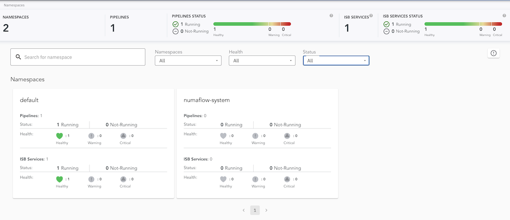
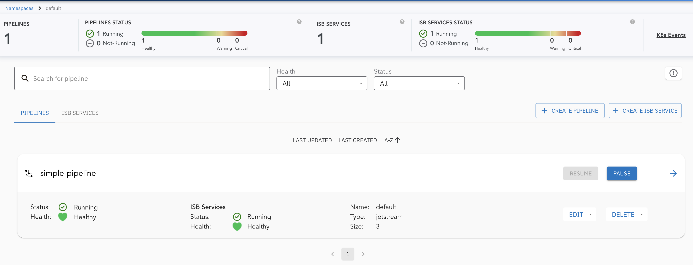
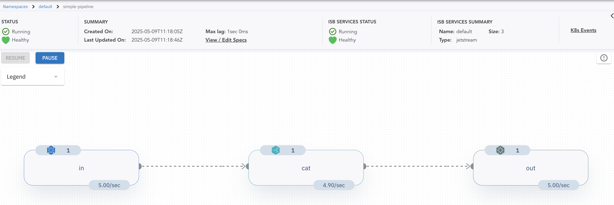
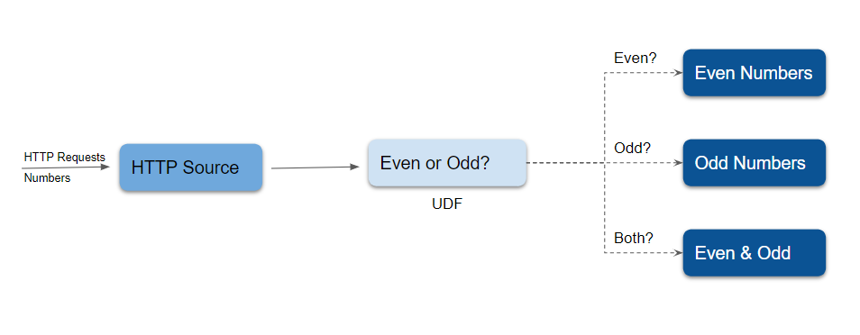
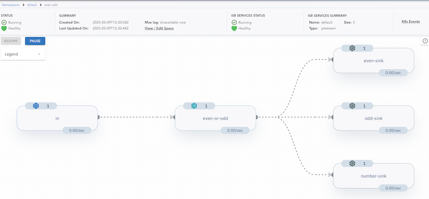

# Pipeline

A [Pipeline](../core-concepts/pipeline.md) connects multiple [vertices](../core-concepts/vertex.md) with [edges](../core-concepts/pipeline.md). Unlike a [MonoVertex](monovertex.md), a pipeline can have many processing stages, branch data to different destinations, join streams, and run windowed aggregation (reduce). Vertices exchange data through an [Inter-Step Buffer Service (isbsvc)](../core-concepts/inter-step-buffer-service.md).

This page builds up in two steps:

1. [A simple pipeline](#a-simple-pipeline) - a source, a processing vertex, and a sink connected by edges.
2. [An advanced pipeline](#an-advanced-pipeline) - conditional forwarding to multiple sinks.

> This page assumes you have already completed [Prerequisites & Installation](prerequisites-and-installation.md). The containers you learned about in the [MonoVertex](monovertex.md) guide - sources, sinks, transformers, and map UDFs - work exactly the same way here.

## Deploy the Inter-Step Buffer Service

Pipelines pass data between vertices through an [Inter-Step Buffer Service](../core-concepts/inter-step-buffer-service.md). A MonoVertex does not need one, which is why we skipped it earlier; a pipeline does. Deploy the JetStream-based ISB Service before creating a pipeline:

```shell
kubectl apply -f https://raw.githubusercontent.com/numaproj/numaflow/main/examples/0-isbsvc-jetstream.yaml
```

You only need to do this once per namespace. All pipelines in the namespace share it.

## A Simple Pipeline

In this section, we create a `simple-pipeline` with three vertices: a source vertex to generate messages, a processing vertex that echoes the messages, and a sink vertex to log them. The edges connect them in order: `in` -> `cat` -> `out`.

### Deploy the Simple Pipeline

```shell
kubectl apply -f https://raw.githubusercontent.com/numaproj/numaflow/main/examples/1-simple-pipeline.yaml
```

### Verify the Pipeline Deployment

To view the list of pipelines you have created, use the following command:

```shell
kubectl get pipeline # or "pl" as a short name
```

You should see an output similar to this, where `AGE` indicates the time elapsed since the pipeline was created:

```shell
NAME              PHASE     VERTICES   AGE   MESSAGE
simple-pipeline   Running   3          47s
```

Next, inspect the status of the pipeline by checking the pods. Note that the pod names in your environment may differ from the example below:

```shell
# Wait for pods to be ready
kubectl get pods

NAME                                         READY   STATUS      RESTARTS       AGE
isbsvc-default-js-0                          3/3     Running        0           4m9s
isbsvc-default-js-1                          3/3     Running        0           4m9s
isbsvc-default-js-2                          3/3     Running        0           4m9s
simple-pipeline-cat-0-xjqbe                  3/3     Running        0           99s
simple-pipeline-daemon-784d5cfd97-vpsmk      1/1     Running        0           99s
simple-pipeline-in-0-vvhu1                   2/2     Running        0           100s
simple-pipeline-out-0-y1z8e                  2/2     Running        0           99s
```

Notice the `isbsvc-default-js-*` pods: those are the Inter-Step Buffer Service that carries data between the vertices.

### View Logs for the Output Vertex

To monitor the logs for the `out` vertex, run the following command. Replace `xxxxx` with the appropriate pod name from the output above:

```shell
kubectl logs -f simple-pipeline-out-0-xxxxx
```

You should see logs similar to the following:

```shell
2025/05/09 11:23:38 (out)  Payload -  {"Data":{"value":1746789818182898304},"Createdts":1746789818182898304}  Keys -  [key-0-0]  EventTime -  1746789818182  Headers -    ID -  cat-1526-0-0
2025/05/09 11:23:38 (out)  Payload -  {"Data":{"value":1746789818182898304},"Createdts":1746789818182898304}  Keys -  [key-0-0]  EventTime -  1746789818182  Headers -    ID -  cat-1529-0-0
2025/05/09 11:23:38 (out)  Payload -  {"Data":{"value":1746789818182898304},"Createdts":1746789818182898304}  Keys -  [key-0-0]  EventTime -  1746789818182  Headers -    ID -  cat-1528-0-0
```

### Access the Numaflow UI

Numaflow includes a built-in user interface for monitoring pipelines. If your local Kubernetes cluster does not include a metrics server by default (e.g., Kind), install it using the following commands:

```shell
kubectl apply -f https://github.com/kubernetes-sigs/metrics-server/releases/latest/download/components.yaml
kubectl patch -n kube-system deployment metrics-server --type=json -p '[{"op":"add","path":"/spec/template/spec/containers/0/args/-","value":"--kubelet-insecure-tls"}]'
```

To access the UI, port-forward the Numaflow server:

```shell
kubectl -n numaflow-system port-forward deployment/numaflow-server 8443:8443
```

Visit [https://localhost:8443/](https://localhost:8443/) to view the UI. Below is the UI for the `simple-pipeline`:

#### Cluster View



#### Default Namespace View



#### Simple Pipeline View



> **Note**: For more details about the UI features and built-in debugging tools, check out the [UI section](../user-guide/UI/overview.md).

### Delete the Pipeline

```shell
kubectl delete -f https://raw.githubusercontent.com/numaproj/numaflow/main/examples/1-simple-pipeline.yaml
```

## An Advanced Pipeline

Now we walk through a more capable pipeline. Our example is called `even-odd`, illustrated by the following diagram:



There are five vertices in this example. An [HTTP](../user-guide/sources/http.md) source vertex serves an HTTP endpoint to receive numbers as source data, a [UDF](../user-guide/user-defined-functions/map/map.md) vertex tags the ingested numbers with the key `even` or `odd`, and three [Log](../user-guide/sinks/log.md) sinks print the `even` numbers, the `odd` numbers, and both, respectively. This shows conditional forwarding: the same UDF output is routed to different sinks based on the message key.

### Deploy the `even-odd` Pipeline

```shell
kubectl apply -f https://raw.githubusercontent.com/numaproj/numaflow/main/examples/2-even-odd-pipeline.yaml
```

You can check the list of pipelines you have created so far using:

```shell
kubectl get pipeline # or "pl" as a short name
```

```shell
NAME       PHASE     VERTICES   AGE   MESSAGE
even-odd   Running   5          51s
```

Otherwise, proceed to inspect the status of the pipeline by checking the pods:

```shell
# Wait for pods to be ready
kubectl get pods

NAME                               READY   STATUS    RESTARTS   AGE
even-odd-daemon-75cdcd5f4c-nmrrp   1/1     Running   0          95s
even-odd-even-or-odd-0-i72hw       3/3     Running   0          95s
even-odd-even-sink-0-gnhou         2/2     Running   0          95s
even-odd-in-0-tvfef                2/2     Running   0          95s
even-odd-number-sink-0-3s3nc       2/2     Running   0          95s
even-odd-odd-sink-0-zktib          2/2     Running   0          95s
isbsvc-default-js-0                3/3     Running   0          15m
isbsvc-default-js-1                3/3     Running   0          15m
isbsvc-default-js-2                3/3     Running   0          15m
```

### Send Data to the Pipeline

Port-forward the HTTP endpoint of the source vertex and send data using `curl`. Replace `xxxxx` with the appropriate pod name:

```shell
kubectl port-forward even-odd-in-0-xxxxx 8444:8443

# Send data to the HTTP endpoint
curl -kq -X POST -d "101" https://localhost:8444/vertices/in
curl -kq -X POST -d "102" https://localhost:8444/vertices/in
curl -kq -X POST -d "103" https://localhost:8444/vertices/in
curl -kq -X POST -d "104" https://localhost:8444/vertices/in
```

### View Logs for the `even` and `odd` Vertices

Monitor the logs for the `even` and `odd` sinks to verify the pipeline's functionality. Replace `xxxxx` with the appropriate pod names:

```shell
# Logs for the even sink
kubectl logs -f even-odd-even-sink-0-xxxxx

2025/05/09 13:34:26 (even-sink)  Payload -  104  Keys -  [even]  EventTime -  1746797665477  Headers -  Content-Length: 3, Content-Type: application/x-www-form-urlencoded, User-Agent: curl/8.7.1, Accept: */*,   ID -  even-or-odd-1-0-0
2025/05/09 13:34:26 (even-sink)  Payload -  102  Keys -  [even]  EventTime -  1746797665430  Headers -  Content-Type: application/x-www-form-urlencoded, User-Agent: curl/8.7.1, Accept: */*, Content-Length: 3,   ID -  even-or-odd-2-0-0

# Logs for the odd sink
kubectl logs -f even-odd-odd-sink-0-xxxxx

2025/05/09 13:34:26 (odd-sink)  Payload -  101  Keys -  [odd]  EventTime -  1746797665407  Headers -  Content-Length: 3, Content-Type: application/x-www-form-urlencoded, User-Agent: curl/8.7.1, Accept: */*,   ID -  even-or-odd-4-0-0
2025/05/09 13:34:26 (odd-sink)  Payload -  103  Keys -  [odd]  EventTime -  1746797665452  Headers -  Content-Length: 3, Content-Type: application/x-www-form-urlencoded, User-Agent: curl/8.7.1, Accept: */*,   ID -  even-or-odd-3-0-0
```

### Access the Numaflow UI

To visualize the pipeline, access the Numaflow UI at https://localhost:8443/ after port forwarding. Below is the UI for the `even-odd` pipeline:



### Delete the Pipeline

```shell
kubectl delete -f https://raw.githubusercontent.com/numaproj/numaflow/main/examples/2-even-odd-pipeline.yaml
```

### Additional Notes

The source code for the `even-odd` [user-defined function](../user-guide/user-defined-functions/user-defined-functions.md) is available [here](https://github.com/numaproj/numaflow-go/tree/main/examples/mapper/even_odd). You can also replace the [Log](../user-guide/sinks/log.md) Sink with other sinks, such as [Kafka](../user-guide/sinks/kafka.md), to forward data to Kafka topics.

## Going Further: Reduce (Aggregation)

Windowed aggregation - grouping messages over time and reducing them - is a **pipeline-only** feature. It requires the full pipeline because data must be shuffled across keys, which a single-vertex MonoVertex cannot do. To set up an example pipeline with the [Reduce UDF](../user-guide/user-defined-functions/reduce/reduce.md), see [Reduce Examples](../user-guide/user-defined-functions/reduce/examples.md).

## Next Step

You have now run both a MonoVertex and a pipeline. Continue to [What's Next](whats-next.md) to explore more sources, sinks, and user-defined functions.
