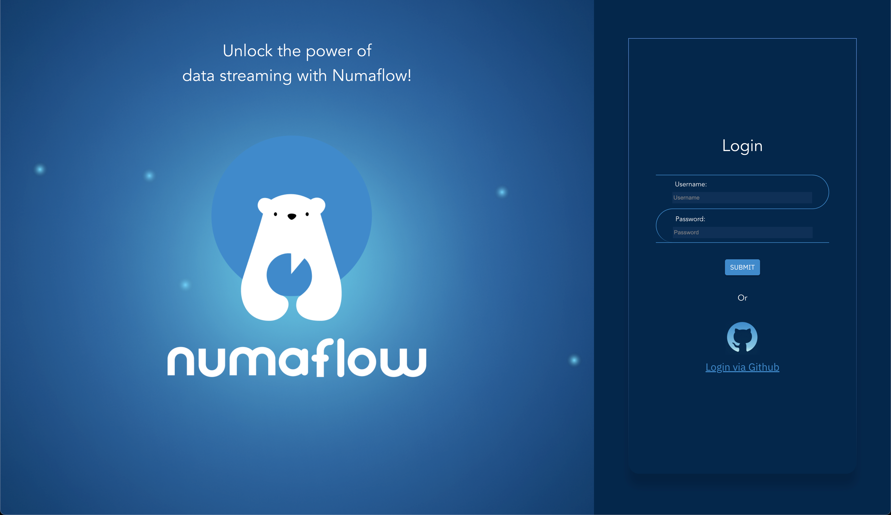

# Local Users

In addition to the authentication using Dex, we also provide an authentication mechanism for local user based on JSON Web Token(JWT).



---

#### NOTE

When you create local users, each of those users will need additional [RBAC](../authz/rbac.md) rules set up,
otherwise they will fall back to the default policy specified by `policy.default` field of the `numaflow-server-rbac-config` ConfigMap.

---

Numaflow comes with a built-in `admin` user that has full access to the system.
It is recommended to use `admin` user for initial configuration then switch to local users or configure SSO integration.

## Accessing admin user

A built-in `admin` user comes with a randomly generated password that is stored in `numaflow-server-secrets` Secret:

### Example

```shell
kubectl get secret numaflow-server-secrets -n <namespace> -o jsonpath='{.data.admin\.initial-password}' | base64 --decode
```

Use the `admin` username and password obtained above to log in to the UI.

## Creating Users

### 1. Adding the username

Users can be created by updating the `numaflow-server-local-user-config` ConfigMap:

### Example

```shell
apiVersion: v1
kind: ConfigMap
metadata:
  name: numaflow-server-local-user-config
data:
  # Format: {username}.enabled: "true"
  bob.enabled: "true"
```

### 2. Generating the password

When adding new users, it is necessary to generate a bcrypt hash of their password:

### Example

```shell
# Format: htpasswd -bnBC 10 "" <password> | tr -d ':\n'
htpasswd -bnBC 10 "" password | tr -d ':\n'
```

### 3. Adding the password for the username

To add the password generated above for the respective user, you can update the `numaflow-server-secrets` Secret:

### Example

```shell
apiVersion: v1
kind: Secret
metadata:
  name: numaflow-server-secrets
type: Opaque
stringData:
  # Format: {username}.password: <bcrypt_hash_password_value>
  bob.password: $2y$10$0TCvrnLHQsQtEJVdXNNL6eeXaxHmGnQO.R8zhh0Mwr2RM7s42knTK
```

You can also update the password for `admin` user similarly, it will be considered over the initial password

---

#### NOTE

For the example above, the username is `bob` and the password is `password`.

---

## Disabling Users

Users can be disabled by updating the `numaflow-server-local-user-config` ConfigMap, including the system generated `admin` user:

### Example

```shell
apiVersion: v1
kind: ConfigMap
metadata:
  name: numaflow-server-local-user-config
data:
  # Set the value to "false" to disable the user.
  bob.enabled: "false"
```

## Deleting Users

Users can be deleted by removing the corresponding entries:

### 1. `numaflow-server-local-user-config` ConfigMap

```shell
# Format: {username}.enabled: null
kubectl patch configmap <configmap-name> -n <namespace> -p '{"data": {"bob.enabled": null}}' --type merge
```

### 2. `numaflow-server-secrets` Secret

```shell
# Format: {username}.password: null
kubectl patch secret <secret-name> -n <namespace> -p '{"data": {"bob.password": null}}' --type merge
```
