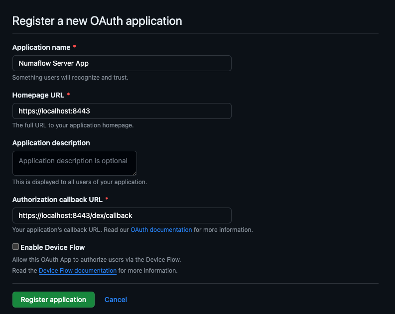

## Dex Server

Numaflow currently installs with a [Dex](https://github.com/dexidp/dex) Server for authentication integration. Currently,
the only supported identity provider is Github. SSO configuration of Numaflow UI will require editing a few files
detailed below.

### 1. Register application for Github

In Github, register a new OAuth application named `Numaflow Server App`. The callback address should be the
homepage of your Numaflow UI + `/dex/callback`. In most cases this should be `https://localhost:8443/dex/callback`.
If you are using a different `baseHref` for your installation, you must also include that.

After registering this application, you will be given a client ID. You will need this value and also generate
a new client secret.



### 2. Configuring Numaflow

First we need to configure `server.disable.auth` to `false` in the ConfigMap `numaflow-cmd-params-config` at `config/base/shared-config/numaflow-cmd-params-config.yaml`.
This will enable authorization and authentication for the UX server.

```yaml
apiVersion: v1
kind: ConfigMap
metadata:
  name: numaflow-cmd-params-config
data:
  ### Whether to disable authentication and authorization for the UX server, defaults to false.
  server.disable.auth: "false"
  #
```

Next we need to configure the `numaflow-dex-server-config` ConfigMap at `config/base/dex/numaflow-dex-server-configmap.yaml`.
Change `<ORG_NAME>` to your organization you created the application under and include the correct teams.
This file will be read by the init container of the Dex server and generate the config it will server.

```yaml
kind: ConfigMap
apiVersion: v1
metadata:
  name: numaflow-dex-server-config
data:
  config.yaml: |
    connectors:
    - type: github
      # https://dexidp.io/docs/connectors/github/
      id: github
      name: GitHub
      config:
        clientID: $GITHUB_CLIENT_ID
        clientSecret: $GITHUB_CLIENT_SECRET
        orgs:
        - name: <ORG_NAME>
          teams:
          - admin
          - readonly
```

Finally we will need to create/update the `numaflow-dex-secrets` Secret.
You will need to add the client ID and secret you created earlier for the application here.

```yaml
apiVersion: v1
kind: Secret
metadata:
  name: numaflow-dex-secrets
stringData:
  # https://dexidp.io/docs/connectors/github/
  dex-github-client-id: <GITHUB_CLIENT_ID>
  dex-github-client-secret: <GITHUB_CLIENT_SECRET>
```

### 3. Restarting Pods

If you are enabling/disabling authorization and authentication for the Numaflow server, it will need to be restarted.

Any changes or additions to the connectors in the `numaflow-dex-server-config` ConfigMap will need to be read and
generated again requiring a restart as well.


