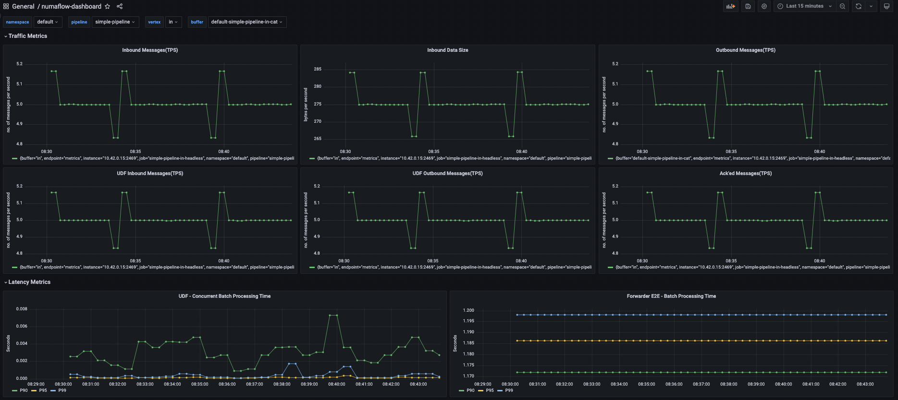
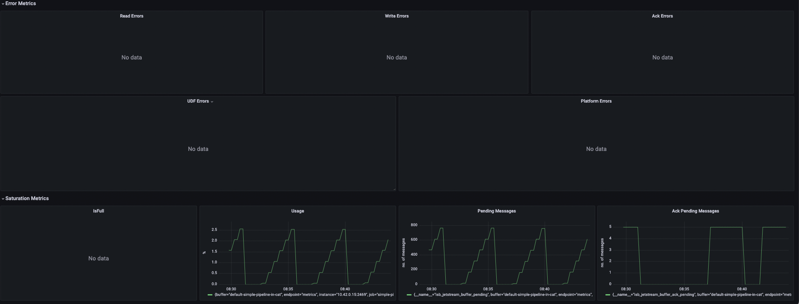

# Grafana

Numaflow provides prometheus metrics on top of which you can build Grafana dashboard to monitor your pipeline.

## Setup Grafana

* (Pre-requisite) Follow [Metrics](./metrics/metrics.md) to set up prometheus operator.
* Follow [Prometheus Tutorial](https://prometheus.io/docs/tutorials/visualizing_metrics_using_grafana/) to install Grafana and visualize metrics.

## Sample Dashboard

You can customize your own dashboard by selecting metrics that best describe the health of your pipeline. Below is a sample dashboard which includes some basic metrics. 

To use the sample dashboard, download the corresponding [sample dashboard template](example-dashboard-template.json), import(before importing change the uid of the datasource in json, issue [link](https://community.grafana.com/t/json-loaded-dashboard-does-not-show-data-in-panel-until-edit-each-panel-and-apply-changes/65792/4)) it to Grafana and use the dropdown menu at top-left of the dashboard to choose which pipeline/vertex/buffer metrics to display.

