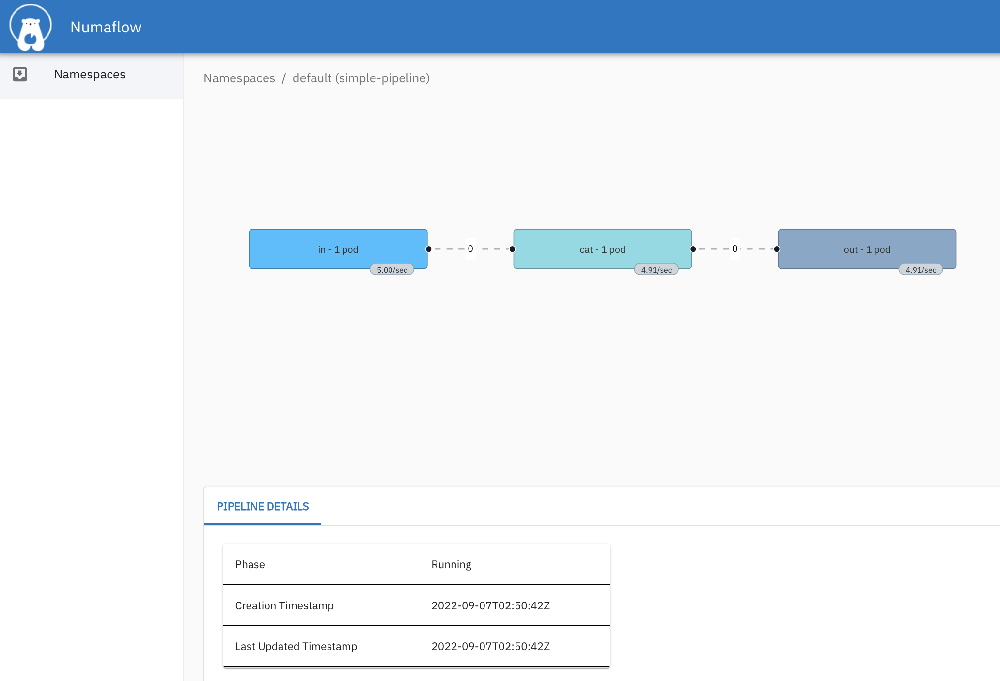
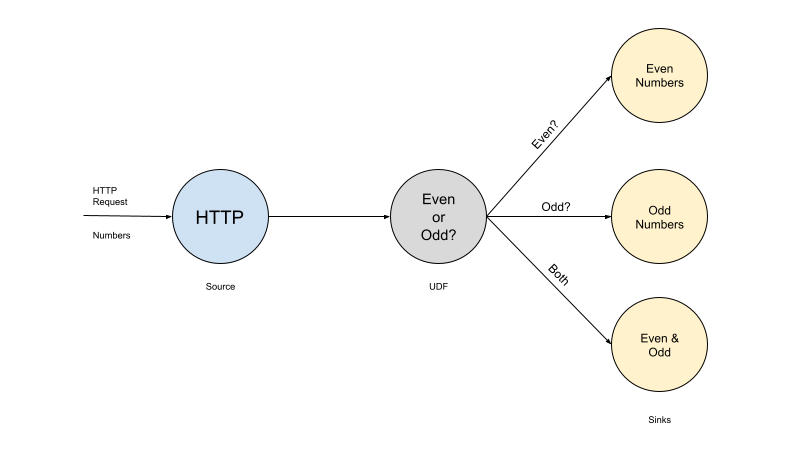
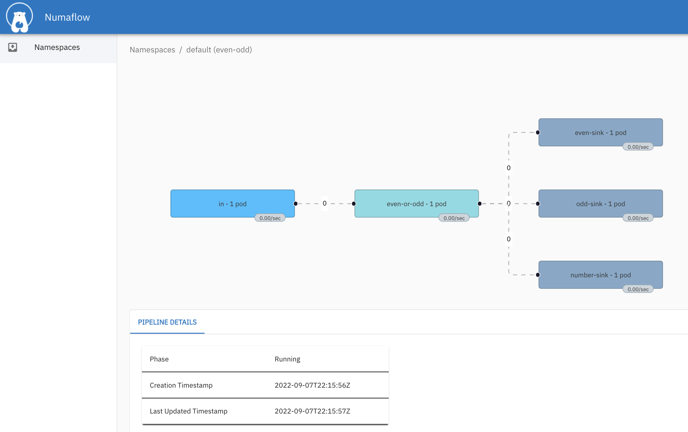

# Quick Start

Install Numaflow and run a couple of example pipelines.

## Prerequisites

A Kubernetes cluster is needed to try out Numaflow. A simple way to create a local cluster is using Docker Desktop.

- [Docker](https://www.docker.com)
- [Docker Desktop](https://www.docker.com/blog/how-kubernetes-works-under-the-hood-with-docker-desktop)

You will also need `kubectl` to manage the cluster.

- [kubectl](https://kubernetes.io/docs/tasks/tools/install-kubectl/)

## Installation

Run the following command lines to install Numaflow and start the Inter-Step Buffer Service that handles communication between vertices.
```shell
kubectl create ns numaflow-system
kubectl apply -n numaflow-system -f https://raw.githubusercontent.com/numaproj/numaflow/stable/config/install.yaml
kubectl apply -f https://raw.githubusercontent.com/numaproj/numaflow/stable/examples/0-isbsvc-jetstream.yaml
```

## A Simple Pipeline

Create a `simple pipeline`, which contains a source vertex to generate messages, a processing vertex that echos the messages, and a sink vertex that logs the messages.
```shell
kubectl apply -f https://raw.githubusercontent.com/numaproj/numaflow/stable/examples/1-simple-pipeline.yaml
kubectl get pipeline # or "pl" as a short name

# Wait for pods to be ready
kubectl get pods
NAME                                         READY   STATUS      RESTARTS   AGE
isbsvc-default-js-0                          3/3     Running     0          19s
isbsvc-default-js-1                          3/3     Running     0          19s
isbsvc-default-js-2                          3/3     Running     0          19s
simple-pipeline-daemon-78b798fb98-qf4t4      1/1     Running     0          10s
simple-pipeline-out-0-xc0pf                  1/1     Running     0          10s
simple-pipeline-cat-0-kqrhy                  2/2     Running     0          10s
simple-pipeline-in-0-rhpjm                   1/1     Running     0          11s

# Watch the log for the `output` vertex
kubectl logs -f simple-pipeline-out-0-xxxx
2022/08/25 23:59:38 (out) {"Data":"VT+G+/W7Dhc=","Createdts":1661471977707552597}
2022/08/25 23:59:38 (out) {"Data":"0TaH+/W7Dhc=","Createdts":1661471977707615953}
2022/08/25 23:59:38 (out) {"Data":"EEGH+/W7Dhc=","Createdts":1661471977707618576}
2022/08/25 23:59:38 (out) {"Data":"WESH+/W7Dhc=","Createdts":1661471977707619416}
2022/08/25 23:59:38 (out) {"Data":"YEaH+/W7Dhc=","Createdts":1661471977707619936}
2022/08/25 23:59:39 (out) {"Data":"qfomN/a7Dhc=","Createdts":1661471978707942057}
2022/08/25 23:59:39 (out) {"Data":"aUcnN/a7Dhc=","Createdts":1661471978707961705}
2022/08/25 23:59:39 (out) {"Data":"iUonN/a7Dhc=","Createdts":1661471978707962505}
2022/08/25 23:59:39 (out) {"Data":"mkwnN/a7Dhc=","Createdts":1661471978707963034}
2022/08/25 23:59:39 (out) {"Data":"jk4nN/a7Dhc=","Createdts":1661471978707963534}

# Port forward the UI to https://localhost:8443/
kubectl -n numaflow-system port-forward deployment/numaflow-server 8443:8443
```


The pipeline can be deleted by
```shell
kubectl delete -f https://raw.githubusercontent.com/numaproj/numaflow/stable/examples/1-simple-pipeline.yaml
```

## An Advanced Pipeline

In this example, there are five vertices in a pipeline. An [HTTP](./sources/http.md) source vertex which serves an HTTP endpoint to receive numbers as source data, a [UDF](./user-defined-functions.md) vertex to tag the ingested numbers with the key `even` or `odd`, three [Log](./sinks/log.md) sinks, one to print the `even` numbers, one to print the `odd` numbers, and the other one to print both the even and odd numbers.



Create the `even-odd` pipeline.
```shell
kubectl apply -f https://raw.githubusercontent.com/numaproj/numaflow/stable/test/e2e/testdata/even-odd.yaml

# Wait for pods to be ready
kubectl get pods
NAME                               READY   STATUS    RESTARTS   AGE
even-odd-daemon-64d65c945d-vjs9f   1/1     Running   0          5m3s
even-odd-even-or-odd-0-pr4ze       2/2     Running   0          30s
even-odd-even-sink-0-unffo         1/1     Running   0          22s
even-odd-in-0-a7iyd                1/1     Running   0          5m3s
even-odd-number-sink-0-zmg2p       1/1     Running   0          7s
even-odd-odd-sink-0-2736r          1/1     Running   0          15s
isbsvc-default-js-0                3/3     Running   0          10m
isbsvc-default-js-1                3/3     Running   0          10m
isbsvc-default-js-2                3/3     Running   0          10m

# Port-forward the HTTP endpoint so we can post data from the laptop
kubectl port-forward even-odd-in-0-xxxx 8444:8443

# Post data to the HTTP endpoint
curl -kq -X POST -d "101" https://localhost:8444/vertices/in
curl -kq -X POST -d "102" https://localhost:8444/vertices/in 
curl -kq -X POST -d "103" https://localhost:8444/vertices/in
curl -kq -X POST -d "104" https://localhost:8444/vertices/in 

# Watch the log for the even vertex
kubectl logs -f even-odd-even-sink-0-nf2ql
2022/09/07 22:29:40 (even-sink) 102
2022/09/07 22:29:40 (even-sink) 104

# Watch the log for the odd vertex
kubectl logs -f even-odd-odd-sink-0-a6p0n
2022/09/07 22:30:19 (odd-sink) 101
2022/09/07 22:30:19 (odd-sink) 103
```

View the UI for the advanced pipeline at https://localhost:8443/


The source code of the `even-odd` [User Defined Function](./user-defined-functions.md) can be found [here](https://github.com/numaproj/numaflow-go/tree/main/pkg/function/examples/evenodd). You also can replace the [Log](./sinks/log.md) Sink with some other sinks like [Kafka](./sinks/kafka.md) to forward the data to Kafka topics.

The pipeline can be deleted by
```shell
kubectl delete -f https://raw.githubusercontent.com/numaproj/numaflow/stable/test/e2e/testdata/even-odd.yaml
```

## What's Next

Try more examples in the [`examples`](https://github.com/numaproj/numaflow/tree/main/examples) directory.

After exploring how Numaflow pipeline run, you can check what data [Sources](./sources/generator.md) and [Sinks](./sinks/kafka.md) Numaflow supports out of the box, or learn how to write [User Defined Functions](./user-defined-functions.md).
