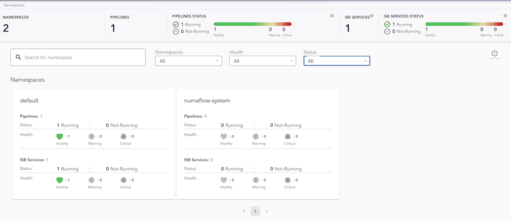
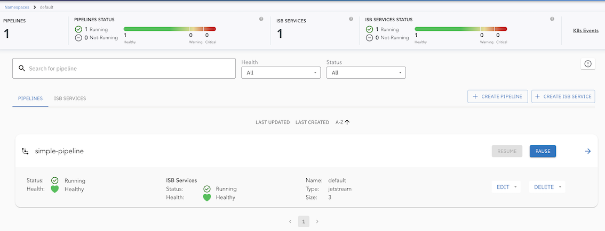
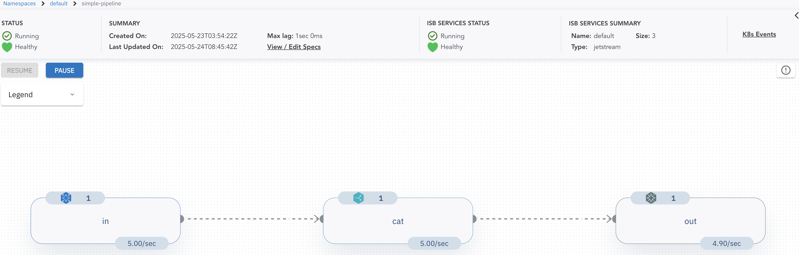
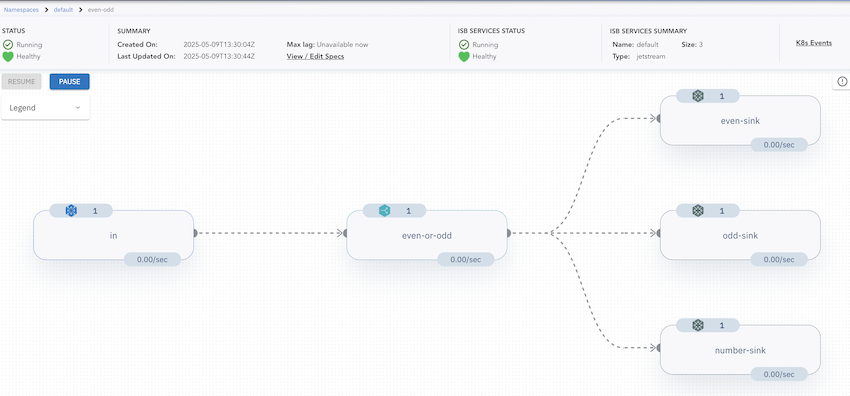
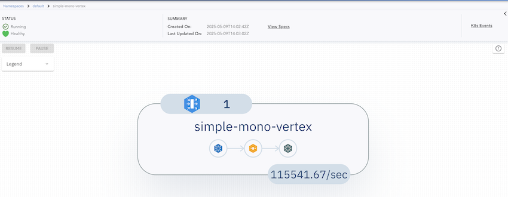

# Quick Start

This guide will walk you through the following steps:

1. [Installing Numaflow](#installing-numaflow)
2. [Creating and running a simple Numaflow Pipeline](#creating-a-simple-pipeline)
3. [Creating and running an advanced Numaflow Pipeline](#creating-an-advanced-pipeline)
4. [Creating and running a Numaflow MonoVertex](#creating-a-monovertex)

## Before You Begin: Prerequisites

To get started with Numaflow, ensure you have the following tools and setups ready:

### Container Runtime

You need a container runtime to run container images. Choose one of the following options:

- [Docker Desktop](https://docs.docker.com/get-docker/)
- [Podman](https://podman.io/)

### Local Kubernetes Cluster

Set up a local Kubernetes cluster using one of these tools:

- [Docker Desktop Kubernetes](https://docs.docker.com/desktop/kubernetes/)
- [k3d](https://k3d.io/)
- [kind](https://kind.sigs.k8s.io/)
- [minikube](https://minikube.sigs.k8s.io/docs/start/)

### Kubernetes CLI (`kubectl`)

Install `kubectl` to manage your Kubernetes cluster. Follow the [official guide](https://kubernetes.io/docs/tasks/tools/#kubectl) for installation instructions. If you're unfamiliar with `kubectl`, refer to the [kubectl Quick Reference Page](https://kubernetes.io/docs/reference/kubectl/quick-reference/) for a list of commonly used commands.

Once these prerequisites are in place, you're ready to proceed with installing and using Numaflow.

## Installing Numaflow

After completing the prerequisites, follow these steps to install Numaflow and set up the [Inter-Step Buffer Service](./core-concepts/inter-step-buffer-service.md), which facilitates communication between pipeline vertices:

### Create a namespace for Numaflow

```shell
kubectl create ns numaflow-system
```

### Install Numaflow components

```shell
kubectl apply -n numaflow-system -f https://raw.githubusercontent.com/numaproj/numaflow/main/config/install.yaml
```

### Deploy the JetStream-based Inter-Step Buffer Service

```shell
kubectl apply -f https://raw.githubusercontent.com/numaproj/numaflow/main/examples/0-isbsvc-jetstream.yaml
```

Once these steps are complete, Numaflow will be ready for use.

## Creating a Simple Pipeline

In this section, we will create a `simple pipeline` that includes a source vertex to generate messages, a processing vertex that echoes the messages, and a sink vertex to log the messages.

### Deploy the Simple Pipeline

Run the following command to deploy the simple pipeline:

```shell
kubectl apply -f https://raw.githubusercontent.com/numaproj/numaflow/main/examples/1-simple-pipeline.yaml
```

### Verify the Pipeline Deployment

To view the list of pipelines you have created, use the following command:

```shell
kubectl get pipeline # or "pl" as a short name
```

You should see an output similar to this, where `AGE` indicates the time elapsed since the pipeline was created:

```shell
NAME              PHASE     VERTICES   AGE   MESSAGE
simple-pipeline   Running   3          47s
```

Next, inspect the status of the pipeline by checking the pods. Note that the pod names in your environment may differ from the example below:

```shell
# Wait for pods to be ready
kubectl get pods

NAME                                         READY   STATUS      RESTARTS       AGE
isbsvc-default-js-0                          3/3     Running        0           4m9s
isbsvc-default-js-1                          3/3     Running        0           4m9s
isbsvc-default-js-2                          3/3     Running        0           4m9s
simple-pipeline-cat-0-xjqbe                  3/3     Running        0           99s
simple-pipeline-daemon-784d5cfd97-vpsmk      1/1     Running        0           99s
simple-pipeline-in-0-vvhu1                   2/2     Running        0           100s
simple-pipeline-out-0-y1z8e                  2/2     Running        0           99s
```

### View Logs for the Output Vertex

To monitor the logs for the `output` vertex, run the following command. Replace `xxxxx` with the appropriate pod name from the output above:

```shell
kubectl logs -f simple-pipeline-out-0-xxxxx
```

You should see logs similar to the following:

```shell
2025/05/09 11:23:38 (out)  Payload -  {"Data":{"value":1746789818182898304},"Createdts":1746789818182898304}  Keys -  [key-0-0]  EventTime -  1746789818182  Headers -    ID -  cat-1526-0-0
2025/05/09 11:23:38 (out)  Payload -  {"Data":{"value":1746789818182898304},"Createdts":1746789818182898304}  Keys -  [key-0-0]  EventTime -  1746789818182  Headers -    ID -  cat-1529-0-0
2025/05/09 11:23:38 (out)  Payload -  {"Data":{"value":1746789818182898304},"Createdts":1746789818182898304}  Keys -  [key-0-0]  EventTime -  1746789818182  Headers -    ID -  cat-1528-0-0
```

### Access the Numaflow UI

Numaflow includes a built-in user interface for monitoring pipelines. If your local Kubernetes cluster does not include a metrics server by default (e.g., Kind), install it using the following commands:

```shell
kubectl apply -f https://github.com/kubernetes-sigs/metrics-server/releases/latest/download/components.yaml
kubectl patch -n kube-system deployment metrics-server --type=json -p '[{"op":"add","path":"/spec/template/spec/containers/0/args/-","value":"--kubelet-insecure-tls"}]'
```

To access the UI, port-forward the Numaflow server:

```shell
kubectl -n numaflow-system port-forward deployment/numaflow-server 8443:8443
```

Visit https://localhost:8443/ to view the UI. Below is the UI for the `simple` pipeline:

#### Cluster View



#### Default Namespace View



#### Simple Pipeline View



> **Note**: For more details about the UI features and built-in debugging tools, check out the [UI section](./user-guide/UI/).

### Deleting Pipeline

To delete the simple pipeline, run the following command:

```shell
kubectl delete -f https://raw.githubusercontent.com/numaproj/numaflow/main/examples/1-simple-pipeline.yaml
```

## Creating an Advanced Pipeline

Now we will walk you through creating an advanced pipeline. In our example, this is called the `even-odd` pipeline, illustrated by the following diagram:


There are five vertices in this example of an advanced pipeline. An [HTTP](./user-guide/sources/http.md) source vertex which serves an HTTP endpoint to receive numbers as source data, a [UDF](user-guide/user-defined-functions/map/map.md) vertex to tag the ingested numbers with the key `even` or `odd`, three [Log](./user-guide/sinks/log.md) sinks, one to print the `even` numbers, one to print the `odd` numbers, and the other one to print both the even and odd numbers.

### Deploying the `even-odd` Pipeline

To deploy the `even-odd` pipeline, run the following command:

```shell
kubectl apply -f https://raw.githubusercontent.com/numaproj/numaflow/main/examples/2-even-odd-pipeline.yaml
```

You can check the list of pipelines you have created so far using:

```shell
kubectl get pipeline # or "pl" as a short name
```

```shell
NAME       PHASE     VERTICES   AGE   MESSAGE
even-odd   Running   5          51s
```

Otherwise, proceed to inspect the status of the pipeline by checking the pods:

```shell
# Wait for pods to be ready
kubectl get pods

NAME                               READY   STATUS    RESTARTS   AGE
even-odd-daemon-75cdcd5f4c-nmrrp   1/1     Running   0          95s
even-odd-even-or-odd-0-i72hw       3/3     Running   0          95s
even-odd-even-sink-0-gnhou         2/2     Running   0          95s
even-odd-in-0-tvfef                2/2     Running   0          95s
even-odd-number-sink-0-3s3nc       2/2     Running   0          95s
even-odd-odd-sink-0-zktib          2/2     Running   0          95s
isbsvc-default-js-0                3/3     Running   0          15m
isbsvc-default-js-1                3/3     Running   0          15m
isbsvc-default-js-2                3/3     Running   0          15m
```

### Sending Data to the Pipeline

Port-forward the HTTP endpoint of the source vertex and send data using `curl`. Replace `xxxxx` with the appropriate pod name:

```shell
kubectl port-forward even-odd-in-0-xxxxx 8444:8443

# Send data to the HTTP endpoint
curl -kq -X POST -d "101" https://localhost:8444/vertices/in
curl -kq -X POST -d "102" https://localhost:8444/vertices/in
curl -kq -X POST -d "103" https://localhost:8444/vertices/in
curl -kq -X POST -d "104" https://localhost:8444/vertices/in
```

### Viewing Logs for the `even` and `odd` Vertices

Monitor the logs for the `even` and `odd` vertices to verify the pipeline's functionality. Replace `xxxxx` with the appropriate pod names:

```shell
# Logs for the even vertex
kubectl logs -f even-odd-even-sink-0-xxxxx

2025/05/09 13:34:26 (even-sink)  Payload -  104  Keys -  [even]  EventTime -  1746797665477  Headers -  Content-Length: 3, Content-Type: application/x-www-form-urlencoded, User-Agent: curl/8.7.1, Accept: */*,   ID -  even-or-odd-1-0-0
2025/05/09 13:34:26 (even-sink)  Payload -  102  Keys -  [even]  EventTime -  1746797665430  Headers -  Content-Type: application/x-www-form-urlencoded, User-Agent: curl/8.7.1, Accept: */*, Content-Length: 3,   ID -  even-or-odd-2-0-0

# Logs for the odd vertex
kubectl logs -f even-odd-odd-sink-0-xxxxx


2025/05/09 13:34:26 (odd-sink)  Payload -  101  Keys -  [odd]  EventTime -  1746797665407  Headers -  Content-Length: 3, Content-Type: application/x-www-form-urlencoded, User-Agent: curl/8.7.1, Accept: */*,   ID -  even-or-odd-4-0-0
2025/05/09 13:34:26 (odd-sink)  Payload -  103  Keys -  [odd]  EventTime -  1746797665452  Headers -  Content-Length: 3, Content-Type: application/x-www-form-urlencoded, User-Agent: curl/8.7.1, Accept: */*,   ID -  even-or-odd-3-0-0
```

### Accessing the Numaflow UI

To visualize the pipeline, access the Numaflow UI at https://localhost:8443/ after port forwarding. Below is the UI for the `even-odd` pipeline:



### Deleting the Pipeline

To delete the `even-odd` pipeline, run:

```shell
kubectl delete -f https://raw.githubusercontent.com/numaproj/numaflow/main/examples/2-even-odd-pipeline.yaml
```

### Additional Notes

The source code for the `even-odd` [user-defined function](user-guide/user-defined-functions/user-defined-functions.md) is available [here](https://github.com/numaproj/numaflow-go/tree/main/examples/mapper/even_odd). You can also replace the [Log](./user-guide/sinks/log.md) Sink with other sinks, such as [Kafka](./user-guide/sinks/kafka.md), to forward data to Kafka topics.

## Creating a MonoVertex

This section demonstrates how to create and deploy a simple [MonoVertex](core-concepts/monovertex.md) that includes a [User-Defined Source (UDSource)](user-guide/sources/user-defined-sources.md), a [Transformer](user-guide/sources/transformer/overview.md), and a [User-Defined Sink (UDSink)](user-guide/sinks/user-defined-sinks.md). The sink in this example is a log sink.

### Deploying the MonoVertex

To deploy the MonoVertex, run the following command:

```shell
kubectl apply -f https://raw.githubusercontent.com/numaproj/numaflow/main/examples/21-simple-mono-vertex.yaml
```

### Verifying the Deployment

Check the list of deployed MonoVertices using:

```shell
kubectl get monovertex # or "mvtx" as a short name
```

You should see an output similar to this:

```shell
NAME                 PHASE     DESIRED   CURRENT   READY   AGE   REASON   MESSAGE
simple-mono-vertex   Running   1         1         1       38s
```

Inspect the status of the MonoVertex by listing the pods. Replace `xxxxx` with the appropriate pod name from your environment:

```shell
# Wait for pods to be ready
kubectl get pods

NAME                                           READY   STATUS    RESTARTS   AGE
simple-mono-vertex-mv-0-w7fmq                  5/5     Running   0          2m30s
simple-mono-vertex-mv-daemon-55bff65db5-mk4g2  1/1     Running   0          2m30s
```

### Viewing Pod Details

To ensure all containers (monitor, udsource, transformer, udsink, and numa) are running, describe the MonoVertex pod:

```shell
kubectl describe pod simple-mono-vertex-mv-0-xxxxx
```

### Monitoring Logs for the Sink Container

To view logs from the `udsink` container, use the following command. Replace `xxxxx` with the appropriate pod name:

```shell
kubectl logs -f simple-mono-vertex-mv-0-xxxxx -c udsink
```

You should see output similar to:

```shell
107705990
107705991
107705992
107705993
107705994
107705995
107705996
107705997
107705998
107705999
```

### Accessing the Numaflow UI

To visualize the MonoVertex, access the Numaflow UI by port-forwarding the Numaflow server:

```shell
kubectl -n numaflow-system port-forward deployment/numaflow-server 8443:8443
```

Visit https://localhost:8443/ to view the UI. Below is an example of the UI for the MonoVertex:



For more details about the UI features and debugging tools, refer to the UI section.(TODO: add UI section link)

### Deleting the MonoVertex

To delete the MonoVertex, run:

```shell
kubectl delete -f https://raw.githubusercontent.com/numaproj/numaflow/main/examples/21-simple-mono-vertex.yaml
```

### Additional Notes

The source code for the user-defined functions used in this MonoVertex is available here:

- [UDSource](https://github.com/numaproj/numaflow-rs/blob/main/examples/simple-source/src/main.rs)
- [Transformer](https://github.com/numaproj/numaflow-rs/blob/main/examples/source-transformer-now/src/main.rs)
- [UDSink](https://github.com/numaproj/numaflow-rs/blob/main/examples/sink-log/src/main.rs)

## A pipeline with reduce (aggregation)

To set up an example pipeline with the [Reduce UDF](user-guide/user-defined-functions/reduce/reduce.md), see [Reduce Examples](user-guide/user-defined-functions/reduce/examples.md).

## What's Next

Try more examples in the [`examples`](https://github.com/numaproj/numaflow/tree/main/examples) directory.

After exploring how Numaflow pipelines run, you can check what data [Sources](./user-guide/sources/generator.md)
and [Sinks](./user-guide/sinks/kafka.md) Numaflow supports out of the box, or learn how to write
[User-defined Functions](user-guide/user-defined-functions/user-defined-functions.md).

Numaflow can also be paired with Numalogic, a collection of ML models and algorithms for real-time data analytics and AIOps including anomaly detection. Visit the [Numalogic homepage](https://numalogic.numaproj.io/) for more information.
