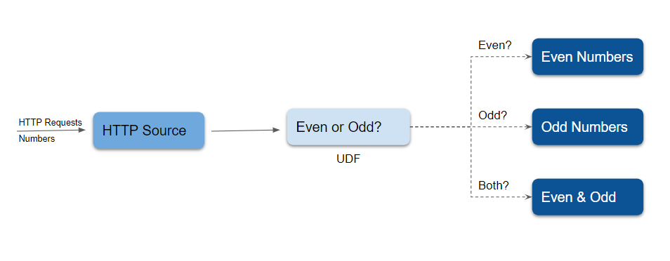

# Quick Start

In this page, we will guide you through the steps to:  
1. Install Numaflow.  
2. Create and run a simple pipeline.  
3. Create and run an advanced pipeline.

## Before you begin: prerequisites

To try Numaflow, you will first need to setup using one of the following options to run container images:
- [Docker Desktop](https://docs.docker.com/get-docker/)
- [podman](https://podman.io/)

Then use one of the following options to create a local Kubernete Cluster:
- [Docker Desktop Kubernetes](https://docs.docker.com/desktop/kubernetes/)
- [k3d](https://k3d.io/)
- [kind](https://kind.sigs.k8s.io/)
- [minikube](https://minikube.sigs.k8s.io/docs/start/)

You will also need `kubectl` to manage the cluster. [Follow these steps to install kubectl](https://kubernetes.io/docs/tasks/tools/install-kubectl/). In case you need a refresher, all the `kubectl` commands used in this quick start guide can be found in the [kubectl Cheat Sheet](https://kubernetes.io/docs/reference/kubectl/cheatsheet/).

## Installing Numaflow

Once you have completed all the prerequisites, run the following command lines to install Numaflow and start the [Inter-Step Buffer Service](./core-concepts/inter-step-buffer-service.md) that handles communication between vertices.

```shell
kubectl create ns numaflow-system
kubectl apply -n numaflow-system -f https://raw.githubusercontent.com/numaproj/numaflow/stable/config/install.yaml
kubectl apply -f https://raw.githubusercontent.com/numaproj/numaflow/stable/examples/0-isbsvc-jetstream.yaml
```

## Creating a simple pipeline

As an example, we will create a `simple pipeline` that contains a source vertex to generate messages, a processing vertex that echos the messages, and a sink vertex that logs the messages. 

Run the command below to create a simple pipeline.

```shell
kubectl apply -f https://raw.githubusercontent.com/numaproj/numaflow/stable/examples/1-simple-pipeline.yaml
```
To view a list of pipelines you've created, run:  
```shell
kubectl get pipeline # or "pl" as a short name
```

This should create a response like the following, with `AGE` indicating the time elapsed since the creation of your simple pipeline.
```shell
NAME              PHASE     MESSAGE   VERTICES   AGE
simple-pipeline   Running             3          9s
```

To inspect the status of the pipeline, use `kubectl get pods`. Note that the pod names will be different from the sample response: 
```shell
# Wait for pods to be ready
kubectl get pods

NAME                                         READY   STATUS      RESTARTS   AGE
isbsvc-default-js-0                          3/3     Running     0          19s
isbsvc-default-js-1                          3/3     Running     0          19s
isbsvc-default-js-2                          3/3     Running     0          19s
simple-pipeline-daemon-78b798fb98-qf4t4      1/1     Running     0          10s
simple-pipeline-out-0-xc0pf                  1/1     Running     0          10s
simple-pipeline-cat-0-kqrhy                  2/2     Running     0          10s
simple-pipeline-in-0-rhpjm                   1/1     Running     0          11s
```

Now you can watch the log for the `output` vertex. Run the command below and remember to replace `xxxxx` with the appropriate pod name above. 
```shell
kubectl logs -f simple-pipeline-out-0-xxxxx
```
This should generate an output like the sample below:
```shell
2022/08/25 23:59:38 (out) {"Data":"VT+G+/W7Dhc=","Createdts":1661471977707552597}
2022/08/25 23:59:38 (out) {"Data":"0TaH+/W7Dhc=","Createdts":1661471977707615953}
2022/08/25 23:59:38 (out) {"Data":"EEGH+/W7Dhc=","Createdts":1661471977707618576}
2022/08/25 23:59:38 (out) {"Data":"WESH+/W7Dhc=","Createdts":1661471977707619416}
2022/08/25 23:59:38 (out) {"Data":"YEaH+/W7Dhc=","Createdts":1661471977707619936}
2022/08/25 23:59:39 (out) {"Data":"qfomN/a7Dhc=","Createdts":1661471978707942057}
2022/08/25 23:59:39 (out) {"Data":"aUcnN/a7Dhc=","Createdts":1661471978707961705}
2022/08/25 23:59:39 (out) {"Data":"iUonN/a7Dhc=","Createdts":1661471978707962505}
2022/08/25 23:59:39 (out) {"Data":"mkwnN/a7Dhc=","Createdts":1661471978707963034}
2022/08/25 23:59:39 (out) {"Data":"jk4nN/a7Dhc=","Createdts":1661471978707963534}
```

Numaflow also comes with a built-in user interface. To port forward the UI,  run the following command.

```shell
# Port forward the UI to https://localhost:8443/
kubectl -n numaflow-system port-forward deployment/numaflow-server 8443:8443
```
This renders the following UI on https://localhost:8443/.


The pipeline can be deleted by issuing the following command:

```shell
kubectl delete -f https://raw.githubusercontent.com/numaproj/numaflow/stable/examples/1-simple-pipeline.yaml
```

## Creating an advanced pipeline

Now we will walk you through creating an advanced pipeline. In our example, this is called the `even-odd` pipeline, illustrated by the following diagram:



There are five vertices in this example of an advanced pipeline. An [HTTP](./user-guide/sources/http.md) source vertex which serves an HTTP endpoint to receive numbers as source data, a [UDF](user-guide/user-defined-functions/map/map.md) vertex to tag the ingested numbers with the key `even` or `odd`, three [Log](./user-guide/sinks/log.md) sinks, one to print the `even` numbers, one to print the `odd` numbers, and the other one to print both the even and odd numbers.


Run the following command to create the `even-odd` pipeline.

```shell
kubectl apply -f https://raw.githubusercontent.com/numaproj/numaflow/main/examples/2-even-odd-pipeline.yaml
```
You may opt to view the list of pipelines you've created so far by running `kubectl get pipeline`. Otherwise, proceed to inspect the status of the pipeline, using `kubectl get pods`.

```shell
# Wait for pods to be ready
kubectl get pods

NAME                               READY   STATUS    RESTARTS   AGE
even-odd-daemon-64d65c945d-vjs9f   1/1     Running   0          5m3s
even-odd-even-or-odd-0-pr4ze       2/2     Running   0          30s
even-odd-even-sink-0-unffo         1/1     Running   0          22s
even-odd-in-0-a7iyd                1/1     Running   0          5m3s
even-odd-number-sink-0-zmg2p       1/1     Running   0          7s
even-odd-odd-sink-0-2736r          1/1     Running   0          15s
isbsvc-default-js-0                3/3     Running   0          10m
isbsvc-default-js-1                3/3     Running   0          10m
isbsvc-default-js-2                3/3     Running   0          10m
```

Next, port-forward the HTTP endpoint, and make a `POST` request using `curl`. Remember to replace `xxxxx` with the appropriate pod names both here and in the next step.
```shell
kubectl port-forward even-odd-in-0-xxxx 8444:8443

# Post data to the HTTP endpoint
curl -kq -X POST -d "101" https://localhost:8444/vertices/in
curl -kq -X POST -d "102" https://localhost:8444/vertices/in
curl -kq -X POST -d "103" https://localhost:8444/vertices/in
curl -kq -X POST -d "104" https://localhost:8444/vertices/in
```

Now you can watch the log for the `even` and `odd` vertices by running the commands below. 

```shell
# Watch the log for the even vertex
kubectl logs -f even-odd-even-sink-0-xxxxx
2022/09/07 22:29:40 (even-sink) 102
2022/09/07 22:29:40 (even-sink) 104

# Watch the log for the odd vertex
kubectl logs -f even-odd-odd-sink-0-xxxxx
2022/09/07 22:30:19 (odd-sink) 101
2022/09/07 22:30:19 (odd-sink) 103
```

View the UI for the advanced pipeline at https://localhost:8443/.


The source code of the `even-odd` [User Defined Function](user-guide/user-defined-functions/user-defined-functions.md) can be found [here](https://github.com/numaproj/numaflow-go/tree/main/pkg/mapper/examples/even_odd). You also can replace the [Log](./user-guide/sinks/log.md) Sink with some other sinks like [Kafka](./user-guide/sinks/kafka.md) to forward the data to Kafka topics.

The pipeline can be deleted by

```shell
kubectl delete -f https://raw.githubusercontent.com/numaproj/numaflow/main/examples/2-even-odd-pipeline.yaml
```

## A pipeline with reduce (aggregation)

To set up an example pipeline with the [Reduce UDF](user-guide/user-defined-functions/reduce/reduce.md), see [Reduce Examples](user-guide/user-defined-functions/reduce/examples.md).

## What's Next

Try more examples in the [`examples`](https://github.com/numaproj/numaflow/tree/main/examples) directory.

After exploring how Numaflow pipelines run, you can check what data [Sources](./user-guide/sources/generator.md) 
and [Sinks](./user-guide/sinks/kafka.md) Numaflow supports out of the box, or learn how to write 
[User Defined Functions](user-guide/user-defined-functions/user-defined-functions.md).

Numaflow can also be paired with Numalogic, a collection of ML models and algorithms for real-time data analytics and AIOps including anomaly detection. Visit the [Numalogic homepage](https://numalogic.numaproj.io/) for more information.