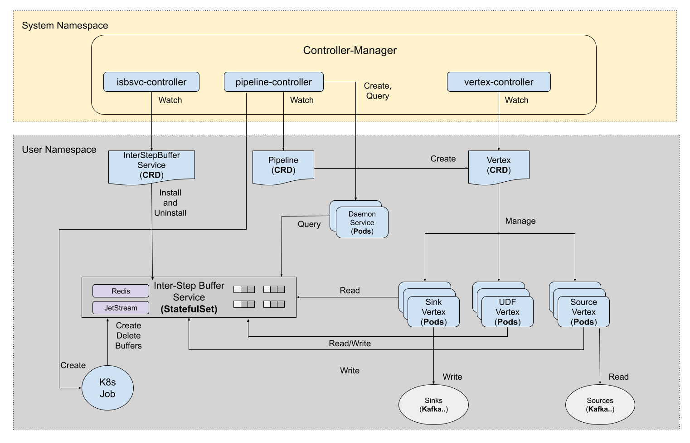

# Controllers

Currently in `Numaflow`, there are 3 CRDs introduced, each one has a corresponding controller.

- interstepbufferservices.numaflow.numaproj.io
- pipelines.numaflow.numaproj.io
- vertices.numaflow.numaproj.io

The source code of the controllers is located at `./pkg/reconciler/`.

## Inter-Step Buffer Service Controller

`Inter-Step Buffer Service Controller` is used to watch `InterStepBufferService` object, and manage generated resources.

## Pipeline Controller

Pipeline Controller is used to watch `Pipeline` objects, it does following major things when there's a pipeline object created.

- Spawn a Kubernetes Job to create [buffers and buckets](./edges-buffers-buckets.md) in the [Inter-Step Buffer Services](../core-concepts/inter-step-buffer-service.md).
- Create `Vertex` objects according to `.spec.vertices` defined in `Pipeline` object.
- Create some other Kubernetes objects used for the Pipeline, such as a Deployment and a Service for daemon service application.

## Vertex Controller

Vertex controller watches the `Vertex` objects, based on the replica defined in the spec, creates a number of pods to run the workloads.
