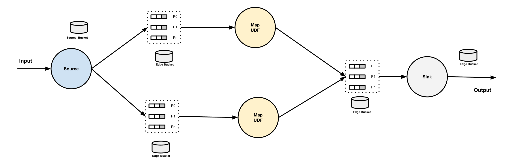
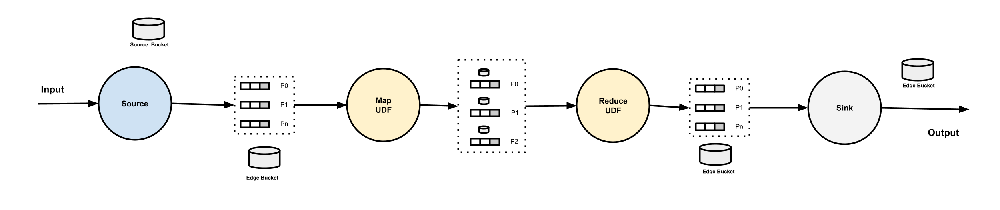

# Edges, Buffers and Buckets

> This document describes the concepts of `Edge`, `Buffer` and `Bucket` in a pipeline.

## Edges

`Edge` is the connection between the vertices, specifically, `edge` is defined in the pipeline spec under `.spec.edges`. No matter if the `to` vertex is a Map, or a Reduce with multiple partitions, it is considered as one edge.

In the following pipeline, there are 3 edges defined (`in` - `aoti`, `aoti` - `compute-sum`, `compute-sum` - `out`).

```yaml
apiVersion: numaflow.numaproj.io/v1alpha1
kind: Pipeline
metadata:
  name: even-odd-sum
spec:
  vertices:
    - name: in
      source:
        http: {}
    - name: atoi
      scale:
        min: 1
      udf:
        container:
          image: quay.io/numaio/numaflow-go/map-even-odd:v0.5.0
    - name: compute-sum
      partitions: 2
      udf:
        container:
          image: quay.io/numaio/numaflow-go/reduce-sum:v0.5.0
        groupBy:
          window:
            fixed:
              length: 60s
          keyed: true
    - name: out
      scale:
        min: 1
      sink:
        log: {}
  edges:
    - from: in
      to: atoi
    - from: atoi
      to: compute-sum
    - from: compute-sum
      to: out
```

Each `edge` could have a name for internal usage, the naming convention is `{pipeline-name}-{from-vertex-name}-{to-vertex-name}`.

## Buffers

`Buffer` is `InterStepBuffer`. Each buffer has an owner, which is the vertex who reads from it. Each `udf` and `sink` vertex in a pipeline owns a group of partitioned buffers. Each buffer has a name with the naming convention `{pipeline-name}-{vertex-name}-{index}`, where the `index` is the partition index, starting from 0. This naming convention applies to the buffers of both map and reduce udf vertices.

When multiple vertices connecting to the same vertex, if the `to` vertex is a Map, the data from all the from vertices will be forwarded to the group of partitoned buffers round-robinly. If the `to` vertex is a Reduce, the data from all the from vertices will be forwarded to the group of partitioned buffers based on the partitioning key.

A Source vertex does not have any owned buffers. But a pipeline may have multiple Source vertices, followed by one vertex. Same as above, if the following vertex is a map, the data from all the Source vertices will be forwarded to the group of partitioned buffers round-robinly. If it is a reduce, the data from all the Source vertices will be forwarded to the group of partitioned buffers based on the partitioning key.

## Buckets

`Bucket` is a K/V store (or a pair of stores) used for watermark propagation.

There are 3 types of buckets in a pipeline:

- `Edge Bucket`: Each edge has a bucket, used for edge watermark propagation, no matter if the vertex that the edge leads to is a Map or a Reduce. The naming convention of an edge bucket is `{pipeline-name}-{from-vertex-name}-{to-vertex-name}`.
- `Source Bucket`: Each Source vertex has a source bucket, used for source watermark propagation. The naming convention of a source bucket is `{pipeline-name}-{vertex-name}-SOURCE`.
- `Sink Bucket`: Sitting on the right side of a Sink vertex, used for sink watermark. The naming convention of a sink bucket is `{pipeline-name}-{vertex-name}-SINK`.

## Diagrams

**Map**


**Reduce**

