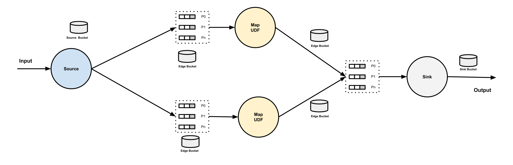
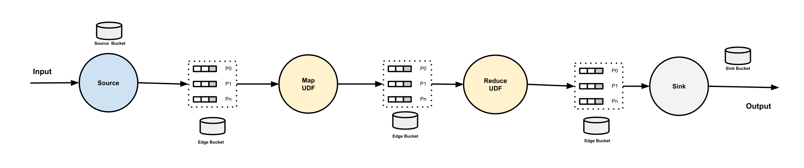

# Edges, Buffers and Buckets

## Edges

`Edge` is the connection between the vertices, specifically, `edge` is defined in the pipeline spec under `.spec.edges`. No matter the to vertex is a map, or a reduce with multiple partitions, it is considered as one edge.

In the following pipeline , there are 3 edges defined (`in` - `aoti`, `aoti` - `compute-sum`, `compute-sum` - `sink`).

```yaml
apiVersion: numaflow.numaproj.io/v1alpha1
kind: Pipeline
metadata:
  name: even-odd-sum
spec:
  vertices:
    - name: in
      source:
        http: {}
    - name: atoi
      scale:
        min: 1
      udf:
        container:
          image: quay.io/numaio/numaflow-go/map-even-odd
    - name: compute-sum
      udf:
        container:
          image: quay.io/numaio/numaflow-go/reduce-sum
        groupBy:
          window:
            fixed:
              length: 60s
          keyed: true
    - name: sink
      scale:
        min: 1
      sink:
        log: {}
  edges:
    - from: in
      to: atoi
    - from: atoi
      to: compute-sum
      parallelism: 2
    - from: compute-sum
      to: sink
```

Each `edge` could have a name for internal usage, the naming convention is `{pipeline-name}-{from-vertex-name}-{to-vertex-name}`.

## Buffers

`Buffer` is `InterStepBuffer`. Each buffer has an owner, which is the vertex who reads from it. Each `udf` and `sink` vertex in a pipeline owns a group of partitioned buffers. Each buffer has a name with the naming convention `{pipeline-name}-{vertex-name}-{index}`, where the `index` is the partition index, starting from 0. This naming convention applies to the buffers of both map and reduce udf vertices.

When multiple vertices connecting to the same vertex, if the to vertex is a map, the data from all the from vertices will be forwarded to the group of partitoned buffers round-robinly. If the to vertex is a reduce, the data from all the from vertices will be forwarded to the group of partitoned buffers based on the partitioning key.

A source vertex does not have any owned buffers. But a pipeline may have multiple source vertices, followed by one vertex. Same as above, if the following vertex is a map, the data from all the source vertices will be forwarded to the group of partitoned buffers round-robinly. If it is a reduce, the data from all the source vertices will be forwarded to the group of partitoned buffers based on the partitioning key.

## Buckets

`Bucket` is a K/V store (or a pair of stores) used for watermark propagation.

There are 3 types of buckets in a pipeline:

- `Edge Bucket`: used for edge watermark propagation. For Map vertices or Sink vertices, each of them has one bucket; for Reduce vertices, each of them has N buckets, where N is the partitions.
- `Source Bucket`: used for source watermark propagation.
- `Sink Bucket`: sitting on the right side of a sink vertex, used for sink watermark.

## Diagrams

**Map**


**Reduce**

