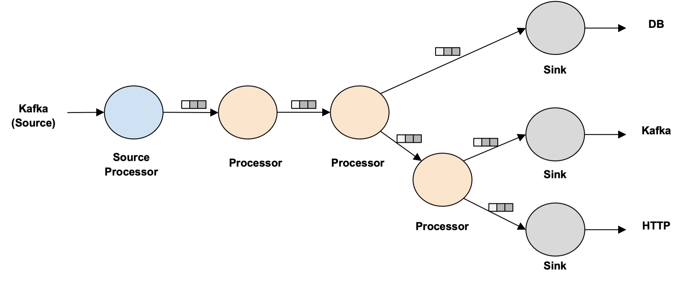
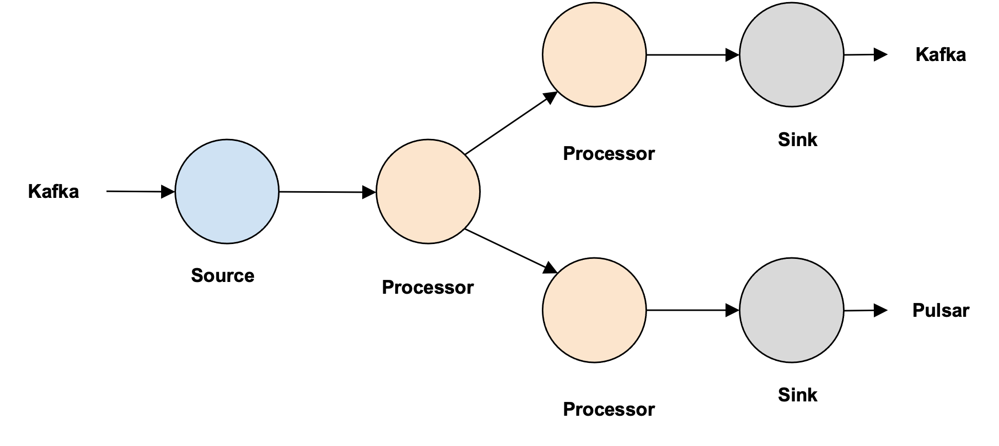
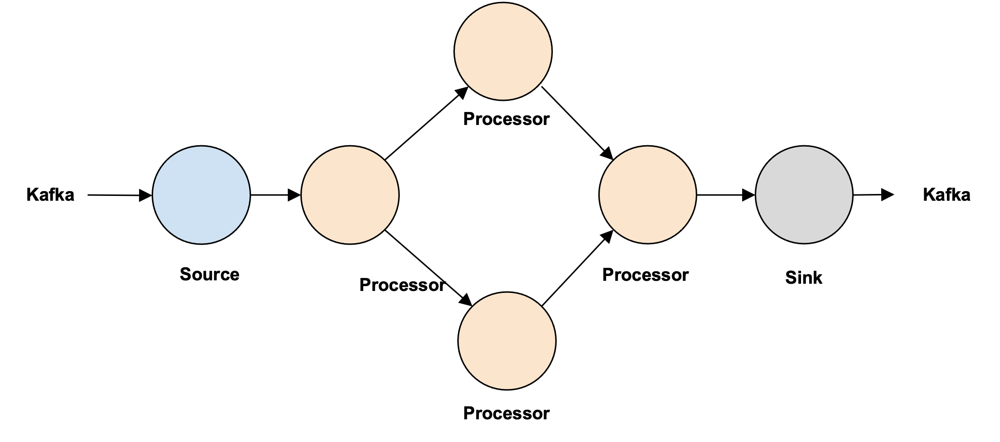
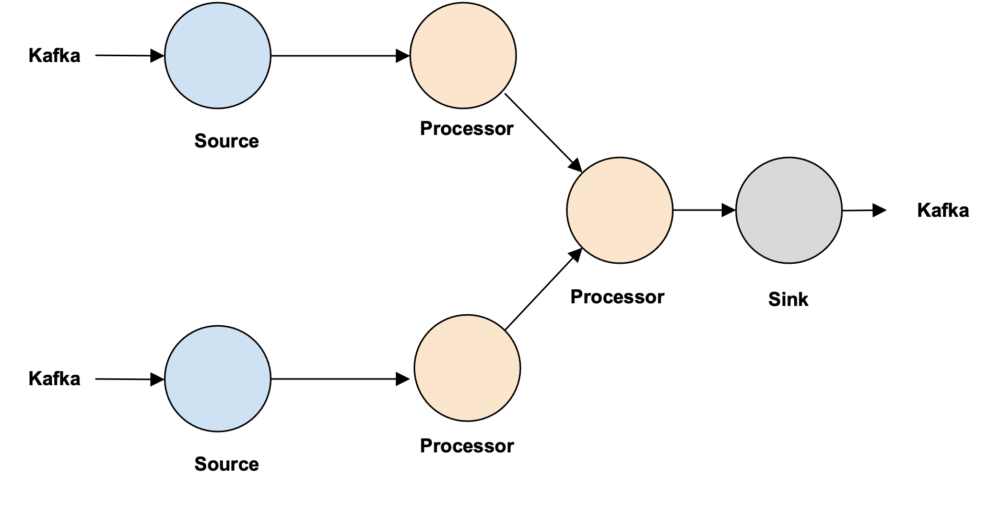
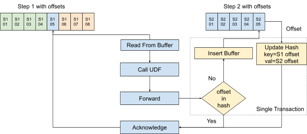
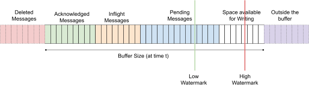

# Numaflow Dataplane High-Level Architecture

## Synopsis

- Numaflow allows developers without any special knowledge of data/stream
 processing to easily create massively parallel data/stream processing jobs 
 using a programming language of their choice, with just basic knowledge of Kubernetes.

- Reliable data processing is highly desirable and exactly-once
  semantics is often required by many data processing applications.
  This document describes the use cases, requirements, and design
  for providing exactly-once semantics with Numaflow.

Use Cases

- Continuous stream processing for unbounded streams.

- Efficient batch processing for bounded streams and data sets.

## Definitions

**Pipeline**

A pipeline contains multiple processors, which include source
processors, data processors, and sink processors. These processors are
not connected directly, but through **inter-step buffers**.



**Source**

The actual source for the data (not a step in the Numaflow).

**Sink**

The actual sink for the data (not a step in the Numaflow).

**Inter-Step Buffers**

Inter-step buffers are used to connect processors and they should
support the following

1.  Durability
1.  Support offsets
1.  Support transactions for Exactly-Once forwarding
1.  Concurrent operations (reader group)
1.  Ability to explicitly ack each data/offset
1.  Claim pending messages (read but never acknowledged)
1.  Ability to trim (buffer size controls)
1.  Fast (high throughput and low latency)
1.  Ability to query buffer information (observability)

**Source Processors**

Source processors are the initial processors that ingest data into the
Numaflow. They sit in front of the first data processor, ingest the data
from the data source, and forward to inter-step buffers.

Logic:

1.  Read data from the data source;
1.  Write to the inter-step buffer;
1.  Ack the data in the data source.

**Data Processors**

The data processors execute idempotent user-defined functions and will
be sandwiched between source and sink processors. There could be one or
more data processors.

A data processor only reads from one upstream buffer, but it might write
to multiple downstream buffers.

Logic:

1.  Read data from the upstream inter-step buffer;
1.  Process data;
1.  Write to downstream inter-step buffers;
1.  Ack the data in the upstream buffer.

**Sink Processors**

Sink processors are the final processors used to write processed data to
sinks.

A sink processor only reads from one upstream buffer and writes to a
single sink.

Logic:

1.  Read data from the upstream inter-step buffer;
1.  Write to the sink;
1.  Ack the data in the upstream buffer.

**UDF (User-defined Function)**

- Use-defined Functions run in data processors.
- UDFs implements a unified interface to process data.
- UDFs are typically implemented by end-users, but there will be some
  built-in functions that can be used without writing any code.
- UDFs can be implemented in different languages, a pseudo-interface
  might look like the below, where the function signatures include
  step context and input payload and returns a result. The Result
  contains the processed data as well as optional labels that will
  be exposed to the DSL to do complex conditional forwarding.
  `Process(key, message, context) (result, err)`
- UDFs should only focus on user logic, buffer message reading and
  writing should not be handled by this function.
- UDFs should be idempotent.

**Matrix of Operations**

|                | Source           | Processor    | Sink          |
|----------------|------------------|--------------|---------------|
| ReadFromBuffer | Read From Source | Generic      | Generic       |
| CallUDF        | Void             | User Defined | Void          |
| Forward        | Generic          | Generic      | Write To Sink |
| Ack            | Ack Source       | Generic      | Generic       |

## Requirements

- Exactly once semantics from the source processor to the sink processor.
- Be able to support a variety of data buffering technologies.
- Numaflow is restartable if aborted or steps fail while preserving
  exactly-once semantics.
- Do not generate more output than can be used by the next stage in a
  reasonable amount of time, i.e., the size of buffers between steps
  should be limited, (aka backpressure).
- User code should be isolated from offset management, restart, exactly once, backpressure, etc.
- Streaming process systems inherently require a concept of time, this
  time will be either derived from the Source (LOG_APPEND_TIME in
  Kafka, etc.) or will be inserted at ingestion time if the source
  doesn't provide it.
- Every processor is connected by an inter-step buffer.
- Source processors add a "header" to each "item" received from the
  source in order to:
  - Uniquely identify the item for implementing exactly-once
  - Uniquely identify the source of the message.
- Sink processors should avoid writing output for the same input when possible.
- Numaflow should support the following types of flows:
  - Line
    
  - Tree
    
  - Diamond (In Future)
    
  - Multiple Sources with the same schema (In Future)
    

## Non-Requirements

- Support for non-idempotent data processors (UDFs?)
  - Distributed transactions/checkpoints are not needed

## Open Issues

- None

## Closed Issues

- In order to be able to support various buffering technologies, we
  will persist and manage stream "offsets" rather than relying on
  the buffering technology (e.g., Kafka)
- Each processor may persist state associated with their processing
  no distributed transactions are needed for checkpointing
- If we have a tree DAG, how will we manage acknowledgments? We
  will use back-pressure and exactly-once schematics on the buffer
  to solve it.
- How/where will offsets be persisted? Buffer will have a "lookup -
  insert - update" as a txn
- What will be used to implement the inter-step buffers between
  processors? The interface is abstracted out, but internally we
  will use Redis Streams (supports streams, hash, txn)

## Design Details

### Duplicates

Numaflow (like any other stream processing engine) at its core has

```
Read -> Process -> Forward -> Acknowledge
```

loop for every message it has to
process. Given that the user-defined process is idempotent, there are
two failure mode scenarios where there could be duplicates.

- The message has been forwarded but the information failed to reach
  back (we do not know whether we really have successfully forwarded
  the message). A retry on forwarding again could lead to
  duplication.
- Acknowledgment has been sent back to the source buffer, but we do
  not know whether we have really acknowledged the successful
  processing of the message. A retry on reading could end up in
  duplications (both in processing and forwarding, but we need to
  worry only about forwarding because processing is idempotent).

To detect duplicates, make sure the delivery is Exactly-Once:

1. A unique and immutable identifier for the message from the upstream
   buffer will be used as the key of the data in the downstream buffer
2. Best effort of the transactional commit.

   1. Data processors make transactional commits for data forwarding
      to the next buffer, and upstream buffer acknowledgment.

   2. Source processors have no way to do similar transactional
      operations for data source message acknowledgment and message
      forwarding, but #1 will make sure there's no duplicate after
      retrying in case of failure.
   3. Sink processors can not do transactional operations unless
      there's a contract between Numaflow and the sink, which is out
      of the scope of this doc. We will rely on the sink to
      implement this (eg, "enable.idempotent" in Kafka producer).

### Unique Identifier for Message

To detect duplicates, we first need to uniquely identify each message.
We will be relying on the "identifier" available (e.g., "offset" in Kafka)
in the buffer to uniquely identify each message. If such an identifier
is not available, we will be creating a unique identifier (sequence
numbers are tough because there are multiple readers). We can use this
unique identifier to ensure that we forward only if the message has not
been forwarded yet. We will only look back for a fixed window of time
since this is a stream processing application on an unbounded stream of
data, and we do not have infinite resources.

The same offset will not be used across all the steps in Numaflow, but
we will be using the current offset only while forwarding to the next
step. Step N will use step N-1th offset to deduplicate. This requires
each step to generate an unique ID. The reason we are not sticking to
the original offset is because there will be operations in future which
will require, say aggregations, where multiple messages will be grouped
together and we will not be able to choose an offset from the original
messages because the single output is based on multiple messages.



### Restarting After a Failure

Numaflow needs to be able to recover from the failure of any step (pods)
or even the complete failure of the Numaflow while preserving
exactly-once semantics.

When a message is successfully processed by a processor, it should have
been written to the downstream buffer, and its status in the upstream
buffer becomes "Acknowledged". So when a processor restarts, it checks
if any message assigned to it in the upstream buffer is in the
"In-Flight" state, if yes, it will read and process those messages
before picking up other messages. Processing those messages follows the
flowchart above, which makes sure they will only be processed once.

### Back Pressure

The durable buffers allocated to the processors are not infinite but
have a bounded buffer. Backpressure handling in Numaflow utilizes the
buffer.

At any time t, the durable buffer should contain messages in the
following states:

- Acked messages - processed messages to be deleted
- Inflight messages - messages being handled by downstream processor
- Pending messages - messages to be read by the downstream processor



The buffer acts like a sliding window, new messages will always be
written to the right, and there's some automation to clean up the
acknowledged messages on the left. If the processor is too slow, the
pending messages will buffer up, and the space available for writing
will become limited. Every time (or periodically for better throughput)
before the upstream processor writes a message to the buffer, it checks
if there's any available space, or else it stops writing (or slows down
the processing while approaching the buffer limit). This buffer pressure
will then pass back to the beginning of the pipeline, which is the
buffer used by the source processor so that the entire flow will stop
(or slow down).
