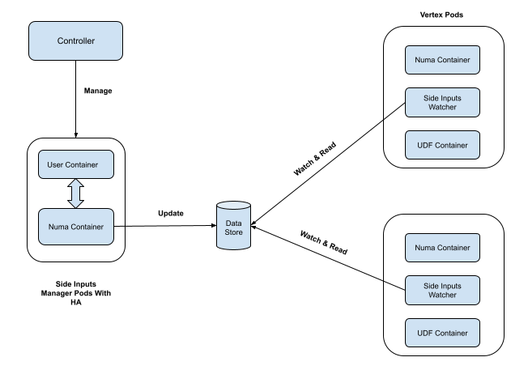
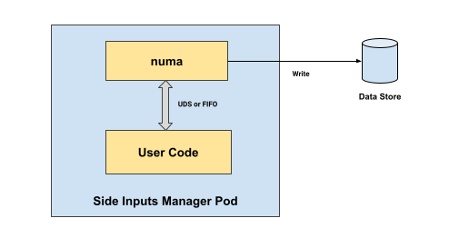
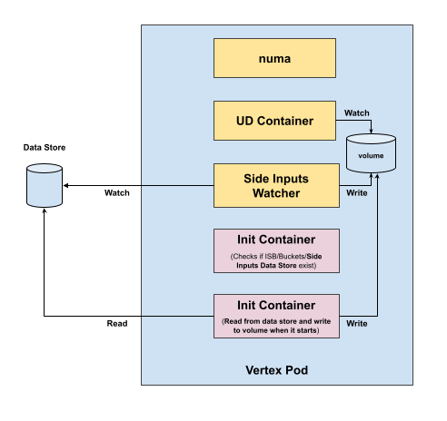

# Side Inputs

Side Inputs allow the user-defined functions (including UDF, UDSink, Transformer, etc.) to access slow updated data or configuration (such as database, file system, etc.) without needing to load it during each message processing. Side Inputs are read-only and can be used in both batch and streaming jobs.

## Requirements

- The Side Inputs should be programmable with any language.
- The Side Inputs should be updated centralized (for a pipeline), and be able to broadcast to each of the vertex pods in an efficient manner.
- The Side Inputs update could be based on a configurable interval.

## Assumptions

- Size of a Side Input data could be up to 1MB.
- The Side Inputs data is updated at a low frequency (minutes level).
- As a platform, Numaflow has no idea about the data format of the Side Inputs, instead, the pipeline owner (programmer) is responsible for parsing the data.

## Design Proposal

### Data Format

Numaflow processes the Side Inputs data as bytes array, thus there’s no data format requirement for it, the pipeline developers are supposed to parse the Side Inputs data from bytes array to any format they expect.

### Architecture

There will be the following components introduced when a pipeline has Side Inputs enabled.

- A Side Inputs Manager - a service for Side Inputs data updating.
- A Side Inputs watcher sidecar - a container enabled for each of the vertex pods to receive updated Side Inputs.
- Side Inputs data store - a data store to store the latest Side Inputs data.



### Data Store

Data store is the place where the latest retrieved Side Inputs data stays. The data is published by the Side Inputs Manager after retrieving from the Side Inputs data source, and consumed by each of the vertex Pods.

The data store implementation could be a Key/Value store in JetStream, which by default supports maximum 1MB - 64MB size data. Extended implementation could be Key/Value store + object store, which makes it possible to store large sizes of data.

Data Store management is supposed to be done by the controller, through the same Kubernetes Job to create/delete Inter-Step Buffers and Buckets.

### Side Inputs Manager

A Side Inputs Manager is a pod (or a group of pods with active-passive HA), created by the Numaflow controller, used to run cron like jobs to retrieve the Side Inputs data and save to a data store. Each Side Inputs Manager is only responsible for corresponding pipeline, and is only created when Side Inputs is enabled for the pipeline.

A pipeline may have multiple Side Inputs sources, each of them will have a Side Inputs Manger.

Each of the Side Inputs Manager pods contains:

- An init container, which checks if the data store is ready.
- A user-defined container, which runs a predefined Numaflow SDK to start a service, calling a user implemented function to get Side Input data.
- A numa container, which runs a cron like job to call the service in the user-defined container, and store the returned data in the data store.



The communication protocol between the 2 containers could be based on UDS or FIFO (TBD).

#### High Availability

Side Inputs Manager needs to run with Active-Passive HA, which requires a leader election mechanism support. Kubernetes has a native leader election API backed by etcd, but it requires extra RBAC privileges to use it.

Considering a similar leader election mechanism is needed in some other scenarios such as Active-Passive User-defined Source, a proposal is to implement our own leader election mechanism by leveraging ISB Service.

#### Why NOT CronJob?

Using Kubernetes CronJob could also achieve the cron like job orchestration, but there are few downsides.
A K8s Job has to be used together with the CronJob to solve the immediate starting problem - A CronJob can not trigger a job immediately after it’s created, it has to wait until the first trigger condition meets.
Using K8s CronJob/Job will be a [challenge](https://github.com/istio/istio/issues/6324) when ServiceMesh (Istio) is enabled.

### Vertex Pod Sidecar



When Side Inputs is enabled for a pipeline, each of its vertex pods will have a second init container added,
the init container will have a shared volume (emptyDir) mounted,
and the same volume will be mounted to the User-defined Function/Source/Sink/Transformer container.
The init container reads from the data store, and saves to the shared volume.

A sidecar container will also be injected by the controller, and it mounts the same volume as above. The sidecar runs a service provided by numaflow, watching the Side Inputs data from the data store, if there’s any update, reads the data and updates the shared volume.

In the User-defined Function/Source/Sink/Transformer container, a helper function will be provided by Numaflow SDK, to return the Side Input data. The helper function caches the Side Inputs data in the memory, but performs thread safe updates if it watches the changes in the shared volume.

### Numaflow SDK

Some new features will be added to the Numaflow SDK.

- Interface for the users to implement the Side Inputs retrievement. A pseudo interface might look like below.

  ```go
    RetrieveSideInput() ([]bytes, error)
  ```

- A main function to start the service in the Side Inputs Manager user container.
- A helper function to be used in the udf/udsink/transformer containers to get the Side Inputs, which reads, watches and caches the data from the shared volume.

  ```go
    SideInput[T any](name string, parseFunc func([]byte) (T, error)) (T, error)
  ```

### User Spec

Side Inputs support is exposed through `sideInputs` in the pipeline spec, it’s updated based on cron like schedule, specified in the pipeline spec with a `trigger` field.

```yaml
apiVersion: numaflow.numaproj.io/v1alpha1
kind: Pipeline
metadata:
  name: my-pipeline
spec:
  sideInputs:
    - name: devPortal
      container:
        image: my-sideinputs-image:v1
      trigger:
        schedule: "0 */15 * * * *"
        # interval: 180s
        # timezone: America/Los_Angeles
  vertices:
    - name: my-vertex
      sideInputs:
        - devPortal
```

## Open Issues

- To support multiple ways to trigger Side Inputs updating other than cron only?
- Event based side inputs where the changes are coming via a stream?
