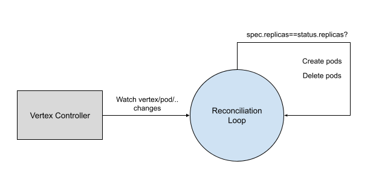

# Autoscaling

[Scale Subresource](https://kubernetes.io/docs/tasks/extend-kubernetes/custom-resources/custom-resource-definitions/#scale-subresource) is enabled in `Vertex` [Custom Resource](https://kubernetes.io/docs/concepts/extend-kubernetes/api-extension/custom-resources/), which makes it possible to scale vertex pods. To be specifically, it is enabled by adding following comments to `Vertex` struct model, and then corresponding CRD definition is automatically generated.

```
// +kubebuilder:subresource:scale:specpath=.spec.replicas,statuspath=.status.replicas,selectorpath=.status.selector
```

Pods management is done by vertex controller.



With `scale` subresource implemented, `vertex` object can be scaled by either horizontal or vertical pod autoscaling.

## Numaflow Autoscaling

The out of box Numaflow autoscaling is done by a `scaling` component running in the controller manager, you can find the source code [here](https://github.com/numaproj/numaflow/tree/main/pkg/reconciler/vertex/scaling). The autoscaling strategy is implemented according to different type of vertices.

## Source Vertices

For source vertices, we define a target time (in seconds) to finish processing the pending messages based on the processing rate (tps) of the vertex.

```
  pendingMessages / processingRate = targetSeconds
```

For example, if `targetSeconds` is 3, current replica number is `2`, current `tps` is 10000/second, and the pending messages is 60000, so we calculate the desired replica number as following:

```
  desiredReplicas = 60000 / (3 * (10000 / 2)) = 4
```

Numaflow autoscaling does not work for those source vertices that can not calculate pending messages.

## UDF and Sink Vertices

Pending messages of a UDF or Sink vertex does not represent the real number because of the restrained writing caused by back pressure, so we use a different model to achieve autoscaling for them.

For each of the vertices, we calculate the available buffer length, and consider it is contributed by all the replicas, so that we can get each replica's contribution.

```
  availableBufferLength = totalBufferLength * bufferLimit(%) - pendingMessages
  singleReplicaContribution = availableBufferLength / currentReplicas
```

We define a target available buffer length, and then calculate how many replicas are needed to achieve the target.

```
  desiredReplicas = targetAvailableBufferLength / singleReplicaContribution
```

## Back Pressure Impact

Back pressure is considered during autoscaling (which is only available for Source and UDF vertices).

We measure the back pressure by defining a threshold of the buffer usage. For example, the total buffer length is 50000, buffer limit is 80%, and the back pressure threshold is 90%, if in the past period of time, the average pending messages is more than `36000 (50000 * 80% * 90%)`, we consider there's back pressure.

When the calculated desired replicas is greater than current replicas:

1. For vertices which have back pressure from the directly connected vertices, instead of increasing the replica number, we decrease it by 1;
2. For vertices which have back pressure in any of its downstream vertices, the replica number remains unchanged.

## Autoscaling Tuning

Numaflow autoscaling can be tuned by updating some parameters, find the details at the [doc](../autoscaling.md).
