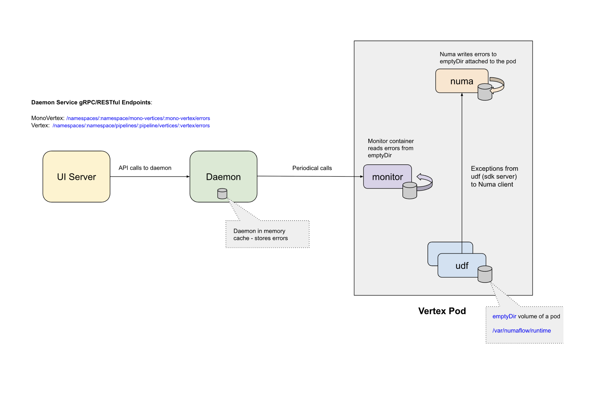

# Errors

The **Numaflow UI** provides an **Errors Tab** that lists the recent errors (up to 10 per container) that may have occurred in the user-defined function (UDF) code. This feature helps users quickly identify and debug application errors.

In this guide, we will simulate a panic in a transformer and demonstrate how the errors are displayed in the Errors Tab for a monovertex.

> **Note**: The Errors Tab and its related functionality are currently available only for MonoVertex. Support for Pipelines is planned for future releases.

---

## High-Level Architecture



---

## Simulating an Error in the Transformer

To simulate an error, we will introduce a panic in the Go SDK for the transformer by modifying the `Transform` function. You can find the relevant code [here](https://github.com/numaproj/numaflow-go/blob/main/examples/sourcetransformer/assign_event_time/main.go).

Below is the modified code snippet:

```go
// AssignEventTime is a source transformer that assigns event time to the message.
type AssignEventTime struct {
    counter uint64
}

func (a *AssignEventTime) Transform(ctx context.Context, keys []string, d sourcetransformer.Datum) sourcetransformer.Messages {
    newCount := atomic.AddUint64(&a.counter, 1)
    // Trigger a panic if the counter is a multiple of 5
    if newCount%5 == 0 {
        panic("Counter reached a multiple of 5")
    }
    // Update the message's event time to the current time
    eventTime := time.Now()
    // Log the action for testing purposes
    log.Printf("AssignEventTime: Assigning event time %v to message %s", eventTime, string(d.Value()))
    return sourcetransformer.MessagesBuilder().Append(sourcetransformer.NewMessage(d.Value(), eventTime).WithKeys(keys))
}
```

In this example, the code triggers a panic whenever the counter reaches a multiple of 5. This simulates an error scenario that will be captured and displayed in the Errors Tab.

---

## The UI Errors Tab


The Errors Tab provides the following features:

- **Error Count**: Displays the total number of errors across all pods and containers at the top level.
- **Pod and Container Filters**: Allows users to filter errors by selecting a specific pod or container for more focused debugging.
- **Tabulated Errors**: Errors are displayed in a tabular format with the following columns:

    - `Pod Name`
    - `Container`
    - `Message`
    - `Last Occurred`

- **Details**: Expanding an error entry reveals a `Details` section that includes the **stack trace** of the error, providing deeper insights for debugging.

---

## Types of Errors Displayed in the Errors Tab

The Errors Tab in the **Numaflow UI** captures and displays various types of errors that may occur during the execution of user-defined functions (UDFs). Below are the common categories of errors you can expect:

### 1. Exceptions in User Code

Any exception that occurs within the user-defined function (UDF) code will be captured and displayed in the Errors Tab. These errors typically indicate issues in the logic or implementation of the UDF.

### 2. Partial Responses

Errors may occur when the user code sends partial or incorrect responses. For example:

-   Returning `null` instead of `Message.toDrop` in a UDSink when a message needs to be dropped.

### 3. Critical Errors Persisted by the User

Users can invoke the `PersistCriticalError` utility function to log critical errors in the `emptyDir` volume. This is useful for capturing severe issues that require immediate attention. Below are links to the implementations in different SDKs:

-   [Go Implementation](https://github.com/numaproj/numaflow-go/blob/47460a1854b8f58a0e918056ef4d169949193ebe/pkg/errors/errors.go)
-   [Java Implementation](https://github.com/numaproj/numaflow-java/blob/2aeaafff1c6dec7fd66e018b142ef6fe4ffcf0a9/src/main/java/io/numaproj/numaflow/errors/PersistCriticalError.java)
-   [Python Implementation](https://github.com/numaproj/numaflow-python/blob/6ccd49ef09ad11eac9b0bb9a6b0f5517d858bea4/pynumaflow/errors/errors.py)
