# Logs View

The **Logs View** lets you inspect container logs for a vertex pod directly in the **Pods View**. After you select a pod and container, the **Container Logs** panel on the right shows logs from that container.

---

## Navigating to Container Logs

Navigate to the **Pods View** tab after selecting the vertex.

**Select a Pod**

Select a pod by name from the **Select a pod by name** dropdown, or select a pod by resource using the CPU/Memory heat map.

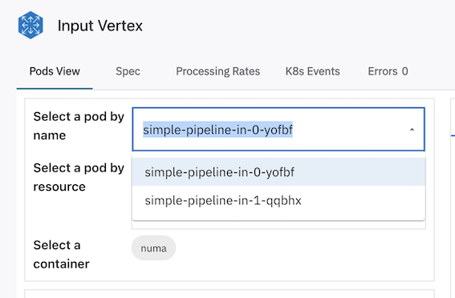

**Select a Container**

Choose a container from the **Select a container** section.

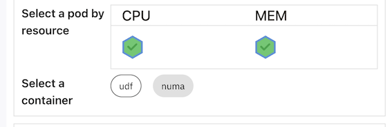

**View Logs**

The **Container Logs** panel appears on the right. The header shows the title **Container Logs** and a badge with the short pod/container name (for example, `out-0/numa`). Hover the badge to see the full pod and container name.

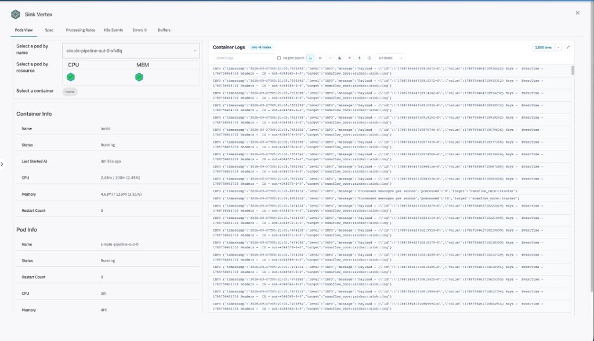

While logs are shown, you can still use the left sidebar to review **Container Info** and **Pod Info** (status, CPU, memory, restart count, and related details).

---

## Toolbar overview

The logs toolbar is grouped into:

- **Header (top row):** title, source badge, optional status banner, tail/window size, and focus (expand) control.
- **Controls (second row):** search, match navigation, negate search, wrap, pause, previous container, theme, sort order, download, timestamps, and level filter.

Status banners appear in the header when applicable:

- **Logs paused** — new log lines are not being added.
- **Previous container** — you are viewing logs from the previous terminated container instance.

---

## Features

### 1. Log window size (tail lines)

Use the **N lines** dropdown in the top-right (default: **1,000 lines**) to choose how many recent log lines to show:

- 500 lines
- 1,000 lines
- 2,000 lines
- 5,000 lines
- 10,000 lines

While logs are updating live, changing the window size **pauses** updates and shows that many recent lines. A **Logs paused** banner appears until you resume.

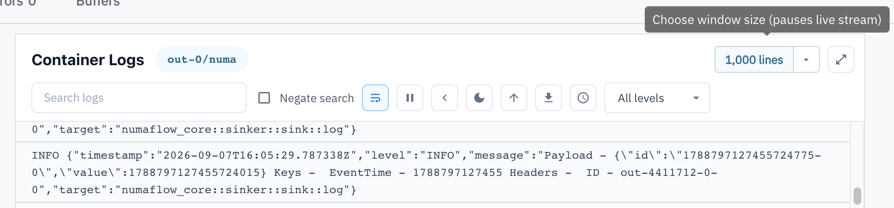

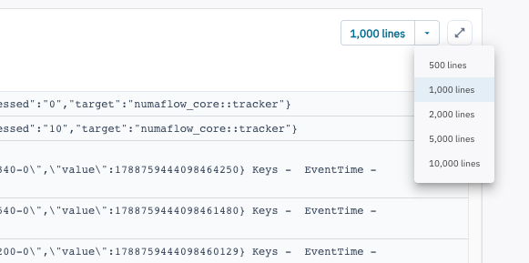

---

### 2. Focus view (expanded logs)

Click the **expand** icon in the header to open a larger focused log view. In focus mode:

- **Pod** and **Container** selectors appear at the top of the dialog so you can switch context without closing focus mode.
- All log toolbar controls remain available.

While focus mode is open, the inline panel shows **Logs are open in the focused view**.

Click **Exit focus** (or the collapse icon) to return to the inline panel.

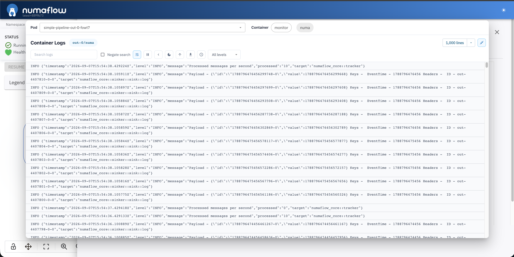

---

### 3. Search logs

Type keywords in **Search logs** to filter the lines currently shown. Matching text is highlighted. When matches exist, a counter (for example, `1 / 3`) appears with **previous** and **next** controls.

Keyboard shortcuts:

- `Enter` — next match
- `Shift+Enter` — previous match

Use the clear (`×`) control to reset the search.

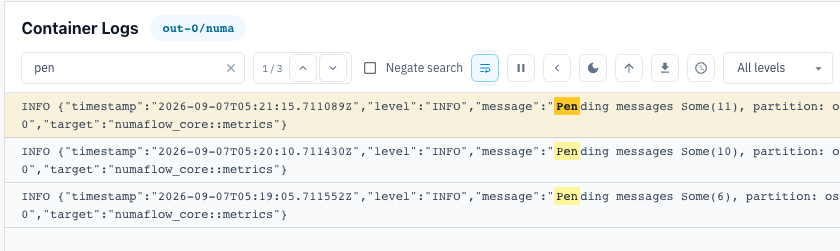

---

### 4. Negate search

Enable **Negate search** to hide lines that match your search term and show only non-matching lines. Useful for filtering out noisy messages (for example, excluding lines containing `pending`).

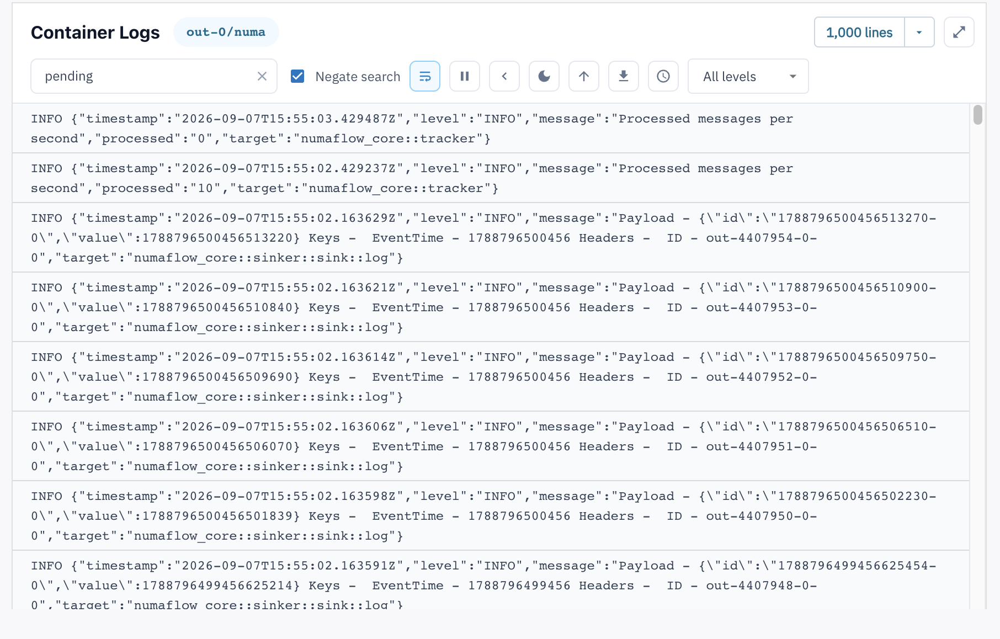

---

### 5. Wrap lines

Toggle **Wrap lines** to wrap long log lines instead of horizontal scrolling. Wrap is enabled by default. When wrap is off, the button shows **Unwrap lines** and long entries display on a single line with horizontal scrolling.

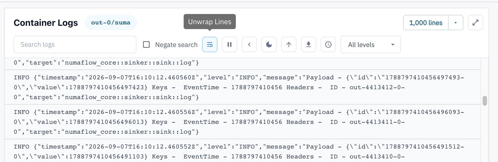

---

### 6. Pause and resume

Click **Pause logs** to stop new lines from appearing while you inspect what is on screen. Click **Play logs** to resume. Resuming resets the window to the default **1,000 lines**.

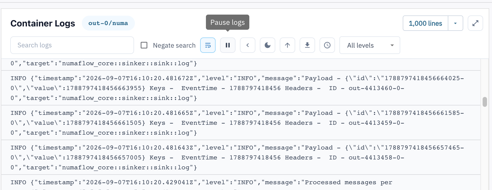

---

### 7. Previous terminated container logs

Click the **back** (`<`) toolbar button to view logs from the **previous terminated** container instance. This helps debug crashes and restarts.

While in this mode, a **Previous container** banner appears in the header. Click the button again to return to the current container's logs.

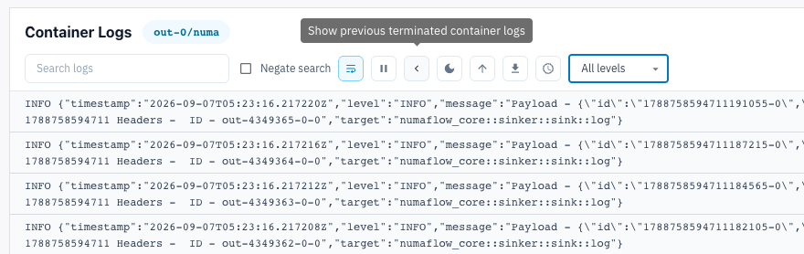

---

### 8. Dark mode

Toggle **Dark mode** / **Light mode** for readability.

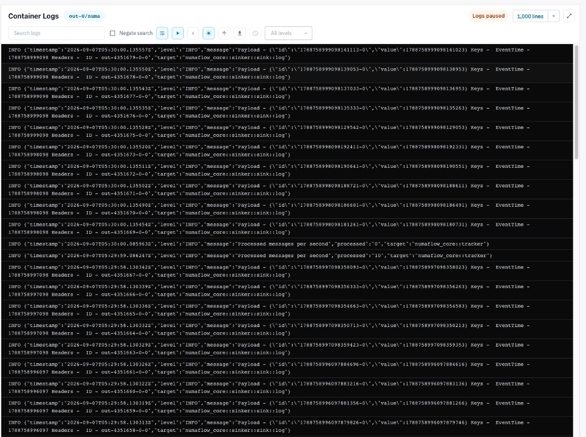

---

### 9. Sort order

Logs default to **descending** order (newest first). Toggle between **ascending** and **descending** timestamp order. The active button tooltip shows the current mode (for example, **Ascending order**).

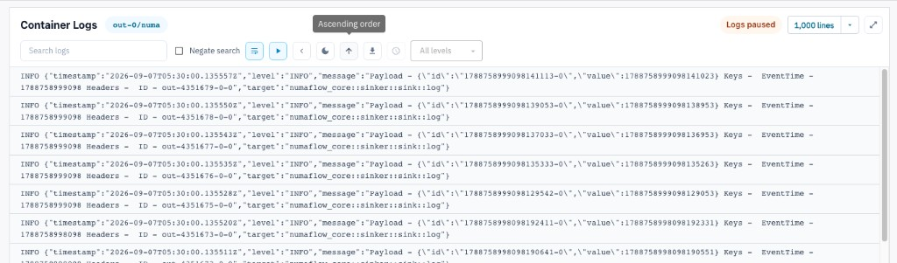

---

### 10. Download logs

Click **Download logs** to save the logs as a `.txt` file named `{podName}-{containerName}-logs.txt`.

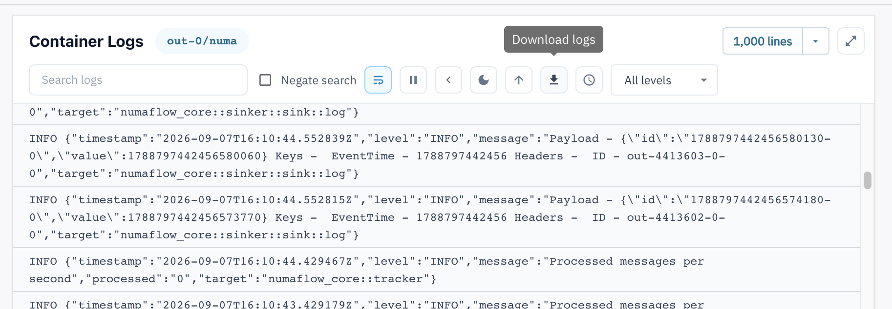

---

### 11. Timestamps

Toggle **Add timestamps** / **Remove timestamps** on log lines. This control is disabled while logs are paused.

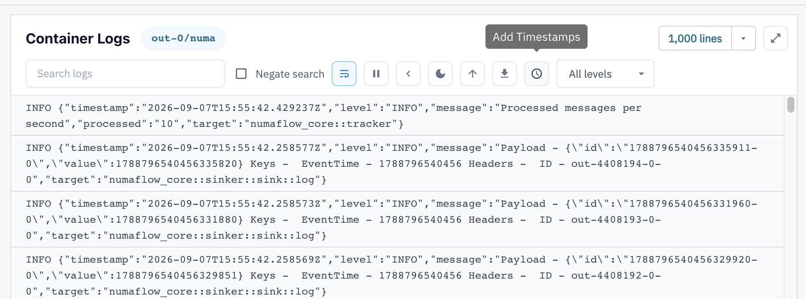

---

### 12. Level-based filtering

Filter by log level using the level dropdown:

- All levels
- Info
- Error
- Warn
- Debug

Level filtering is disabled while logs are paused.

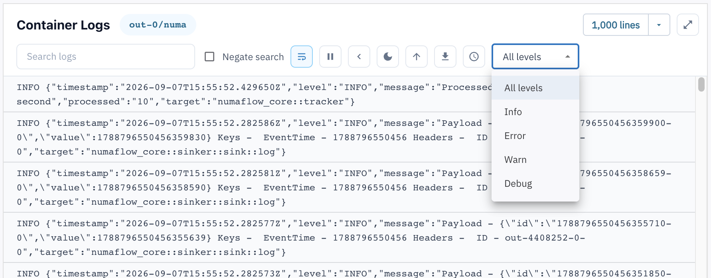

---

## Tips

- Use **pause** before downloading if you want a stable snapshot of what is on screen.
- Combine **search** and **negate search** to narrow down noisy output.
- For crash debugging, switch to **previous terminated container logs** after a restart.
- Use **focus view** when reviewing long JSON or stack traces.
