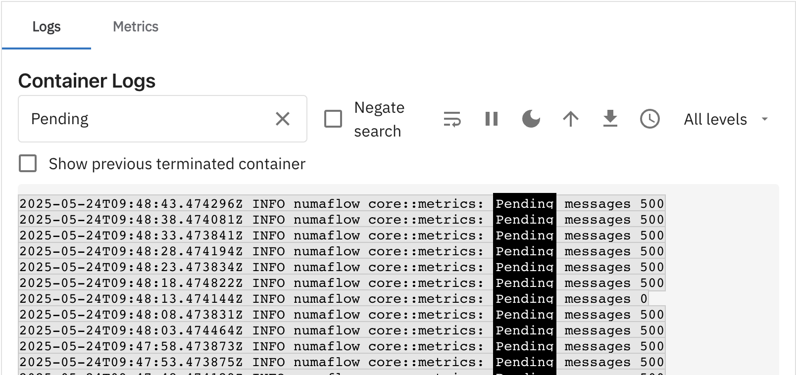
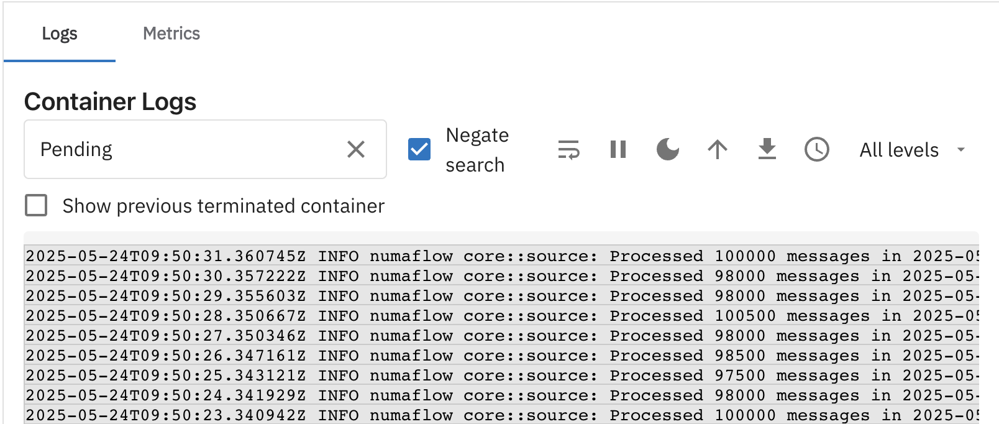
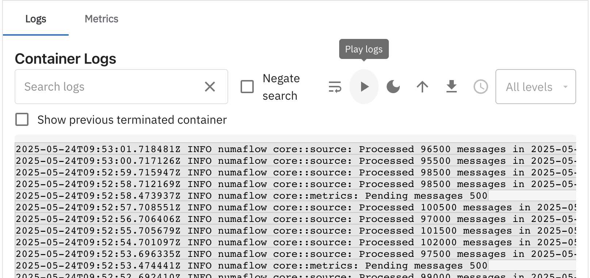
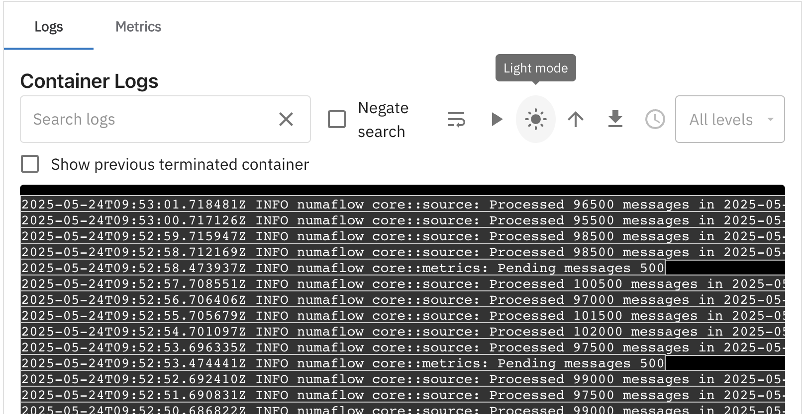
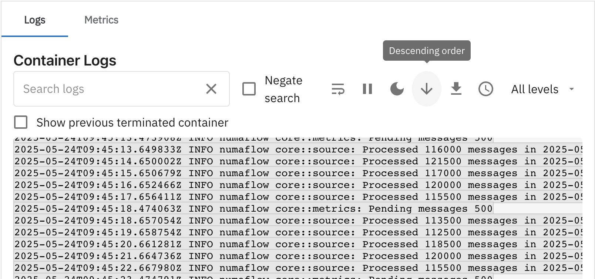
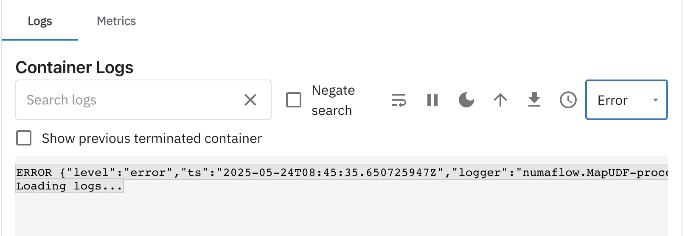

# Logs View

The **Logs View** allows users to inspect the logs of a specific container within a pod of a vertex. This guide will walk you through the Logs tab and its various features.

---

## Navigating to the Logs Tab

1. **Select a Pod**
   Navigate to the `Pods View` tab after selecting the vertex and select a pod by name from the `Select a Pod by Name` dropdown.
   

2. **Select a Container**
   Choose a container from the `Select a Container` section.
   

3. **View Logs**
   Open the **Logs Tab** on the right to view the container logs.
   

---

## Features

### 1. Previous Terminated Container Logs

- Enable the checkbox to view logs from previously terminated containers.
- This is particularly useful for debugging issues.

---

### 2. Search Logs

- Filter logs by typing keywords in the **Search Logs** box.
  

---

### 3. Negate Search

- Enable the **Negate Search** option to exclude logs matching the search keywords from the view.
  

---

### 4. Wrap Lines

- Use the **Wrap Lines** feature to avoid horizontal scrolling for long log lines, improving readability.
  

---

### 5. Pause Logs

- Pause the log stream to inspect logs when there is a high volume of data.
  

---

### 6. Dark Mode

- Toggle between **Dark Mode** and **Light Mode** for better visibility based on your preference.
  

---

### 7. Ascending/Descending Order

- Switch between ascending and descending order of log timestamps for easier navigation.
  

---

### 8. Download Logs

- Download the last 1000 logs for offline analysis.

---

### 9. Add/Remove Timestamps

- Toggle timestamps in the logs based on your requirements.
  

---

### 10. Level-Based Filtering

- Filter logs by log levels such as:

  - **Info**
  - **Error**
  - **Warn**
  - **Debug**

  

---
