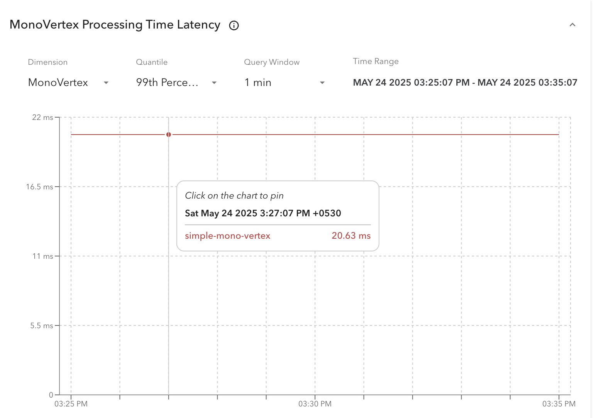
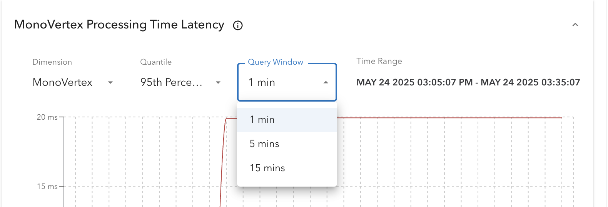

# Metrics Tab

Numaflow provides a comprehensive [set of Prometheus metrics](../../operations/metrics/metrics.md), enabling users to monitor their pipelines effectively and set up alerts as needed. This feature enhances the debugging experience by offering contextual insights directly within the UI. By leveraging these metrics, users can identify and resolve issues more efficiently, ensuring smoother pipeline operations.

---

## Prerequisites

Before visualizing metrics in the UI, ensure the following requirements are met:

-   **Prometheus Server Setup**: A Prometheus server must be configured and running. Refer to the [Prometheus Operator Installation Guide](https://github.com/prometheus-operator/prometheus-operator/blob/main/Documentation/getting-started/installation.md) for detailed instructions.
-   **Service Monitors**: Configure Service/Pod Monitors for scraping pipeline/monovertex metrics. Refer to [this section](../../operations/metrics/metrics.md#configure-the-below-servicepod-monitors-for-scraping-your-pipelinemonovertex-metrics) for configuration details.
-   **Basic Knowledge of PromQL**: Familiarity with PromQL (Prometheus Query Language) is recommended to effectively query and interpret the metrics.

Meeting these prerequisites will help you make the most of the metrics visualization and monitoring features in Numaflow.

---

## Metrics Configuration

To visualize metrics in the UI, you need to configure them using a ConfigMap. Numaflow provides a default [ConfigMap](https://github.com/numaproj/numaflow/blob/main/config/base/numaflow-server/numaflow-server-metrics-proxy-config.yaml) that includes a variety of pre-configured metrics. These metrics cover essential pipeline operations and also include custom metrics, such as CPU and memory usage.

You can customize this ConfigMap to add or modify metrics based on your specific requirements. For example, you can include additional Prometheus metrics relevant to your use case.

Refer to the [Numaflow Metrics Documentation](../../operations/metrics/metrics.md) for more details on available metrics and their usage.

---

### Current Configuration Snippet

Below is a snippet of the default ConfigMap configuration:

```yaml
apiVersion: v1
kind: ConfigMap
metadata:
    name: numaflow-server-metrics-proxy-config
data:
    config.yaml: |
        url: http://prometheus-operated.monitoring.svc.cluster.local:9090
        patterns:
          - name: vertex_gauge
            objects:
              - vertex
            title: Vertex Gauge Metrics
            description: This pattern represents the gauge metrics for a vertex across different dimensions.
            expr: |
              sum($metric_name{$filters}) by ($dimension, period)
            params:
              - name: start_time
                required: false
              - name: end_time
                required: false
            metrics:
              - metric_name: vertex_pending_messages
                display_name: Vertex Pending Messages
                metric_description: Tracks the total number of messages waiting to be processed over varying time frames (e.g., 1min, 5min, 15min).
                required_filters:
                  - namespace
                  - pipeline
                  - vertex
                dimensions:
                  - name: pod
                    filters:
                      - name: pod
                        required: false
                      - name: period
                        required: false
                  - name: vertex
                    filters:
                      - name: period
                        required: false
```

### Key Definitions

Prometheus metrics are categorized into three main types: Histogram, Gauge, and Counter. The configuration provided above groups metrics of a similar type under a single pattern, making it more generic and easier to manage.

1. **url**
   The `url` is a required field that specifies the Prometheus service endpoint to which the metrics proxy will connect. If the `url` is not set or is incorrectly configured, the Metrics Tab will not be displayed in the UI.

-   **Example**: If you set up a local Prometheus operator using [Helm](https://bitnami.com/stack/prometheus-operator/helm), the `url` would look like this:
    `http://my-release-kube-prometheus-prometheus.default.svc.cluster.local:9090`

2. **patterns**
   A list of patterns that group metrics of a similar type.

-   **name**: The name of the pattern.
-   **objects**: Specifies the object type, which can either be `vertex` or `mono-vertex`. For pipelines, the object is `vertex`, and for MonoVertex, the object is `mono-vertex`.
-   **title**: The title of the pattern.
-   **description**: A description of the pattern.
-   **expr**: The PromQL expression used to construct queries, with placeholders for dynamic values.
-   **params**: Common parameters for all metrics within the pattern. These may include:

    -   **start_time**: The start time for the PromQL query (optional).
    -   **end_time**: The end time for the PromQL query (optional).
    -   **duration**: The query window (required for histograms).
    -   **quantile**: The quantile value (required for histograms). The quantiles can be 0.99, 0.95, 0.90, or 0.50.

-   **metrics**:
    A list of metrics defined within the pattern.
    -   **metric_name**: The actual name of the metric.
    -   **display_name**: A user-friendly name for the metric. Avoid editing this for existing metrics.
    -   **metric_description**: A detailed description of the metric, displayed as an info icon next to the metric name in the UI.
    -   **required_filters**: Filters that must be included in the PromQL request body.
    -   **dimensions**: Dimensions allow users to drill down into specific components, such as pods or containers, for more granular data.
        -   **name**: The name of the dimension (e.g., pod, vertex).
        -   **filters**: Filters applied to the data for a specific key.
            -   **name**: The name of the filter.
            -   **required**: If set to `true`, the filter is automatically added to `$filters`. If `false`, users can select a value for the filter key, which is then added to `$filters`.
            -   **expr**: (Optional) Overrides the top-level `expr` for a specific metric and dimension.

This structured configuration ensures flexibility and ease of use when visualizing and analyzing metrics in the Numaflow UI.

---

## Explanation with an Example

The above configuration might seem complex at first glance. Let’s break it down with an example using the out-of-the-box metric `monovtx_processing_time_bucket`.

### Example Configuration

```yaml
- name: mono_vertex_histogram
  objects:
   - mono-vertex
  title: MonoVertex Histogram Metrics
  description: This pattern is for P99, P95, P90, and P50 quantiles for a mono-vertex across different dimensions.
  expr: |
   histogram_quantile($quantile, sum by($dimension,le) (rate($metric_name{$filters}[$duration])))
  params:
   - name: quantile
    required: true
   - name: duration
    required: true
   - name: start_time
    required: false
   - name: end_time
    required: false
  metrics:
   - metric_name: monovtx_processing_time_bucket
    display_name: MonoVertex Processing Time Latency
    metric_description: This metric represents a histogram to keep track of the total time taken to forward a chunk of messages.
    required_filters:
      - namespace
      - mvtx_name
    dimensions:
      - name: mono-vertex
      - name: pod
       filters:
        - name: pod
          required: false
```

### Key Points

1. **Pattern Name**: `mono_vertex_histogram`
   This indicates that the pattern includes histogram metrics for a mono-vertex.

2. **Expression (`expr`)**
   The expression calculates quantiles (e.g., P99, P95). Learn more about quantiles in Prometheus [here](https://prometheus.io/docs/practices/histograms/#quantiles).
   Placeholders such as `quantile`, `dimension`, `metric_name`, `filters`, and `duration` are dynamically populated based on the configuration.

3. **Parameters (`params`)**

    - `quantile` and `duration` are required placeholders in the expression.
    - `start_time` and `end_time` are optional parameters for defining the query duration.

4. **Metric Name (`metric_name`)**
   This forms the `$metric_name` placeholder in the expression.

5. **Required Filters (`required_filters`)**
   These filters populate the `$filters` placeholder in the expression.

6. **Dimensions**

    - For the `mono-vertex` dimension, no additional filters are applied.
    - For the `pod` dimension, an additional filter (`pod`) is appended to the `$filters` placeholder.

---

### Example Expressions

Below are examples of how the placeholders are replaced to form the final PromQL expressions:

-   **Dimension**: `mono-vertex`
    **Quantile**: `0.99`
    **Namespace**: `default`
    **MonoVertex Name**: `simple-mono-vertex`
    **Duration**: `5m`
    **Resultant Expression**:

    ```promql
    histogram_quantile(0.99, sum by(mvtx_name,le) (rate(monovtx_processing_time_bucket{namespace="default",mvtx_name="simple-mono-vertex"}[5m])))
    ```

-   **Dimension**: `pod`
    **Quantile**: `0.99`
    **Namespace**: `default`
    **MonoVertex Name**: `simple-mono-vertex`
    **Pod**: `simple-mono-vertex-mv-0-edj2s`
    **Duration**: `1m`
    **Resultant Expression**:

    ```promql
    histogram_quantile(0.99, sum by(pod,le) (rate(monovtx_processing_time_bucket{namespace="default",mvtx_name="simple-mono-vertex",pod="simple-mono-vertex-mv-0-edj2s"}[1m])))
    ```

This example demonstrates how the configuration translates into actionable PromQL queries, making it easier to understand and customize.

## How the Metrics Tab Appears in the UI

The **Metrics Tab** is located next to the [Logs Tab](./logs.md) in the [Pods View](./pods-view.md).


The following screenshots illustrate how the UI translates the discussed configuration into a visual representation:

### MonoVertex Histogram Example

The UI displays the configured metrics, such as the `monovtx_processing_time_bucket` histogram, with options to select dimensions and filters.



### Dimension Selection

Users can choose dimensions for the metric, such as `MonoVertex` or `Pod`, to view data at different levels of granularity. After selecting `Pod` dimension, we see that `Filters` box appears which allow us to add filters for a dimension. Here, `pod` dimension has pod as a filter.


### Quantile Selection

For histogram metrics, users can select quantile values (e.g., P99, P95) from the available options, as explained in the [Key Definitions](#key-definitions) section.


### Query Window/Duration

The query window specifies the time range over which the `rate()` function calculates the per-second average rate of increase for each histogram bucket.



### Time Range Selection

Users can select a predefined time range or set a custom time range for their PromQL queries.


## Adding Custom Metrics

To add metrics not provided by Numaflow, follow the configuration patterns described above. For example, you can add a custom metric similar to the `pod_cpu_memory_utilization` pattern [here](#current-configuration).
