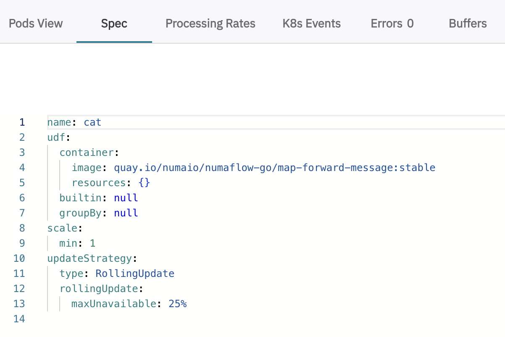
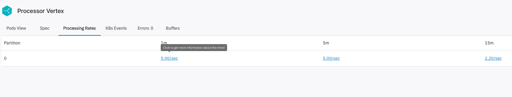
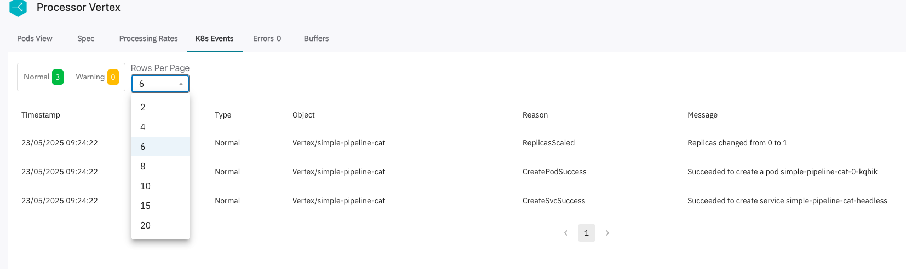
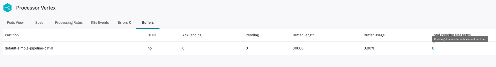

# Numaflow UI Overview

Numaflow provides a built-in user interface (UI) for monitoring and managing your data pipelines.

### Accessing the Numaflow UI

To access the Numaflow UI, use the following command to port-forward the Numaflow server:

```shell
kubectl -n numaflow-system port-forward deployment/numaflow-server 8443:8443
```

Once port-forwarding is active, open your browser and navigate to [https://localhost:8443](https://localhost:8443).

### UI Views

We have already walked through some of the views of UI to monitor pipelines in the [Quick Start](../../quick-start.md) guide.

- **Cluster View**
- **Namespace View**
- **Simple Pipeline View**

### Vertex View

Vertex View provides detailed insights into each pipeline vertex. The following features are available:

#### **[Pods View](./pods-view.md)**

Inspect the status and details of pods running in your pipelines.

#### **Spec**

View the specification of the vertex.



#### **Processing Rates**

See the last 1m, 5m, and 15m processing rates for each partition of the vertex.

If a Prometheus server is configured, you can click on the number to see more details in the Metrics tab.



#### **Kubernetes Events**

View Kubernetes events related to the vertex.



#### **[Errors](./errors.md)**

Review errors detected in your pipelines for quick debugging.

#### **Buffers**

See buffer details for every partition, including buffer length, usage, and number of pending messages.
Click on the pending number to view complete pending metrics in the [Metrics tab](./metrics-tab.md).



#### **[Logs](./logs.md)**

View logs for different containers of pods to help diagnose issues.

#### **[Metrics](./metrics-tab.md)**

Monitor pipeline metrics for performance.

---
