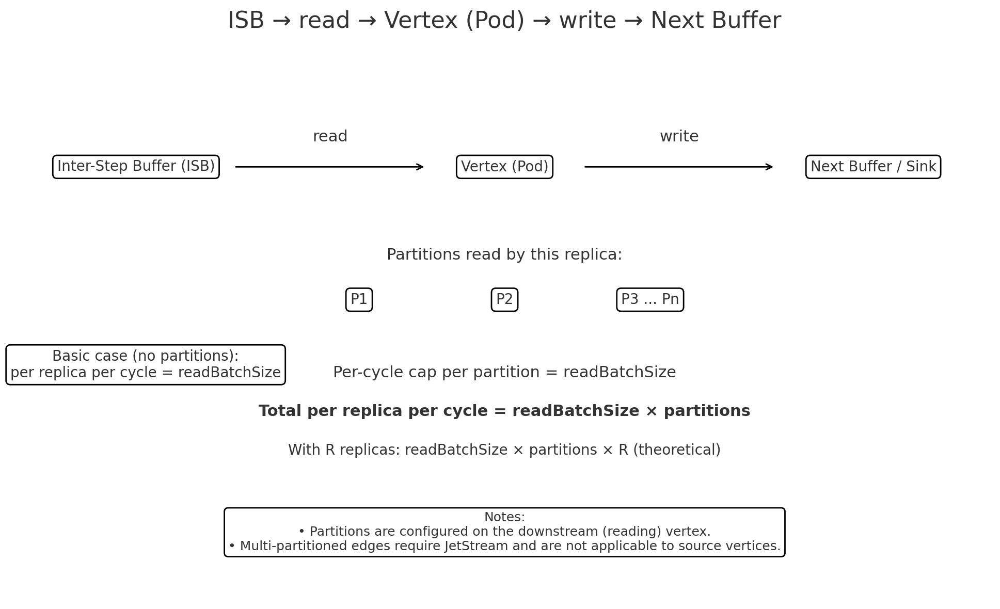

### Understanding `readBatchSize`

At its core, `readBatchSize` is the **maximum number of messages a single vertex replica (pod) will try to read per cycle**. 

#### **Default Behavior (Single Partition)**

By default, the edge connecting vertices has one partition. In this common setup, a single replica reads from that single partition.

**Note**: Monovertex always follows this default behavior, as it does not have the concept of partitions.
* **Example:** If `readBatchSize` is **500** and you have **1** replica, that replica will read up to **500** messages in each processing cycle. Simple!

#### **Behavior with Multi-Partitioned Edges**

When you configure a vertex to have multiple partitions (**not applicable for Source Vertices**), you increase its ability to process data in parallel. The key thing to understand is that the `readBatchSize` limit applies to the read operation on **each partition** that a replica is responsible for.

This means the total number of messages a single replica can process per cycle becomes:
$$\text{Total Messages per Replica} = \text{readBatchSize} \times \text{Number of Partitions}$$

* **Example:** Let's say you configure a vertex to have **3** partitions and it's running with **1** replica. If `readBatchSize` is **500**:
    * The single replica will read up to **500** messages from Partition 1.
    * It will *also* read up to **500** messages from Partition 2 and 3.
    * In total, that single replica can now process up to **1,500** messages per cycle (500 * 3).

