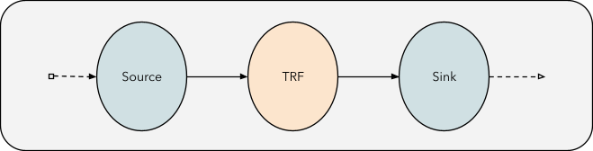

# MonoVertex Bypass Routing

## Overview

Provides capability to users to skip components when sending messages to different types of sinks.

### Example Scenario

Let’s say a message is determined to be faulty/corrupted/non-parsable in the transformer component, such messages are to 
be written to a fallback sink/DLQ in this use case. The bypass configuration allows tagging this message with some user 
defined tag in the spec, so that it can directly be forwarded to the fallback sink when encountered in the transformer 
and skip UDF/Primary sink components.

## Flow Visualized

### Normal Flow



### With bypass enabled


## Details

Currently bypassing/routing is supported only to the 3 types of sink paradigms allowed in Numaflow MonoVertex spec, namely:

* `sink` or the primary sink
* `fallback` sink
* `onSuccess` sink

### Spec

The bypass spec subsequently allows defining bypass rules for these 3 currently supported sink types:

* `sink` (our primary sink)
* `fallback` (fallback sink)
* `onSuccess` (onSuccess sink)

Conditions defined under each sink label follow the same pattern as our conventional conditional forwarding for edges in numaflow pipelines.

Spec for MonoVertex bypass feature:

```yaml
# Short-circuiting/Bypass routing rules for mvtx
spec:
  bypass:
    fallback:
      tags:
        operator: or
        values:
          - tag-a
    onSuccess:
      tags:
        operator: and
        values:
          - tag-b
    sink:
      tags:
        operator: nor
        values:
          - tag-c
            ...
```

### Caveats

* As defined in [fallback sink](https://numaflow.numaproj.io/user-guide/sinks/fallback/) and 
[onSuccess sink](https://numaflow.numaproj.io/user-guide/sinks/on-success/) docs, these supporting sinks can only be added 
if the primary sink is a user-defined sink. 
* If bypass conditions are specified for the primary sink, then any message that 
doesn’t satisfy any of the bypass conditions is dropped when it reaches the primary sink and hence not processed by the primary sink.


