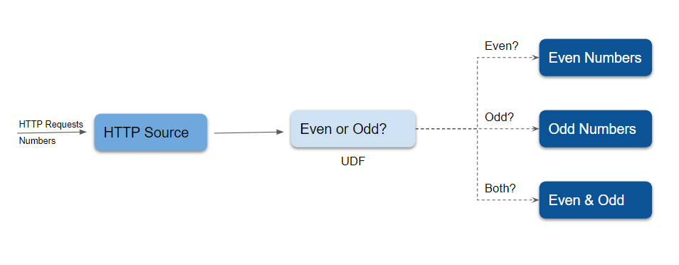

# Map Examples

Please read [map](./map.md) to get the best out of these examples.

## Prerequisites

### Inter-Step Buffer Service (ISB Service)

#### What is ISB Service?
An Inter-Step Buffer Service is described by a [Custom Resource](https://kubernetes.io/docs/concepts/extend-kubernetes/api-extension/custom-resources/), which is used to pass data between vertices of a numaflow pipeline.
Please refer to the doc [Intern-Step Buffer Service](../../../core-concepts/inter-step-buffer.md) for more information on ISB.


#### How to install the ISB Service

```shell
kubectl apply -f https://raw.githubusercontent.com/numaproj/numaflow/stable/examples/0-isbsvc-jetstream.yaml
```

The expected output of the above command is shown below:

```shell
$ kubectl get isbsvc 

NAME      TYPE        PHASE     MESSAGE   AGE
default   jetstream   Running             3d19h

# Wait for pods to be ready
$ kubectl get pods

NAME                                         READY   STATUS      RESTARTS   AGE
isbsvc-default-js-0                          3/3     Running     0          19s
isbsvc-default-js-1                          3/3     Running     0          19s
isbsvc-default-js-2                          3/3     Running     0          19s
```

---
**NOTE**

The Source used in the examples is an HTTP source producing messages with values 5 and 10 with event time
starting from 60000. Please refer to the doc [http source](../../sources/http.md) on how to use an HTTP
source.
An example will be as follows,

```sh
curl -kq -X POST -H "x-numaflow-event-time: 60000" -d "5" ${http-source-url}
curl -kq -X POST -H "x-numaflow-event-time: 60000" -d "10" ${http-source-url}
```
---

## Creating a simple Map pipeline

Now we will walk you through creating a map pipeline. In our example, this is called the `even-odd` pipeline, illustrated by the following diagram:



There are five vertices in this example of a map pipeline. An [HTTP](../../sources/http.md) source vertex which serves an HTTP endpoint to receive numbers as source data, a [UDF](./map.md) vertex to tag the ingested numbers with the key `even` or `odd`, three [Log](../../sinks/log.md) sinks, one to print the `even` numbers, one to print the `odd` numbers, and the other one to print both the even and odd numbers.

Run the following command to create the `even-odd` pipeline.

```shell
kubectl apply -f https://raw.githubusercontent.com/numaproj/numaflow/main/examples/2-even-odd-pipeline.yaml
```

You may opt to view the list of pipelines you've created so far by running `kubectl get pipeline`. Otherwise, proceed to inspect the status of the pipeline, using `kubectl get pods`.

```shell
# Wait for pods to be ready
kubectl get pods

NAME                               READY   STATUS    RESTARTS   AGE
even-odd-daemon-64d65c945d-vjs9f   1/1     Running   0          5m3s
even-odd-even-or-odd-0-pr4ze       2/2     Running   0          30s
even-odd-even-sink-0-unffo         1/1     Running   0          22s
even-odd-in-0-a7iyd                1/1     Running   0          5m3s
even-odd-number-sink-0-zmg2p       1/1     Running   0          7s
even-odd-odd-sink-0-2736r          1/1     Running   0          15s
isbsvc-default-js-0                3/3     Running   0          10m
isbsvc-default-js-1                3/3     Running   0          10m
isbsvc-default-js-2                3/3     Running   0          10m
```

Next, port-forward the HTTP endpoint, and make a `POST` request using `curl`. Remember to replace `xxxxx` with the appropriate pod names both here and in the next step.

```shell
kubectl port-forward even-odd-in-0-xxxx 8444:8443

# Post data to the HTTP endpoint
curl -kq -X POST -d "101" https://localhost:8444/vertices/in
curl -kq -X POST -d "102" https://localhost:8444/vertices/in
curl -kq -X POST -d "103" https://localhost:8444/vertices/in
curl -kq -X POST -d "104" https://localhost:8444/vertices/in
```

Now you can watch the log for the `even` and `odd` vertices by running the commands below.

```shell
# Watch the log for the even vertex
kubectl logs -f even-odd-even-sink-0-xxxxx
2022/09/07 22:29:40 (even-sink) 102
2022/09/07 22:29:40 (even-sink) 104

# Watch the log for the odd vertex
kubectl logs -f even-odd-odd-sink-0-xxxxx
2022/09/07 22:30:19 (odd-sink) 101
2022/09/07 22:30:19 (odd-sink) 103
```

View the UI for a pipeline at https://localhost:8443/.


The source code of the `even-odd` [User Defined Function](../user-defined-functions.md) can be found [here](https://github.com/numaproj/numaflow-go/tree/main/pkg/mapper/examples/even_odd). You also can replace the [Log](../../sinks/log.md) Sink with some other sinks like [Kafka](../../sinks/kafka.md) to forward the data to Kafka topics.

The pipeline can be deleted by

```shell
kubectl delete -f https://raw.githubusercontent.com/numaproj/numaflow/main/examples/2-even-odd-pipeline.yaml
```