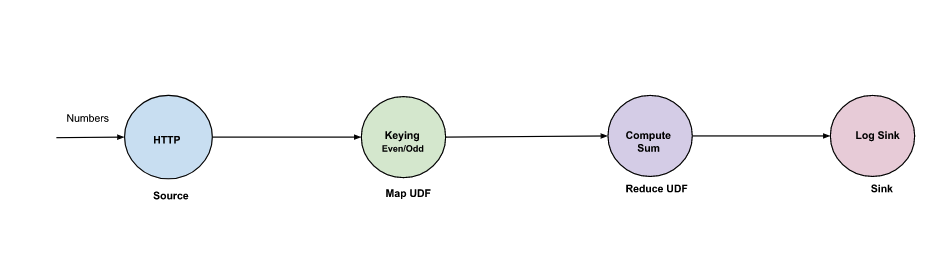
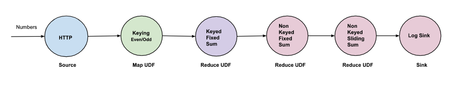

# Reduce Examples

Please read [reduce](./reduce.md) to get the best out of these examples.

## Prerequisites

Install the ISB

```shell
kubectl apply -f https://raw.githubusercontent.com/numaproj/numaflow/stable/examples/0-isbsvc-jetstream.yaml
```

Source used in the examples is an HTTP source producing messages with value 5 and 10 with event time
starting from 60000. Please refer the doc [http source](../../sources/http.md) on how to use an HTTP
source.
An example will be as follows,

```sh
curl -kq -X POST -H "x-numaflow-event-time: 60000" -d "5" ${http-source-url}
curl -kq -X POST -H "x-numaflow-event-time: 60000" -d "10" ${http-source-url}
```

## sum pipeline using fixed window

This is a simple reduce pipeline that just does summation (sum of numbers) but uses fixed window.
The snippet for the reduce vertex is as follows.



```yaml
- name: compute-sum
  udf:
    container:
      # compute the sum
      image: quay.io/numaio/numaflow-go/reduce-sum:v0.5.0
    groupBy:
      window:
        fixed:
          length: 60s
      keyed: true
```

[6-reduce-fixed-window.yaml](https://github.com/numaproj/numaflow/blob/main/examples/6-reduce-fixed-window.yaml)
has the complete pipeline definition.

In this example we use a `partitions` of `2`. We are setting a partitions > 1 because it is a
keyed window.

```yaml
- name: compute-sum
  partitions: 2
```

```shell
kubectl apply -f https://raw.githubusercontent.com/numaproj/numaflow/main/examples/6-reduce-fixed-window.yaml
```

Output :

```text
2023/01/05 11:54:41 (sink)  Payload -  300  Key -  odd  Start -  60000  End -  120000
2023/01/05 11:54:41 (sink)  Payload -  600  Key -  even  Start -  60000  End -  120000
2023/01/05 11:54:41 (sink)  Payload -  300  Key -  odd  Start -  120000  End -  180000
2023/01/05 11:54:41 (sink)  Payload -  600  Key -  even  Start -  120000  End -  180000
2023/01/05 11:54:42 (sink)  Payload -  600  Key -  even  Start -  180000  End -  240000
2023/01/05 11:54:42 (sink)  Payload -  300  Key -  odd  Start -  180000  End -  240000
```

In our example, input is an HTTP source producing 2 messages each second with values 5 and 10,
and the event time starts from 60000. Since we have considered a fixed window of length 60s,
and also we are producing two messages with different keys "even" and "odd", Numaflow will create
two different windows with a start time of 60000 and an end time of 120000. So the output will be
300(5 \* 60) and 600(10 \* 60).

If we had used a non keyed window (`keyed: false`), we would have seen one single output with value
of 900(300 of odd + 600 of even) for each window.

## sum pipeline using sliding window

This is a simple reduce pipeline that just does summation (sum of numbers) but uses sliding window.
The snippet for the reduce vertex is as follows.


```yaml
- name: reduce-sliding
  udf:
    container:
      # compute the sum
      image: quay.io/numaio/numaflow-go/reduce-sum:v0.5.0
    groupBy:
      window:
        sliding:
          length: 60s
          slide: 10s
      keyed: true
```

[7-reduce-sliding-window.yaml](https://github.com/numaproj/numaflow/blob/main/examples/7-reduce-sliding-window.yaml)
has the complete pipeline definition

```shell
kubectl apply -f https://raw.githubusercontent.com/numaproj/numaflow/main/examples/7-reduce-sliding-window.yaml
```

Output:

```text
2023/01/05 15:13:16 (sink)  Payload -  300  Key -  odd  Start -  60000  End -  120000
2023/01/05 15:13:16 (sink)  Payload -  600  Key -  even  Start -  60000  End -  120000
2023/01/05 15:13:16 (sink)  Payload -  300  Key -  odd  Start -  70000  End -  130000
2023/01/05 15:13:16 (sink)  Payload -  600  Key -  even  Start -  700000  End -  1300000
2023/01/05 15:13:16 (sink)  Payload -  300  Key -  odd  Start -  80000  End -  140000
2023/01/05 15:13:16 (sink)  Payload -  600  Key -  even  Start -  80000  End -  140000
```

In our example, input is an HTTP source producing 2 messages each second with values 5 and 10,
and the event time starts from 60000. Since we have considered a sliding window of length 60s
and slide 10s, and also we are producing two messages with different keys "even" and "odd".
Numaflow will create two different windows with a start time of 60000 and an end time of 120000,
and because the slide duration is 10s, a next set of windows will be created with start time of
70000 and an end time of 130000. Since it's a sum operation the output will be 300(5 \* 60) and 600(10 \* 60).

`Payload -  50  Key -  odd  Start -  10000  End -  70000`, we see 50 here for odd because the
first window has only 10 elements

## complex reduce pipeline

In the complex reduce example, we will

- chain of reduce functions
- use both fixed and sliding windows
- use keyed and non-keyed windowing



[8-reduce-complex-pipeline.yaml](https://github.com/numaproj/numaflow/blob/main/examples/8-reduce-complex-pipeline.yaml)
has the complete pipeline definition

```shell
kubectl apply -f https://raw.githubusercontent.com/numaproj/numaflow/main/examples/8-reduce-complex-pipeline.yaml
```

Output:

```text
2023/01/05 15:33:55 (sink)  Payload -  900  Key -  NON_KEYED_STREAM  Start -  80000  End -  140000
2023/01/05 15:33:55 (sink)  Payload -  900  Key -  NON_KEYED_STREAM  Start -  90000  End -  150000
2023/01/05 15:33:55 (sink)  Payload -  900  Key -  NON_KEYED_STREAM  Start -  100000  End -  160000
2023/01/05 15:33:56 (sink)  Payload -  900  Key -  NON_KEYED_STREAM  Start -  110000  End -  170000
2023/01/05 15:33:56 (sink)  Payload -  900  Key -  NON_KEYED_STREAM  Start -  120000  End -  180000
2023/01/05 15:33:56 (sink)  Payload -  900  Key -  NON_KEYED_STREAM  Start -  130000  End -  190000
```

In our example, first we have the reduce vertex with a fixed window of duration 5s. Since the input is 5
and 10, the output from the first reduce vertex will be 25 (5 \* 5) and 50 (5 \* 10). This will be passed
to the next non-keyed reduce vertex with the fixed window duration of 10s. This being a non-keyed, it will
combine the inputs and produce the output of 150(25 \* 2 + 50 \* 2), which will be passed to the reduce
vertex with a sliding window of duration 60s and with the slide duration of 10s. Hence the final output
will be 900(150 \* 6).
