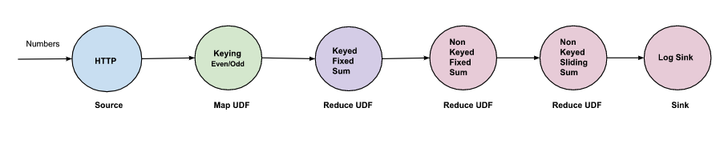

# Reduce UDF

Reduce is one of the most commonly used abstractions in a stream processing pipeline to define 
aggregation functions on a stream of data. It is the reduce feature that helps us solve problems like 
"performs a summary operation(such as counting the number of occurrence of a key, yielding user login 
frequencies), etc."Since the input an unbounded stream (with infinite entries), we need an additional
parameter to convert the unbounded problem to a bounded problem and provide results on that. That
bounding condition is "time", eg, "number of users logged in per minute". So while processing an 
unbounded stream of data, we need a way to group elements into finite chunks using time. To build these
chunks the reduce function is applied to the set of records produced using the concept of [windowing](./windowing/windowing.md).

Unlike in _map_ vertex where only an element is given to user-defined function, in _reduce_ since
there is a group of elements, an iterator is passed to the reduce function.

```python
# counter counts the number of elements in the array
# e.g. use-case of counter is counting number of users online per minute
def counter(key: str, datums: Iterator[Datum], md: Metadata) -> Messages:
    counter = 0
    for _ in datums:
        counter += 1
     return Messages(Message.to_vtx(key, str.encode(msg)))
```

The structure for defining a reduce vertex is as follows.
```yaml
    - name: my-reduce-udf
      udf:
        container:
          image: my-reduce-udf:latest
        groupBy:
          window:
            ...
          keyed: ...
```

The reduce spec adds a new section called `groupBy` and this how we differentiate a _map_ vertex
from _reduce_ vertex. There are two important fields, the [_window_](./windowing/windowing.md)
and [_keyed_](./windowing/windowing.md#non-keyed-vs-keyed-windows). These two fields play an
important role in grouping the data together and pass it to the user-defined reduce code.

The reduce supports a parallelism value while defining the edge. This is because auto-scaling is 
not supported in reduce vertex. If `parallelism` is not defined default of one will be used.

```yaml
    - from: edge1
      to: my-reduce-reduce
      parallelism: integer
```

It is wrong to give a `parallelism` > `1` if it is a _non-keyed_ vertex (`keyed: false`).


# Examples

## Prerequisites

Install the ISB

```shell
kubectl apply -f https://raw.githubusercontent.com/numaproj/numaflow/stable/examples/0-isbsvc-jetstream.yaml
```

## sum pipeline using fixed window
This is a simple reduce pipeline that just does summation (sum of numbers) but uses fixed window.
The snippet for the reduce vertex is as follows. [6-reduce-fixed-window.yaml](....)  has the 
complete pipeline definition.


```yaml
    - name: compute-sum
      udf:
        container:
          # compute the sum
          image: quay.io/numaio/numaflow-go/reduce-sum
        groupBy:
          window:
            fixed:
              length: 60s
          keyed: true
```

In this example we use a `parallelism` of `2`. We are setting a parallelism > 1 because it is a 
keyed window.

```yaml
    - from: atoi
      to: compute-sum
      parallelism: 2
```

```shell
kubectl apply -f https://github.com/numaproj/numaflow/blob/main/examples/examples/6-reduce-fixed-window.yaml
```

Output :
```text
2023/01/05 11:54:41 (sink)  Payload -  300  Key -  odd  Start -  60000  End -  120000
2023/01/05 11:54:41 (sink)  Payload -  600  Key -  even  Start -  60000  End -  120000
2023/01/05 11:54:41 (sink)  Payload -  300  Key -  odd  Start -  120000  End -  180000
2023/01/05 11:54:41 (sink)  Payload -  600  Key -  even  Start -  120000  End -  180000
2023/01/05 11:54:42 (sink)  Payload -  600  Key -  even  Start -  180000  End -  240000
2023/01/05 11:54:42 (sink)  Payload -  300  Key -  odd  Start -  180000  End -  240000
```

In our example, input is an HTTP source producing 2 messages each second with values 5 and 10,
and the event time starts from 60000. Since we have considered a fixed window of length 60s,
and also we are producing two messages with different keys "even" and "odd". Numaflow will create
two different windows with a start time of 60000 and an end time of 120000. So the output will be
300(5 * 60) and 600(10 * 60).

If we had used a non keyed window (`keyed: false`), we would have seen one single output with value
of 900(300 of odd + 600 of even) for each window.

## sum pipeline using sliding window
This is a simple reduce pipeline that just does summation (sum of numbers) but uses sliding window. 
The snippet for the reduce vertex is as follows. [7-reduce-sliding-window.yaml](https://github.com/numaproj/numaflow/blob/main/examples/examples/7-reduce-sliding-window.yaml) has the 
complete pipeline definition


```yaml
    - name: compute-sum
      udf:
        container:
          # compute the sum
          image: quay.io/numaio/numaflow-go/reduce-sum
        groupBy:
          window:
            sliding:
              length: 10s
              slide: 5s
          keyed: true
```

```shell
kubectl apply -f https://github.com/numaproj/numaflow/blob/main/examples/examples/7-reduce-sliding-window.yaml
```
Output:
```text
2023/01/05 15:13:15 (sink)  Payload -  50  Key -  odd  Start -  10000  End -  70000
2023/01/05 15:13:16 (sink)  Payload -  100  Key -  odd  Start -  20000  End -  80000
2023/01/05 15:13:16 (sink)  Payload -  100  Key -  even  Start -  10000  End -  70000
2023/01/05 15:13:16 (sink)  Payload -  200  Key -  even  Start -  20000  End -  80000
2023/01/05 15:13:16 (sink)  Payload -  300  Key -  even  Start -  30000  End -  90000
2023/01/05 15:13:16 (sink)  Payload -  400  Key -  even  Start -  40000  End -  100000
2023/01/05 15:13:16 (sink)  Payload -  150  Key -  odd  Start -  30000  End -  90000
2023/01/05 15:13:16 (sink)  Payload -  200  Key -  odd  Start -  40000  End -  100000
2023/01/05 15:13:16 (sink)  Payload -  250  Key -  odd  Start -  50000  End -  110000
2023/01/05 15:13:16 (sink)  Payload -  300  Key -  odd  Start -  60000  End -  120000
2023/01/05 15:13:16 (sink)  Payload -  500  Key -  even  Start -  50000  End -  110000
2023/01/05 15:13:16 (sink)  Payload -  600  Key -  even  Start -  60000  End -  120000
```

In our example, input is an HTTP source producing 2 messages each second with values 5 and 10,
and the event time starts from 60000. Since we have considered a sliding window of length 60s
and slide 10s, and also we are producing two messages with different keys "even" and "odd".

`Payload -  50  Key -  odd  Start -  10000  End -  70000`, we see 50 here for odd because the 
first window has only 10 elements 

## complex reduce pipeline

In the complex reduce example, we will 
* chain of reduce functions
* use both fixed and sliding windows
* use keyed and non-keyed windowing



```shell
kubectl apply -f https://github.com/numaproj/numaflow/blob/main/examples/examples/8-reduce-complex-pipeline.yaml
```

Output:
```text
2023/01/05 12:08:59 (sink)  Payload -  15  Key -  NON_KEYED_STREAM  Start -  20000  End -  80000
2023/01/05 12:08:59 (sink)  Payload -  45  Key -  NON_KEYED_STREAM  Start -  30000  End -  90000
2023/01/05 12:08:59 (sink)  Payload -  75  Key -  NON_KEYED_STREAM  Start -  40000  End -  100000
2023/01/05 12:08:59 (sink)  Payload -  105  Key -  NON_KEYED_STREAM  Start -  50000  End -  110000
2023/01/05 12:08:59 (sink)  Payload -  135  Key -  NON_KEYED_STREAM  Start -  60000  End -  120000
2023/01/05 12:08:59 (sink)  Payload -  165  Key -  NON_KEYED_STREAM  Start -  70000  End -  130000
2023/01/05 12:08:59 (sink)  Payload -  180  Key -  NON_KEYED_STREAM  Start -  80000  End -  140000
2023/01/05 12:08:59 (sink)  Payload -  180  Key -  NON_KEYED_STREAM  Start -  90000  End -  150000
2023/01/05 12:08:59 (sink)  Payload -  180  Key -  NON_KEYED_STREAM  Start -  100000  End -  160000
```