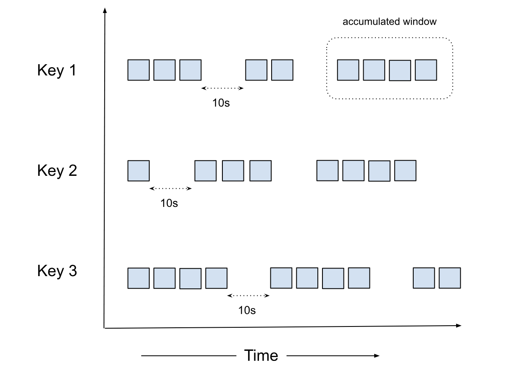

# Accumulator

Accumulator is a special kind of window similar to a [Session Window](session.md) designed for complex operations like
reordering, custom triggering, and joining multiple ordered streams. Like other windowing strategies (fixed,
sliding, or session windows), the Accumulator window maintains state for each key, but unlike others, it allows for
manipulation of the `Datum` and emitting them based on custom rules (e.g., sorting) . Accumulator solves is a different
type of problem outside both `map`/`flatmap` (one to ~one) and `reduce` (many to ~one) and instead of `Message`, we
have to emit back the "manipulated" `Datum`.



Another difference between the Accumulator and the Session windows is that in Accumulator, there is no concept of
[window merge](./session.md#window-merge).

## Why Accumulator?

Accumulator is a powerful concept that lets you tap into the raw Datum stream and manipulate not just the order but the
Datum stream itself. It has a powerful semantics where the input and output is a stream of `Datum` creating a
Global Window. It opens up the possibility of very advanced use cases like custom triggers (e.g., count based triggers
combined with windowing strategies).

=== "Go"

    ```go
    func Accumulator(in <-chan Datum) <-chan Datum {
        out := make(chan Datum)
        go func() {
            defer close(out)
            var state []Datum
            for i := range in {
                if WatermarkProgressed(i) {
                    sort.Slice(state, func(a, b int) bool {
                        return state[a].Timestamp < state[b].Timestamp
                    })
                    for _, d := range state {
                        out <- d
                    }
                    state = nil
                }
                state = append(state, i)
            }
        }()
        return out
    }
    ```

=== "Python"

    ```python
    def Accumulator(input_stream):
        """
        Processes an input stream of Datum objects, maintaining an ordered state.
        Emits elements when the watermark progresses.
        """
        state = OrderedList()
        output_stream = []

        for i in input_stream:
            # The condition will return True if watermark progresses
            if WatermarkProgressed(i):
                # Pop all sorted elements and write to output stream
                output_stream.extend(state.pop_n())

            # Insert the current element into the ordered state
            state.insert(i)

        return output_stream
    ```

=== "Rust"

    ```rust
    struct Accumulator {
        state: OrderedList<Datum>,
    }

    impl Accumulator {
        fn new() -> Self {
            Self {
                state: OrderedList::new(),
            }
        }

        fn process(&mut self, input_stream: &[Datum], output_stream: &mut Vec<Datum>) {
            for i in input_stream {
                // Check if the watermark has progressed
                if WatermarkProgressed(i) {
                    // Pop all sorted elements and write to output stream
                    let popped = self.state.pop_all();
                    output_stream.extend(popped);
                }
                self.state.insert(i.clone());
            }
        }
    }

    ```

=== "Java"

    ```java
    import java.util.ArrayList;
    import java.util.List;

    public class Accumulator {
        private OrderedList<Datum> state;

        public Accumulator() {
            state = new OrderedList<>();
        }

        public void process(List<Datum> inputStream, List<Datum> outputStream) {
            for (Datum i : inputStream) {
                // Check if the watermark has progressed
                if (WatermarkProgressed(i)) {
                    // Pop all sorted elements and write to output stream
                    List<Datum> popped = state.popAll();
                    outputStream.addAll(popped);
                }
                state.insert(i);
            }
        }
    }
    ```

### Considerations

The Accumulator window is powerful but should be used carefully as it can cause pipeline stalling if not configured
properly.

#### Factors to consider

Please consider the following factors when using the Accumulator window (not comprehensive):

1. For high-throughput scenarios, ensure adequate storage is provisioned
2. The timeout should be set based on the expected data arrival patterns and latency requirements
3. Consider the trade-off between data completeness (longer timeout) and processing latency (shorter timeout)
4. Please make sure Watermark is honored when publishing the data, else completeness and correctness is not guaranteed

#### Data Retention

To ensure there is no data loss during pod restarts, the Accumulator window replays data from persistent storage. The
system stores data until `Outbound(Watermark) - 1`, which means it keeps the minimum necessary data to ensure correctness
while managing resource usage.

#### Constraints

1. For data older than `Outbound(Watermark) - 1`, users need to bring in an external store and implement replay on restart
2. Data deletion is based on the `Outbound(Watermark)`

### Few general use cases

1. **Stream Joining**: Combining multiple ordered streams into a single ordered output
2. **Event Reordering**: Handling out-of-order events and ensuring they're processed in the correct sequence
3. **Time-based Correlation**: Correlating events from different sources based on their timestamps
4. **Custom Sorting**: Implementing user-defined sorting logic for event streams
5. **Custom Triggering**: Triggering actions based on specific conditions or events within the stream

## Configuration

```yaml
vertices:
  - name: my-udf
    udf:
      groupBy:
        window:
          accumulator:
            timeout: duration
```

NOTE: A duration string is a possibly signed sequence of decimal numbers, each with optional fraction and a unit suffix,
such as "300ms", "1.5h" or "2h45m". Valid time units are "ns", "us" (or "µs"), "ms", "s", "m", "h".

### timeout

The `timeout` is the duration of inactivity (no data flowing in for a particular key) after which the accumulator state
is removed. This helps prevent memory leaks by cleaning up state for keys that are no longer active.

Note: The determination of whether a key is inactive, or has timed out, is based on the watermark progressing. 
In order to close the accumulator window, we compare this timeout against the watermark. 
If the watermark progression for the vertex has stalled for some reason, eg: due to one of the sources idling in a multi-source setup, 
the timeout may not be triggered without configuring [idle watermark detection](https://numaflow.numaproj.io/core-concepts/watermarks/#idle-detection).
Currently, in such cases, the accumulator window may not close as it continues to hold on to the state for the key while ingesting
more data, hoping to progress watermark with the next datum. This might lead to OOM situations.

## How It Works

The Accumulator window works by:

1. Maintaining an ordered list of elements for each key
2. When the watermark progresses, it pops all sorted elements and writes them to the output stream
3. New elements are inserted into the ordered list based on their event time
4. If no new data arrives for a key within the specified timeout period, the window is closed

Unlike both `map` or `reduce` operations, where `Datum` is consumed and `Message` is returned, for reordering with the
Accumulator, the `Datum` is kept intact.


## Example

Here's an [example](https://github.com/numaproj/numaflow/blob/main/examples/13-accumulator-window.yaml) of using an
Accumulator window to join and sort two HTTP sources:

```yaml
apiVersion: numaflow.numaproj.io/v1alpha1
kind: Pipeline
metadata:
  name: simple-accumulator
spec:
  vertices:
    - name: http-one
      scale:
        min: 1
        max: 1
      source:
        http: {}
    - name: http-two
      scale:
        min: 1
        max: 1
      source:
        http: {}
    - name: accum
      udf:
        container:
          # stream sorter example
          image: quay.io/numaio/numaflow-go/stream-sorter:stable
        groupBy:
          window:
            accumulator:
              timeout: 10s
          keyed: true
          storage:
            persistentVolumeClaim:
              volumeSize: 1Gi
    - name: sink
      scale:
        min: 1
        max: 1
      sink:
        log: {}
  edges:
    - from: http-one
      to: accum
    - from: http-two
      to: accum
    - from: accum
      to: sink
```

In this example:

1. We have two HTTP sources (`http-one` and `http-two`) that produce ordered streams
2. The `accum` vertex uses an Accumulator window with a timeout of 10 seconds
3. The accumulator joins and sorts the events from both sources based on their event time
4. The sorted output is sent to a log sink

Note: Setting `readBatchSize: 1` helps maintain the ordering of events in the input streams.

Check out the snippets below to see the UDF examples for different languages:

=== "Go"

    ```go
    func (s *streamSorter) Accumulate(ctx context.Context, input <-chan accumulator.Datum, output chan<- accumulator.Message) {
        for {
            select {
            case <-ctx.Done():
                log.Println("Exiting the Accumulator")
                return
            case datum, ok := <-input:
                // this case happens due to timeout
                if !ok {
                    log.Println("Input channel closed")
                    return
                }
                log.Println("Received datum with event time: ", datum.EventTime().UnixMilli())

                // watermark has moved, let's flush
                if datum.Watermark().After(s.latestWm) {
                    s.latestWm = datum.Watermark()
                    s.flushBuffer(output)
                }

                // store the data into the internal buffer
                s.insertSorted(datum)
            }
        }
    }
    ```
    [View the Full Example on numaflow-go Github](https://github.com/numaproj/numaflow-go/blob/3abee2e44a004909e99ea1c3b5ee8d328cba37b0/examples/accumulator/streamsorter/main.go#L23)

=== "Python"

    ```python
    class StreamSorter(Accumulator):
      def __init__(self):
          _LOGGER.info("StreamSorter initialized")
          self.latest_wm = datetime.fromtimestamp(-1)
          self.sorted_buffer: list[Datum] = []

      async def handler(
          self,
          datums: AsyncIterable[Datum],
          output: NonBlockingIterator,
      ):
          _LOGGER.info("StreamSorter handler started")
          async for datum in datums:
              _LOGGER.info(
                  f"Received datum with event time: {datum.event_time}, "
                  f"Current latest watermark: {self.latest_wm}, "
                  f"Datum watermark: {datum.watermark}"
              )

              # If watermark has moved forward
              if datum.watermark and datum.watermark > self.latest_wm:
                  self.latest_wm = datum.watermark
                  _LOGGER.info(f"Watermark updated: {self.latest_wm}")
                  await self.flush_buffer(output)

              self.insert_sorted(datum)

          _LOGGER.info("Timeout reached")
          await self.flush_buffer(output, flush_all=True)
    ```
    [View the full example on numaflow-python Github](https://github.com/numaproj/numaflow-python/blob/83eeb23c791de5121b1b03cd1717234e2c5a5048/packages/pynumaflow/examples/accumulator/streamsorter/example.py#L19)

=== "Rust"

    ```rust
      /// insert_sorted will do a binary-search and inserts the AccumulatorRequest into the sorted buffer.
      fn insert_sorted(sorted_buffer: &mut Vec<AccumulatorRequest>, request: AccumulatorRequest) {
          let event_time = request.event_time;

          // Find the insertion point using binary search
          let index = sorted_buffer
              .binary_search_by(|probe| probe.event_time.cmp(&event_time))
              .unwrap_or_else(|e| e);

          sorted_buffer.insert(index, request);
      }

    ```
    [View the full example in nummaflow-rs on Github](https://github.com/numaproj/numaflow-rs/blob/3adf2b5280e3e57abeb521ac02222ff1c7ce8e5f/examples/stream-sorter/src/main.rs#L17C1-L28C1)

=== "Java"

    ```java
      @Slf4j
      @AllArgsConstructor
      public class StreamSorterFactory extends AccumulatorFactory<StreamSorterFactory.StreamSorter> {

          public static void main(String[] args) throws Exception {
              log.info("Starting stream sorter server..");
              Server server = new Server(new StreamSorterFactory());

              // Start the server
              server.start();

              // wait for the server to shut down
              server.awaitTermination();
              log.info("Stream sorter server exited..");
          }

          @Override
          public StreamSorter createAccumulator() {
              return new StreamSorter();
          }

          public static class StreamSorter extends Accumulator {
              private Instant latestWm = Instant.ofEpochMilli(-1);
              private final TreeSet<Datum> sortedBuffer = new TreeSet<>(Comparator
                      .comparing(Datum::getEventTime)
                      .thenComparing(Datum::getID)); // Assuming Datum has a getUniqueId() method

              @Override
              public void processMessage(Datum datum, OutputStreamObserver outputStream) {
                  log.info("Received datum with event time: {}", datum.toString());
                  if (datum.getWatermark().isAfter(latestWm)) {
                      latestWm = datum.getWatermark();
                      flushBuffer(outputStream);
                  }
                  sortedBuffer.add(datum);
              }

              @Override
              public void handleEndOfStream(OutputStreamObserver outputStreamObserver) {
                  log.info("Eof received, flushing sortedBuffer: {}", latestWm.toEpochMilli());
                  flushBuffer(outputStreamObserver);
              }

              private void flushBuffer(OutputStreamObserver outputStream) {
                  log.info("Watermark updated, flushing sortedBuffer: {}", latestWm.toEpochMilli());
                  while (!sortedBuffer.isEmpty() && sortedBuffer
                          .first()
                          .getEventTime()
                          .isBefore(latestWm)) {
                      Datum datum = sortedBuffer.pollFirst();
                      assert datum != null;
                      outputStream.send(new Message(datum));
                      log.info("Sent datum with event time: {}", datum.getEventTime().toEpochMilli());
                  }
              }
          }
      }
    ```
    [View the full example in numaflow-java Github](https://github.com/numaproj/numaflow-java/blob/38734c04df9e2182c0dadf2c7a4d83997ea7c2ad/examples/src/main/java/io/numaproj/numaflow/examples/accumulator/sorter/StreamSorterFactory.java)

