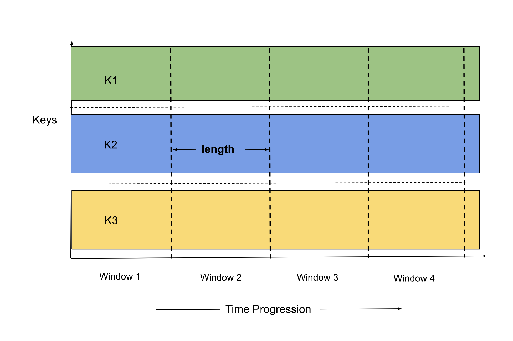

# Fixed

## Overview

Fixed windows (sometimes called tumbling windows) are defined by a static window size, e.g. 30 second
windows, one minute windows, etc. They are generally aligned, i.e. every window applies across all
the data for the corresponding period of time. It has a fixed size measured in time and does not
overlap. The element which belongs to one window will not belong to any other tumbling window.
For example, a window size of 20 seconds will include all entities of the stream which came in a
certain 20-second interval.



To enable Fixed window, we use `fixed` under `window` section.

```yaml
vertices:
  - name: my-udf
    udf:
      groupBy:
        window:
          fixed:
            length: duration
```

NOTE: A duration string is a possibly signed sequence of decimal numbers, each with optional fraction
and a unit suffix, such as "300ms", "1.5h" or "2h45m". Valid time units are "ns", "us" (or "µs"), "ms", "s", "m", "h".

### Length

The `length` is the window size of the fixed window.

## Example

A 60-second window size can be defined as following.

```yaml
vertices:
  - name: my-udf
    udf:
      groupBy:
        window:
          fixed:
            length: 60s
```

The yaml snippet above contains an example spec of a _reduce_ vertex that uses fixed window 
aggregation. As we can see, the length of the window is 60s. This means only one window will be 
active at any point in time. It is also possible to have multiple inactive and non-empty windows
(based on out-of-order arrival of elements).

The window boundaries for the first window (post bootstrap) are determined by rounding down from
`time.now()` to the nearest multiple of `length` of the window. So considering the above example,
if the `time.now()` corresponds to `2031-09-29T18:46:30Z`, then the start-time of the window will
be adjusted to `2031-09-29T18:46:00Z` and the end-time is set accordingly to `2031-09-29T18:47:00Z`.
Windows are left inclusive and right exclusive which means an element with event time (considering
event time characteristic) of `2031-09-29T18:47:00Z` will belong to the window with boundaries
`[2031-09-29T18:47:00Z, 2031-09-29T18:48:00Z)`

It is important to note that because of this property, for a constant throughput, the first window 
may contain fewer elements than other windows. 


