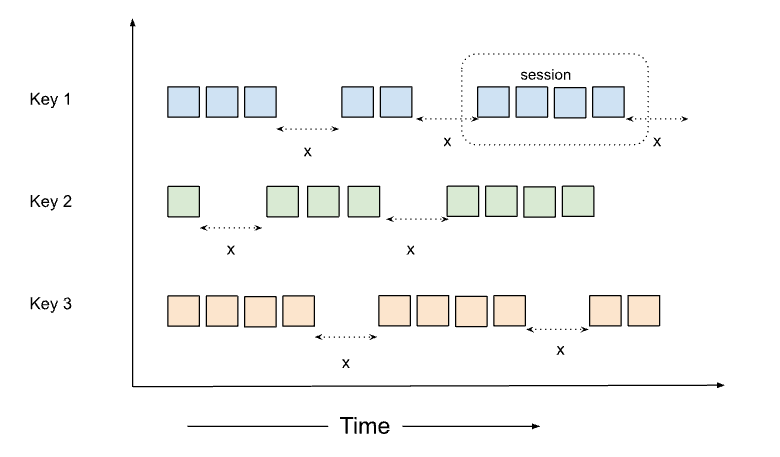

# Session

## Overview

Session window is a type of Unaligned window where the window’s end time keeps moving until there is no data for a 
given time duration. Unlike fixed and sliding windows, session windows do not overlap, nor do they have a set start
and end time. They can be used to group data based on activity.



```yaml
vertices:
  - name: my-udf
    udf:
      groupBy:
        window:
          session:
            timeout: duration
```

NOTE: A duration string is a possibly signed sequence of decimal numbers, each with optional fraction
and a unit suffix, such as "300ms", "1.5h" or "2h45m". Valid time units are "ns", "us" (or "µs"), "ms", "s", "m", "h".

### timeout

The `timeout` is the duration of inactivity (no data flowing in for the particular key) after which the session is
considered to be closed.

## Example

To create a session window of timeout 1 minute, we can use the following snippet.

```yaml
vertices:
  - name: my-udf
    udf:
      groupBy:
        window:
          session:
            timeout: 60s
```

The yaml snippet above contains an example spec of a _reduce_ vertex that uses session window aggregation. As we can see,
the timeout of the window is 60s. This means we no data arrives for a particular key for 60 seconds, we will mark
it as closed.

Let's say, `time.now()` in the pipeline is `2031-09-29T18:46:30Z` as the current time, and we have a session gap of 30s.
If we receive events in this pattern:

```text
Event-1 at 2031-09-29T18:45:40Z
Event-2 at 2031-09-29T18:45:55Z   # Notice the 15 sec interval from Event-1, still within session gap
Event-3 at 2031-09-29T18:46:20Z   # Notice the 25 sec interval from Event-2, still within session gap
Event-4 at 2031-09-29T18:46:55Z   # Notice the 35 sec interval from Event-3, beyond the session gap
Event-5 at 2031-09-29T18:47:10Z   # Notice the 15 sec interval from Event-4, within the new session gap
```

This would lead to two session windows as follows:

```text
[2031-09-29T18:45:40Z, 2031-09-29T18:46:20Z)   # includes Event-1, Event-2 and Event-3
[2031-09-29T18:46:55Z, 2031-09-29T18:47:10Z)   # includes Event-4 and Event-5
```

In this example, the start time is inclusive and the end time is exclusive. `Event-1`, `Event-2`, and `Event-3` fall within 
the first window, and this window closes 30 seconds after `Event-3` at `2031-09-29T18:46:50Z`. `Event-4` arrives 5 seconds 
later, meaning it's beyond the session gap of the previous window, initiating a new window. The second window includes 
`Event-4` and `Event-5`, and it closes 30 seconds after `Event-5` at `2031-09-29T18:47:40Z`, if no further events arrive
for the key until the timeout.

Note: Streaming mode is by default enabled for session windows. 

Check the links below to see the UDF examples for different languages. Currently, we have the SDK support for Golang and Java.

- [Golang](https://github.com/numaproj/numaflow-go/tree/main/pkg/sessionreducer)
- [Java](https://github.com/numaproj/numaflow-java/tree/main/examples/src/main/java/io/numaproj/numaflow/examples/reducesession/counter)


