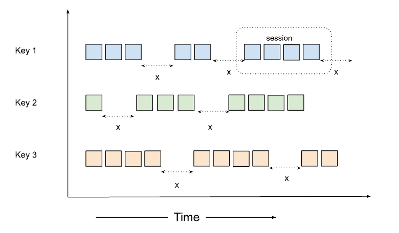

# Session

Session window is a type of Unaligned window where the window’s end time keeps moving until there is no data for a 
given time duration. Unlike fixed and sliding windows, session windows do not overlap, nor do they have a set start
and end time. They can be used to group data based on activity.



## Window Merge
There are cases where two session windows can be merged into one. This happens when the end time of one window is greater
than the start time of the other window. The reason for creating two sessions is that there was a gap (greater than
the session timeout) between the arrival of the events due to out-of-orderliness at the source. The moment an event that
arrives in between the two windows arrives, the two windows are merged into one.

## Configuration

```yaml
vertices:
  - name: my-udf
    udf:
      groupBy:
        window:
          session:
            timeout: duration
```

NOTE: A duration string is a possibly signed sequence of decimal numbers, each with optional fraction
and a unit suffix, such as "300ms", "1.5h" or "2h45m". Valid time units are "ns", "us" (or "µs"), "ms", "s", "m", "h".

### timeout

The `timeout` is the duration of inactivity (no data flowing in for the particular key) after which the session is
considered to be closed.

Note: The determination of whether a key is inactive, or has timed out, is based on the watermark progressing.
In order to close the session window, we compare this timeout against the watermark.
If the watermark progression for the vertex has stalled for some reason, eg: due to one of the sources idling in a multi-source setup,
the timeout may not be triggered without configuring [idle watermark detection](https://numaflow.numaproj.io/core-concepts/watermarks/#idle-detection).
Currently, in such cases, the session window may not close as it continues to hold on to the state for the key while ingesting
more data, hoping to progress watermark with the next datum. This might lead to OOM situations.

## Example

To create a session window of timeout 1 minute, we can use the following snippet.

```yaml
vertices:
  - name: my-udf
    udf:
      groupBy:
        window:
          session:
            timeout: 60s
```

The yaml snippet above contains an example spec of a _reduce_ vertex that uses session window aggregation. As we can see,
the timeout of the window is 60s. This means we no data arrives for a particular key for 60 seconds, we will mark
it as closed.

Let's say, `time.now()` in the pipeline is `2031-09-29T18:46:30Z` as the current time, and we have a session gap of 30s.
If we receive events in this pattern:

```text
Event-1 at 2031-09-29T18:45:40Z
Event-2 at 2031-09-29T18:45:55Z   # Notice the 15 sec interval from Event-1, still within session gap
Event-3 at 2031-09-29T18:46:20Z   # Notice the 25 sec interval from Event-2, still within session gap
Event-4 at 2031-09-29T18:46:55Z   # Notice the 35 sec interval from Event-3, beyond the session gap
Event-5 at 2031-09-29T18:47:10Z   # Notice the 15 sec interval from Event-4, within the new session gap
```

This would lead to two session windows as follows:

```text
[2031-09-29T18:45:40Z, 2031-09-29T18:46:20Z)   # includes Event-1, Event-2 and Event-3
[2031-09-29T18:46:55Z, 2031-09-29T18:47:10Z)   # includes Event-4 and Event-5
```

In this example, the start time is inclusive and the end time is exclusive. `Event-1`, `Event-2`, and `Event-3` fall within 
the first window, and this window closes 30 seconds after `Event-3` at `2031-09-29T18:46:50Z`. `Event-4` arrives 5 seconds 
later, meaning it's beyond the session gap of the previous window, initiating a new window. The second window includes 
`Event-4` and `Event-5`, and it closes 30 seconds after `Event-5` at `2031-09-29T18:47:40Z`, if no further events arrive
for the key until the timeout.

Note: Streaming mode is by default enabled for session windows. 

Check out the snippets below to see the UDF examples for different languages. Currently, we have the SDK support for Golang, Java and Rust.

=== "Go"

    ```go
    // Counter is a simple session reducer which counts the number of events in a session.
    type Counter struct {
        count *atomic.Int32
    }

    func (c *Counter) SessionReduce(ctx context.Context, keys []string, input <-chan sessionreducer.Datum, outputCh chan<- sessionreducer.Message) {
        for range input {
            c.count.Inc()
        }
        outputCh <- sessionreducer.NewMessage([]byte(fmt.Sprintf("%d", c.count.Load()))).WithKeys(keys)
    }

    func (c *Counter) Accumulator(ctx context.Context) []byte {
        return []byte(strconv.Itoa(int(c.count.Load())))
    }

    func (c *Counter) MergeAccumulator(ctx context.Context, accumulator []byte) {
        val, err := strconv.Atoi(string(accumulator))
        if err != nil {
            log.Println("unable to convert the accumulator value to int: ", err.Error())
            return
        }
        c.count.Add(int32(val))
    }
    ```
    [View the full example on numaflow-go Github](https://github.com/numaproj/numaflow-go/blob/1534f10dfc84c1e46bea2e0fbcecdf648f042384/examples/sessionreducer/counter/main.go)

=== "Java"

    ```java
    /**
     * CountFunction is a simple session reducer which counts the number of events in a session.
     */
    @Slf4j
    public class CountFunction extends SessionReducer {

        private final AtomicInteger count = new AtomicInteger(0);

        @Override
        public void processMessage(
                String[] keys,
                Datum datum,
                io.numaproj.numaflow.sessionreducer.model.OutputStreamObserver outputStreamObserver) {
            this.count.incrementAndGet();
        }

        @Override
        public void handleEndOfStream(
                String[] keys,
                io.numaproj.numaflow.sessionreducer.model.OutputStreamObserver outputStreamObserver) {
            outputStreamObserver.send(new Message(String.valueOf(this.count.get()).getBytes()));
        }

        @Override
        public byte[] accumulator() {
            return String.valueOf(this.count.get()).getBytes();
        }

        @Override
        public void mergeAccumulator(byte[] accumulator) {
            int value = 0;
            try {
                value = Integer.parseInt(new String(accumulator));
            } catch (NumberFormatException e) {
                log.info("error while parsing integer - {}", e.getMessage());
            }
            this.count.addAndGet(value);
        }
    }
    ```
    [View the full example on numaflow-java Github](https://github.com/numaproj/numaflow-java/blob/a312216e5a56d7cc25614b03a13f9ee7960f3c2c/examples/src/main/java/io/numaproj/numaflow/examples/reducesession/counter/CountFunction.java)

=== "Rust"

    ```rust
    pub(crate) struct Counter {
        count: Arc<AtomicU32>,
    }

    #[async_trait]
    impl SessionReducer for Counter {
        async fn session_reduce(
            &self,
            keys: Vec<String>,
            mut input: mpsc::Receiver<SessionReduceRequest>,
            output: mpsc::Sender<Message>,
        ) {
            // Count all incoming messages in this session
            while input.recv().await.is_some() {
                self.count.fetch_add(1, Ordering::Relaxed);
            }

            // Send the current count as the result
            let count_value = self.count.load(Ordering::Relaxed);
            let message = Message::new(count_value.to_string().into_bytes()).with_keys(keys);

            if let Err(e) = output.send(message).await {
                eprintln!("Failed to send message: {}", e);
            }
        }

        async fn accumulator(&self) -> Vec<u8> {
            // Return the current count as bytes for accumulator
            let count = self.count.load(Ordering::Relaxed);
            count.to_string().into_bytes()
        }

        async fn merge_accumulator(&self, accumulator: Vec<u8>) {
            // Parse the accumulator value and add it to our count
            if let Ok(accumulator_str) = String::from_utf8(accumulator) {
                if let Ok(accumulator_count) = accumulator_str.parse::<u32>() {
                    self.count.fetch_add(accumulator_count, Ordering::Relaxed);
                } else {
                    eprintln!("Failed to parse accumulator value: {}", accumulator_str);
                }
            } else {
                eprintln!("Failed to convert accumulator bytes to string");
            }
        }
    }
    ```
    [View the full example on numaflow-rs Github](https://github.com/numaproj/numaflow-rs/blob/c36edc2ccdeb1d1baa0b970c7ae0c88db62f0ccf/examples/session-counter/src/main.rs)
