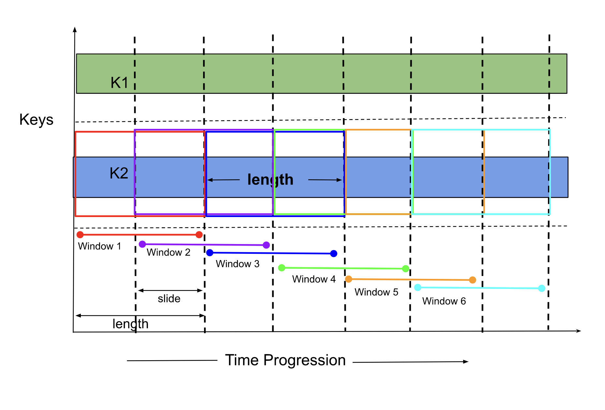

# Sliding

Sliding windows are similar to Fixed windows, the size of the windows is measured in time and is fixed.
The important difference from the Fixed window is the fact that it allows an element to be present in
more than one window. The additional window slide parameter controls how frequently a sliding window
is started. Hence, sliding windows will be overlapping and the slide should be smaller than the window
length.



## Configuration

```yaml
vertices:
  - name: my-udf
    udf:
      groupBy:
        window:
          sliding:
            length: duration
            slide: duration
```

NOTE: A duration string is a possibly signed sequence of decimal numbers, each with optional fraction
and a unit suffix, such as "300ms", "1.5h" or "2h45m". Valid time units are "ns", "us" (or "µs"), "ms", "s", "m", "h".

### Length

The `length` is the window size of the fixed window.

### Slide

`slide` is the slide parameter that controls the frequency at which the sliding window is created.

## Example

To create a sliding window of length 1 minute which slides every 10 seconds, we can use the following snippet.

```yaml
vertices:
  - name: my-udf
    udf:
      groupBy:
        window:
          sliding:
            length: 60s
            slide: 10s
```

The yaml snippet above contains an example spec of a _reduce_ vertex that uses sliding window aggregation. As we can see, 
the length of the window is 60s and sliding frequency is once every 10s. This means there will be multiple windows
active at any point in time. 

Let's say, `time.now()` in the pipeline is `2031-09-29T18:46:30Z` the active window boundaries will be as follows (there
are total of 6 windows `60s/10s`)

```text
[2031-09-29T18:45:40Z, 2031-09-29T18:46:40Z)
[2031-09-29T18:45:50Z, 2031-09-29T18:46:50Z) # notice the 10 sec shift from the above window
[2031-09-29T18:46:00Z, 2031-09-29T18:47:00Z)
[2031-09-29T18:46:10Z, 2031-09-29T18:47:10Z)
[2031-09-29T18:46:20Z, 2031-09-29T18:47:20Z)
[2031-09-29T18:46:30Z, 2031-09-29T18:47:30Z)
```

The window start time is always be left inclusive and right exclusive. That is why `[2031-09-29T18:45:30Z, 2031-09-29T18:46:30Z)` 
window is not considered active (it fell on the previous window, right exclusive) but `[2031-09-29T18:46:30Z, 2031-09-29T18:47:30Z)` 
is an active (left inclusive).

The first window always ends after the sliding seconds from the `time.Now()`, the start time of the window will be the 
nearest integer multiple of the slide which is less than the message's event time. So the first window starts in the 
past and ends _sliding_duration (based on time progression in the pipeline and not the wall time) from present. It is 
important to note that regardless of the window boundary (starting in the past or ending in the future) the target element 
set totally depends on the matching time (in case of event time, all the elements with the time that falls with in the 
boundaries of the window, and in case of system time, all the elements that arrive from the `present` until the end of 
window `present + sliding`)

From the point above, it follows then that immediately upon startup, for the first window, fewer elements may get 
aggregated depending on the current _lateness_ of the data stream.

Check the links below to see the UDF examples for different languages.

- [Python](https://github.com/numaproj/numaflow-python/tree/main/packages/pynumaflow/examples/reduce)
- [Golang](https://github.com/numaproj/numaflow-go/tree/main/examples/reducer)
- [Java](https://github.com/numaproj/numaflow-java/tree/main/examples/src/main/java/io/numaproj/numaflow/examples/reduce)


## Streaming Mode

Reduce can be enabled on streaming mode to stream messages or forward partial responses to the next vertex.
This is useful for custom triggering, where we want to forward responses to the next vertex quickly,
even before the fixed window closes. The close-of-book and a final triggering will still happen even if
partial results have been emitted.


To enable reduce streaming, set the `streaming` flag to `true` in the sliding window configuration.

```yaml
vertices:
  - name: my-udf
    udf:
      groupBy:
        window:
          sliding:
            length: duration
            slide: duration
            streaming: true # set streaming to true to enable reduce streamer
```

Note: UDFs should use the ReduceStreamer functionality in the SDKs to use this feature.

Check the links below to see the UDF examples in streaming mode for different languages.

- [Python](https://github.com/numaproj/numaflow-python/tree/main/packages/pynumaflow/examples/reducestream)
- [Golang](https://github.com/numaproj/numaflow-go/tree/main/examples/reducestreamer)
- [Java](https://github.com/numaproj/numaflow-java/tree/main/examples/src/main/java/io/numaproj/numaflow/examples/reducestreamer/sum)


