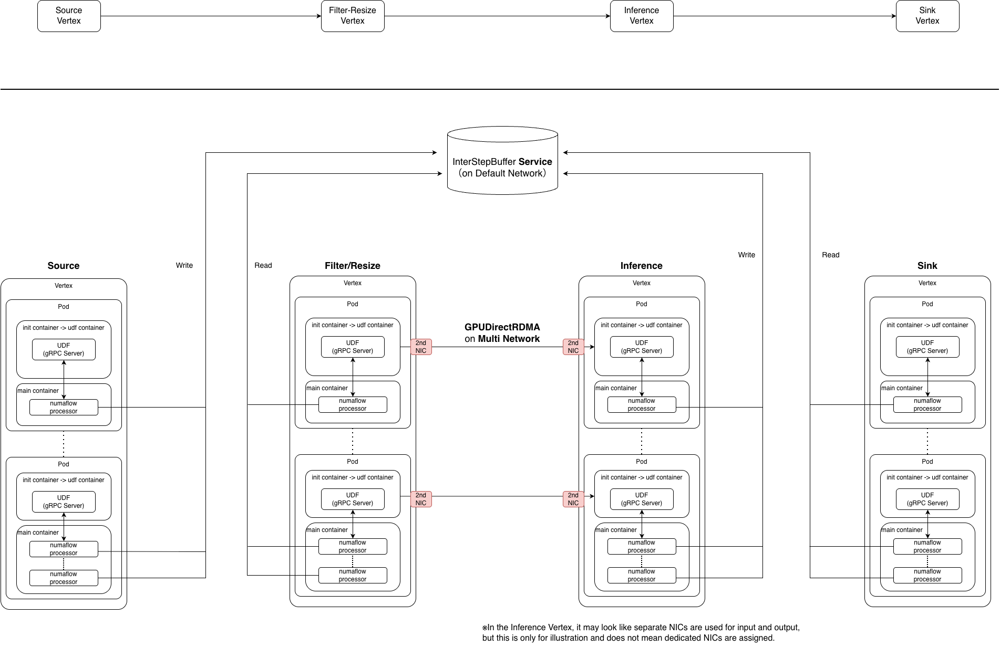
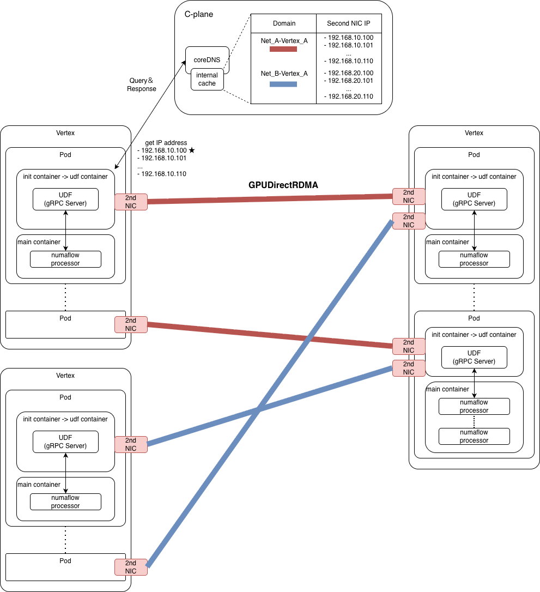
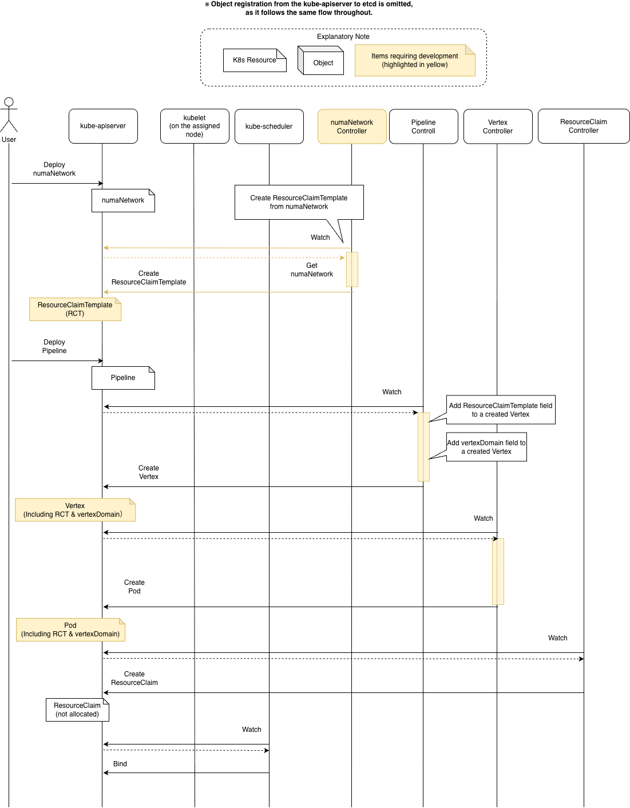

# Summary

# Motivation
With advances in sensing, networking, and AI processing, modern ICT infrastructures are facing rapidly increasing demands for large-scale data processing. As a result, the power consumption required to handle these large volumes of data has become a serious concern. In other words, today’s infrastructures must simultaneously improve processing performance while reducing energy consumption.

For dataflow-based platforms such as Numaflow, using hardware accelerators for individual tasks (pods) can significantly improve performance per watt. We expect that, in the near future, most tasks in an application will run on specialized accelerators. 

While accelerators reduce task execution time, processing can be bottlenecked if data transfer speeds between tasks do n't improve accordingly. Therefore, as data processing performance increases, the performance requirements for data communication to support large-scale data transfers also become more demanding.

Therefore, we consider introducing a high-speed communication method with low transfer overhead, such as GPUDirect RDMA, for inter-vertex communication. To achieve this, the following elements are required.

1. [GPUDirect RDMA](https://developer.nvidia.com/gpudirect), which enables direct device-to-device communication between GPUs, requires RDMA-capable NICs. In other words, it is necessary to introduce a high-speed network by assigning a second NIC for RDMA to each pod, separate from the default network.
2. To enable direct communication using GPUDirect RDMA, a method is required to specify the peer device based on its IP address on a high-speed network.

Therefore, to realize the ICT infrastructure required in the near future, we propose new approaches for Numaflow regarding (1) the type of network and (2) the data communication method used between vertices.

**the type of network used between vertices**

Currently, pod-to-pod communication in Kubernetes clusters is handled via the default network. However, to support use cases that process large volumes of data, such as LLMs, there is a growing demand for high-bandwidth networks in Kubernetes clusters.

Accordingly, within the Kubernetes community’s [Device Management Working Group](https://github.com/kubernetes-sigs/wg-device-management), discussions are underway to enable the construction of high-speed networks (MultiNetwork) by assigning a second NIC to pods using the DRA feature proposed by the WG.

Based on this trend, we also aim to introduce MultiNetwork into Numaflow and enable MultiNetwork to be specified as the network used for communication between vertices.

**the data communication method used between vertices**

In the current Numaflow architecture, data communication is performed via the InterStepBufferService (ISBSVC) resource from the main container, which is separate from the UDF container that executes the actual processing.

In contrast, GPUDirect RDMA enables direct device-to-device communication. Therefore, instead of using ISBSVC and the main container, data is sent directly from a UDF container to the next UDF container that acts as the downstream processing entity.

Accordingly, to enable GPUDirect RDMA in Numaflow, we introduce a mechanism that provides the necessary connection information—such as IP address, port, and GPU ID—required for direct device-to-device communication using GPUDirect RDMA.

# Desired Functionality
## Overall Architecture
An example pipeline based on the Video Inference System is presented below.



The figure illustrates a newly proposed network type and a direct communication method (GPUDirect RDMA) introduced between Filter/Resize and Inference.

> [!IMPORTANT] Basic Architecture Overview
> - A Vertex (CR) is the fundamental unit of a pipeline.
> - Each Vertex consists of one or more pods. Each pod contains a container responsible for data processing and a main container responsible for data communication.
> 
> - Vertex scaling is classified into two types:
>   - Horizontal scaling, achieved by increasing or decreasing the number of pods.
>   - Vertical scaling, achieved by increasing or decreasing the number of Numaflow processors within the main container, which handle the actual communication processing.


## Functionality



<table>
  <tr>
    <th>Functionality</th>
    <th>Responsibility</th>
    <th>Change</th>
  </tr>
  <tr>
    <td rowspan="4">Add MultiNetwork as a network type for inter-Vertex communication</td>
    <td>The numaNetwork (a new CRD) to represent the MultiNetwork concept</td>
    <td>Add numaNetwork(CRD)</td>
  </tr>
  <tr>
    <td>the edge field in the Pipeline manifest specifies the numaNetwork used for inter-Vertex communication</td>
    <td>Add a numaNetwork field to the edges field in the Pipeline manifest.</td>
  </tr>
  <tr>
    <td>The numaNetwork controller create a ResourceClaim to assign a second NIC</td>
    <td>Add the numaNetwork controller</td>
  </tr>
  <tr>
    <td>The Pipeline controller adds a reference to a ResourceClaimTemplate to each Vertex</td>
    <td>Change the Pipeline controller logic that parses the spec.edges field in the Pipeline manifest</td>
  </tr>
  <tr>
    <td rowspan="5">Add GPUDirect RDMA as a communication method on MultiNetwork</td>
    <td>The Vertex controller creates and stores a query domain name</td>
    <td>TBD</td>
  </tr>
  <tr>
    <td>The external controller(a new component) registers DNS resource records in CoreDNS, mapping destination Vertex domains to second NIC IPs on the network to which the Vertex belongs</td>
    <td>Create the external controller</td>
  </tr>
  <tr>
    <td>The CoreDNS etcd plugin stores DNS resource records</td>
    <td>Add the etcd plugin to CoreDNS</td>
  </tr>
  <tr>
    <td>The UDF retrieves a list of second NIC IPs for containers belonging to the destination Vertex</td>
    <td>Create an API to query CoreDNS and retrieve the results</td>
  </tr>
  <tr>
    <td>A new communication library wraps GPUDirect RDMA and sends data to the next Vertex</td>
    <td>Create a new communication library</td>
  </tr>
</table>

# Workflow
## Precondition
1. Cluster administrator create [Virtual Function](https://docs.nvidia.com/doca/archive/doca-v1.3/virtual-functions/index.html)
2. Cluster administrator deploy [DeviceClass](https://kubernetes.io/docs/concepts/scheduling-eviction/dynamic-resource-allocation/#deviceclass)
3. Users create [ResourceClaims or ResourceClaimTemplates](https://kubernetes.io/docs/concepts/scheduling-eviction/dynamic-resource-allocation/#resourceclaims-templates) to request PCIe devices other than NICs, such as GPUs

## Deployment Sequence of Pods resources



The following workflow represents our current understanding.

1. Deploy a numaNetwork resource and store the corresponding ResourceClaimTemplate, which is required to construct the network, in etcd
2. Deploy a Pipeline, and the Pipeline controller parses the edge information
   1. If a numaNetwork is referenced, the controller accesses the API Server to retrieve the numaNetwork information
   2. Add a field to the Vertex to reference the ResourceClaimTemplate associated with the numaNetwork
   3. Creates a domain name for each destination Vertex on a per-network basis in the toEdges field
       - The domain name is called vertexDomain and is defined as <numaNetwork metadata.name>-<vertex metadata.name>
3. The Vertex controller creates Pod resources and registers them in etcd via the API Server
4. The ResourceClaimTemplate controller detects that pod.spec.resourceClaims[].resourceClaimTemplateName is specified and creates the corresponding ResourceClaim
5. The kube-scheduler schedules the Pod
   - The mapping between the ResourceClaim and the ResourceSlice is evaluated


## Second NIC IP Configuration and Assignment
- Precondition:
	- A component that watches Vertex creation and registers DNS resource records in CoreDNS is running
	- Each DNS resource record maps a Vertex domain to the second NIC IP address assigned to the container

1. Once the kube-scheduler assigns a Pod to a Node, the kubelet on that Node starts operating
2. Based on the ResourceClaims associated with the Pod assigned to the Node, the kubelet instructs the DRA driver to allocate the actual device.
3. DRA driver for NIC performs device setup. As part of this process, it assigns an IP address to the second NIC (VF) using an IPAM tool
   - In the case of [dranet](https://github.com/kubernetes-sigs/dranet?tab=readme-ov-file), this would be an internal IPAM tool (not supported in the current specification. We are planning to propose a new feature.)
4. The NIC DRA driver assigns the second NIC (VF) to the container
5. Pod creation is completed (the Vertex controller continues running and proceeds to the next phase)
6. Clients verify whether a DNS record has been registered for a newly created Vertex. If no record exists, the client registers the record in etcd
	- "The Vertex domain" is defined by introducing a new vertexDomain field in the Vertex resource and is referenced from there.
	- "The secondary NIC IP address assigned to the container" is planned to be obtained by referencing the ResourceClaimStatus.


## Direct Communication Processing During Application Execution
- Precondition: 
  - The UDF container holds the domain corresponding to the destination Vertex as a environment varialbe
  - Users are expected to perform direct communication by using a newly developed library that wraps GPUDirect RDMA libraries
    - From the user’s perspective, only an interface function needs to be invoked
    - The newly developed library is intended to be provided as part of the Numaflow SDK

1. Users pass "the data to be sent" to the interface function
   - The exact interface specification is yet to be defined
2. The IP addresses of candidate destination pods are retrieved using the Vertex domain name obtained from environment variables.
   - In languages such as Python, this can be achieved using functions like socket.getaddrinfo. 
   - Name resolution follows the standard OS-level procedure; therefore, no special handling is required as long as the library function relies on the operating system’s name resolution mechanism.
      - Specifically, the function queries the OS resolver, which refers to /etc/resolv.conf and sends a request to the DNS server specified there (CoreDNS). CoreDNS then queries the Kubernetes API and returns a list of pod IP addresses.
      - Since the resolved destination candidates are expected to be stored in an internal cache (within the container’s OS space), this lookup is assumed to occur only once in most cases.
3. Data is sent to the destination pods using a selection strategy such as round-robin.


# Resource Specification
> [!WARNING]
> With a view to supporting InterStepBufferService (ISBSVC) on MultiNetwork in the future, the resource specification is designed with potential ISBSVC extensions in mind.
>
>However, the extension of ISBSVC itself is outside the scope of this proposal.

## Pipeline
### Specification
```
apiVersion: numaflow.numaproj.io/v1alpha1
kind: Pipeline
metadata:
  name: ...
spec:
  vertices:
    - name: in
      ...
    - name: filter-resize
      ...
      udf:
        container:
          ...
          resources:
            claims:
              - name: gpu
      resourceClaims:
        - name: gpu
          resourceClaimTemplateName: A100
    - name: inference
      ...
      udf:
        container:
          ...
          resources:
            claims:
              - name: gpu
      resourceClaims:
        - name: gpu
          resourceClaimTemplateName: A100
      ...
    - name: out
      ...
          
  edges:
    - from: in
      to: filter-resize
    - from: filter-resize
      to: inference
      numaNetwork:
        name: pipeline1-multi-network  # ★1
        connectionType: direct         # ★2
    - from: inference
      to: out
      numaNetwork:
        name: pipeline1-multi-network  # ★1
        connectionType: multi-isbsvc   # ★2
```

| Parameter Path | Description |
| :-- | :-- |
| edges[].numaNetwork.name<br>(★1) | Specifies the name of the numaNetwork used for communication between Vertices.<br> - If this parameter is omitted, the communication falls back to the default behavior of Numaflow, in which communication is performed via ISBSVC on the DefaultNetwork. |
| edges[].numaNetwork.connectionType<br>(★2) | Specifies the communication method used for connections between Vertices.<br> - direct: Performs direct UDF-to-UDF communication using the numaNetwork specified by name.<br> - multi-isbsvc: Performs communication via an InterStepBufferService (ISBSVC) associated with the numaNetwork specified by name.

### Behavior
- If a numaNetwork is specified in edges[], the Pipeline controller retrieves the corresponding, already deployed numaNetwork resource
- It then adds a field to the Vertices specified in the from and to fields to reference the associated ResourceClaimTemplate

```
edeges:
  - from: filter-resize
    to: inference
    numaNetwork:
      name: pipeline1-multi-network  # ★1
      connectionType: direct         # ★2
```

The following shows an example of a Vertex resource with the added fields.
The ResourceClaimTemplate name is tentatively defined as `<numaNetwork metadata.name>-rct`, where rct is an abbreviation for ResourceClaimTemplate.

```
- name: inference
  ...
  udf:
    container:
      ...
      resources:
        claims:
          - name: gpu
          - name: secondNIC <- Add
  resourceClaims:
    - name: gpu
      resourceClaimTemplateName: A100
    - name: secondNIC
      resourceClaimTemplateName: pipeline1-multi-network-rct <- Add
  ...
```

## (New) numaNetwork
### Background and Motivation
In this proposal, to allow users to use a new type of network, it is necessary to provide a resource that serves as an abstraction of the network. At the same time, by using this resource as an interface for deploying new network designs, users can avoid the need to manually define multiple manifest files required to realize a network configuration.

In parallel, the Kubernetes SIG Network Multi-Network Subproject is discussing the concept of a [NetworkClass](https://docs.google.com/document/d/1R2LDPZzstUKJVC5old9TfR6Db6gp-eAcpCcZtqG52Ac/edit?tab=t.0#heading=h.diva5j5ez6fn). A NetworkClass is deployed by a cluster administrator and can reference a custom resource definition (CRD) to declare that the CRD represents a network implementation recognized by Kubernetes. This indicates a shared understanding within the Kubernetes community that resources are needed to represent network abstractions. For this reason, numaNetwork is required as a resource to model and manage network configurations in this context.

### Overview
- The numaNetwork is a Custom Resource (CR) that defines the network configuration itself, which users design on MultiNetwork.
  - While users can define multiple numaNetwork resources, it is not feasible to allow unlimited creation. Therefore, the CR should be designed to support configurable limits, such as an upper bound on the number of resources, in the future.
- This CR can be referenced from the InterStepBufferService (ISBSVC) manifest and the edge field of the Pipeline manifest.
  - Each edge can specify exactly one numaNetwork; however, the same or different numaNetwork resources may be specified on a per-edge basis.
  - In addition, the same numaNetwork can be shared across edges belonging to different pipelines.
- The numaNetwork information is referenced during the processing flows of the InterStepBufferService and Pipeline controllers, and is used to create the required fields.

### Specification
```
apiVersion: numaflow.numaproj.io/v1alpha1
kind: numaNetwork
metadata:
  name: pipeline1-multi-network
spec:
  refDeviceClass
    name: vf.nvidia.dra.net                # ★1
  refResouceClaimDranet
    ipRange: 192.168.10.0/24               # ★2
    ethernetSpeed: 100                     # ★3
    vlanTag: 10                            # ★4
    
```

| Parameter Path | Description |
| :- | :- |
| refDeviceCalss | Contains fields related to [DeviceClass](https://kubernetes.io/docs/concepts/scheduling-eviction/dynamic-resource-allocation/#deviceclass) configuration |
| refDeviceClass.name(★1) | Specifies the DeviceClass used by the network defined in the numaNetwork. The DeviceClass defines the type of NIC assigned to Pods |
| refResourceClaimDranet | Contains fields related to [DRANET](https://github.com/kubernetes-sigs/dranet?tab=readme-ov-file)<br><br> **Warning**: Subfields of this field are used as DRANET-specific parameters in ResourceClaims and must conform to the DRANET driver specification. Therefore, if the required functionality is not covered by the current specification, we plan to propose extensions accordingly. |
| refResourceClaimDranet.ipRange<br>(★2) | IP range assigned to the second NIC by the dranet IPAM tool |
| refResourceClaimDranet.ethernetSpeed<br>(★3) | The maximum Ethernet link speed (Gb/s) used along the physical network path.<br>- Since software cannot obtain the maximum capacity of the physical Ethernet cabling in use, this value is intended for manifest authors to record network configuration information. |
| refResourceClaimDranet.vlanTag<br>(★4) | The VLAN tag value assigned to data belonging to a numaNetwork. |

### Behavior
1. When a numaNetwork resource is deployed, a ResourceClaimTemplate is created using the fields defined under its spec, as shown below:
```
apiVersion: resource.k8s.io/v1beta1
kind:  ResourceClaimTemplate
metadata:
  name: <numaNetwork metadata.name>-<rct>
spec:
  devices:
    requests:
    - name: req-nvidia-vf-ip
      deviceClassName: XXX <- refDeviceClass.name
    config:
    - opaque:
        driver: dra.net
        parameters:
          <- refResourceClaimDranet.XXX
```

2. When a Pipeline resource is deployed, a reference to the corresponding ResourceClaimTemplate is added to the Vertex (see ResourceSpecification > Pipeline > Behavior for details)
3. When a Pod is deployed, the parameters are interpreted by DRANET, and the internal IPAM tool in dranet allocates an IP address and assigns the NIC to the Pod