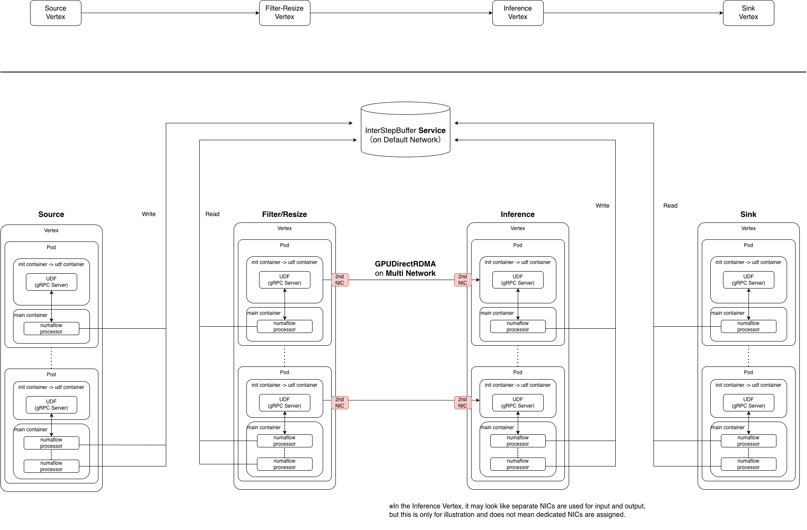
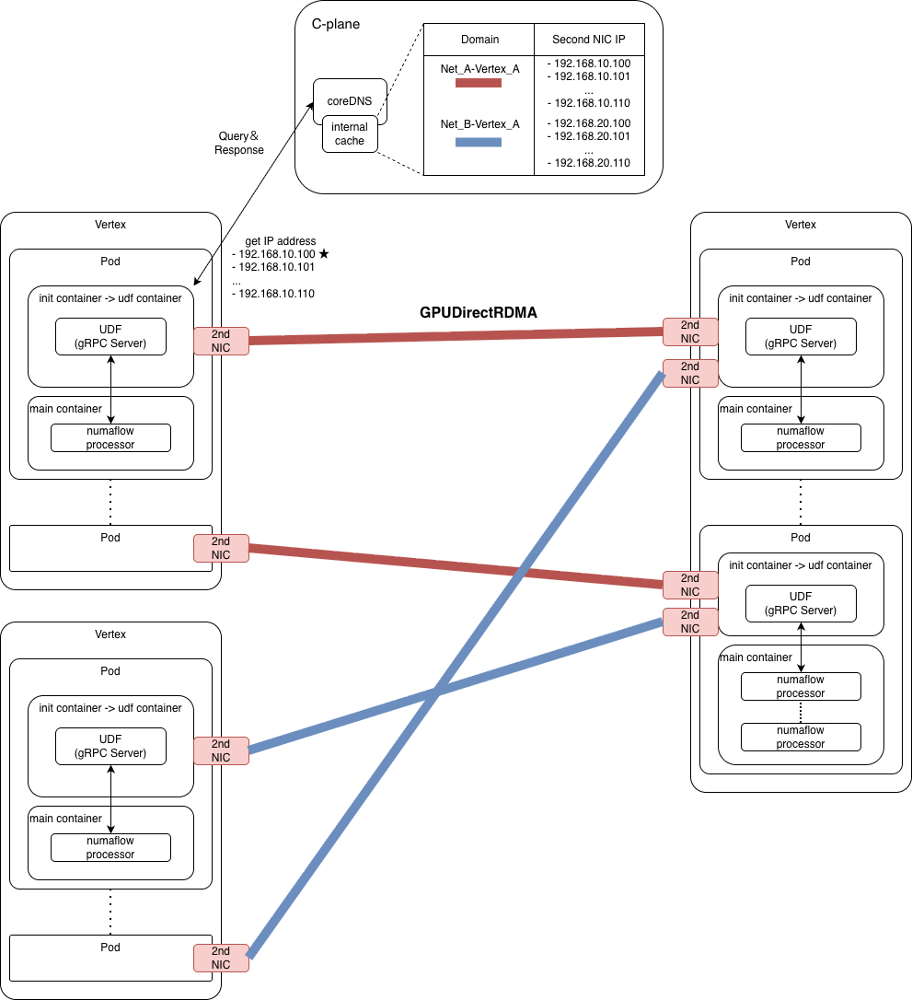
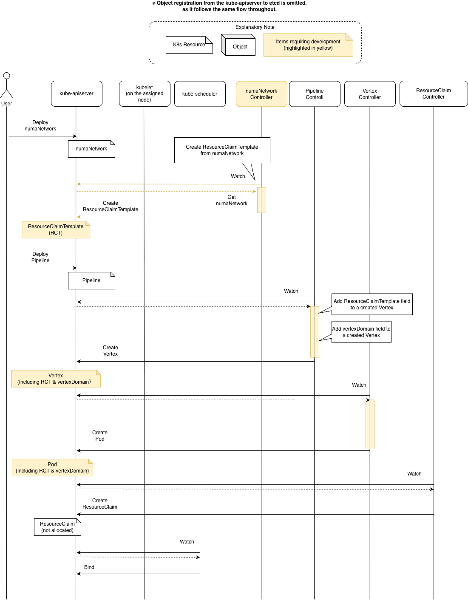
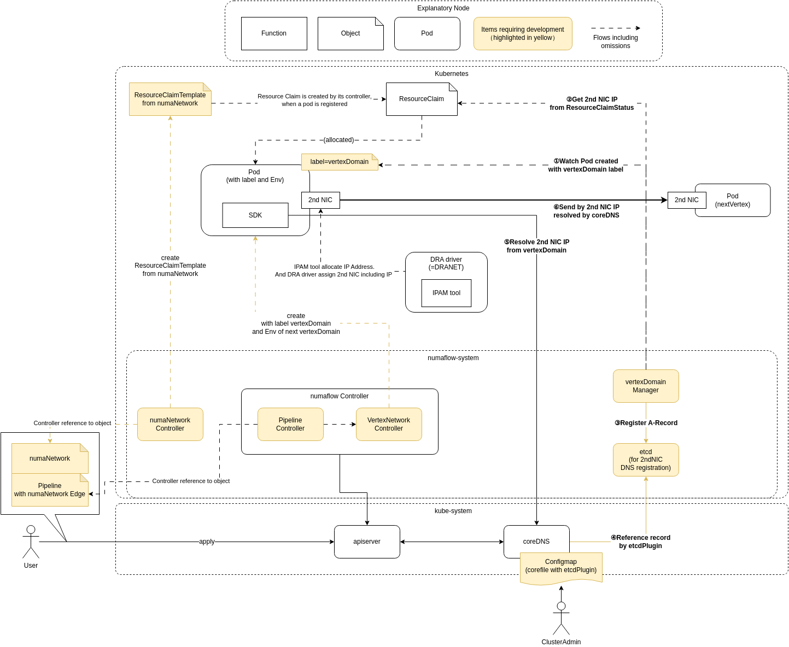
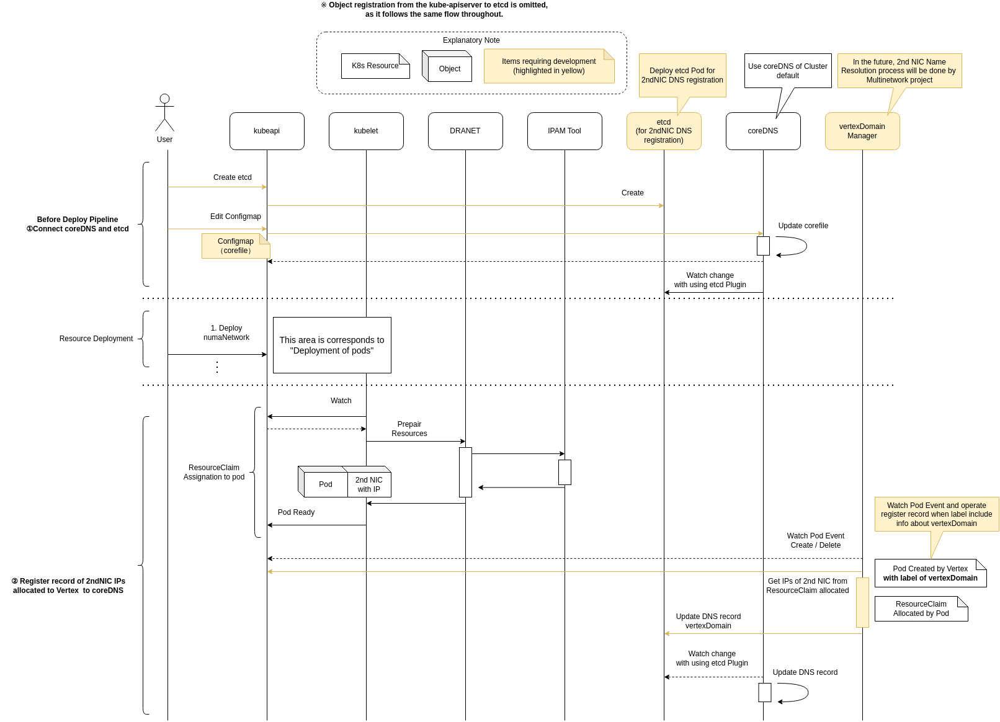
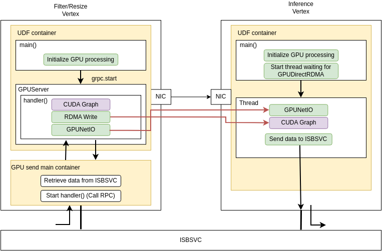
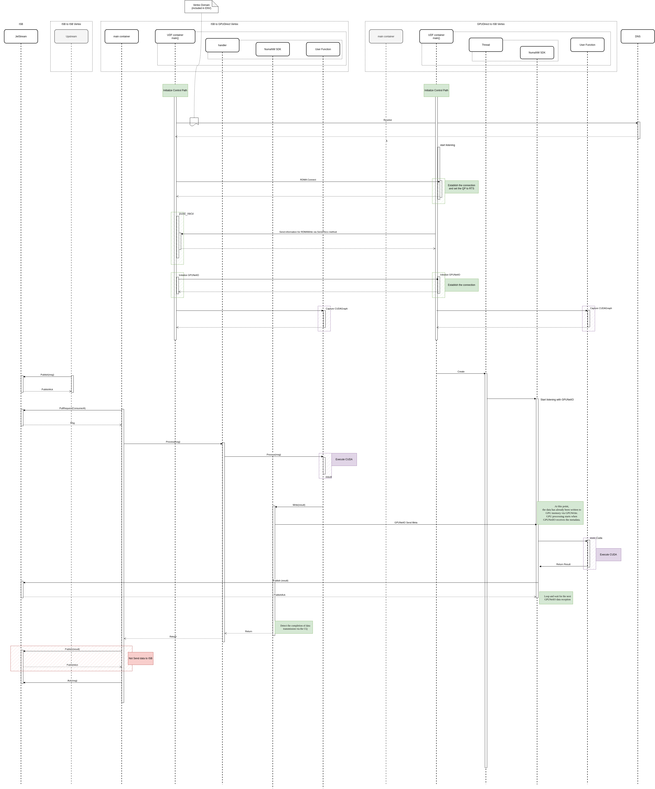

# Motivation
With advances in sensing, networking, and AI processing, modern ICT infrastructures are facing rapidly increasing demands for large-scale data processing. As a result, the power consumption required to handle these large volumes of data has become a serious concern. In other words, today’s infrastructures must simultaneously improve processing performance while reducing energy consumption.

For dataflow-based platforms such as Numaflow, using hardware accelerators for individual tasks (pods) can significantly improve performance per watt. We expect that, in the near future, most tasks in an application will run on specialized accelerators. 

While accelerators reduce task execution time, processing can be bottlenecked if data transfer speeds between tasks do n't improve accordingly. Therefore, as data processing performance increases, the performance requirements for data communication to support large-scale data transfers also become more demanding.

Therefore, we consider introducing a high-speed communication method with low transfer overhead, such as GPUDirect RDMA, for inter-vertex communication. To achieve this, the following elements are required.

1. [GPUDirect RDMA](https://developer.nvidia.com/gpudirect), which enables direct device-to-device communication between GPUs, requires RDMA-capable NICs. In other words, it is necessary to introduce a high-speed network by assigning a second NIC for RDMA to each pod, separate from the default network.
2. To enable direct communication using GPUDirect RDMA, a method is required to specify the peer device based on its IP address on a high-speed network.

Therefore, to realize the ICT infrastructure required in the near future, we propose new approaches for Numaflow regarding (1) the type of network and (2) the data communication method used between vertices.

**the type of network used between vertices**

Currently, pod-to-pod communication in Kubernetes clusters is handled via the default network. However, to support use cases that process large volumes of data, such as LLMs, there is a growing demand for high-bandwidth networks in Kubernetes clusters.

Accordingly, within the Kubernetes community’s [Device Management Working Group](https://github.com/kubernetes-sigs/wg-device-management), discussions are underway to enable the construction of high-speed networks (MultiNetwork) by assigning a second NIC to pods using the DRA feature proposed by the WG.

Based on this trend, we also aim to introduce MultiNetwork into Numaflow and enable MultiNetwork to be specified as the network used for communication between vertices.

**the data communication method used between vertices**

In the current Numaflow architecture, data communication is performed via the InterStepBufferService (ISBSVC) resource from the main container, which is separate from the UDF container that executes the actual processing.

In contrast, GPUDirect RDMA enables direct device-to-device communication. Therefore, instead of using ISBSVC and the main container, data is sent directly from a UDF container to the next UDF container that acts as the downstream processing entity.

Accordingly, to enable GPUDirect RDMA in Numaflow, we introduce a mechanism that provides the necessary connection information—such as IP address, port, and GPU ID—required for direct device-to-device communication using GPUDirect RDMA.

# Desired Functionality
This section describes the features introduced by this proposal.

## Overall Architecture
An example pipeline based on the Video Inference System is presented below.



The figure illustrates a newly proposed network type and a direct communication method (GPUDirect RDMA) introduced between Filter/Resize and Inference.

> [!IMPORTANT] Basic Architecture Overview
> - A Vertex (CR) is the fundamental unit of a pipeline.
> - Each Vertex consists of one or more pods. Each pod contains a container responsible for data processing and a main container responsible for data communication.
> 
> - Vertex scaling is classified into two types:
>   - Horizontal scaling, achieved by increasing or decreasing the number of pods.
>   - Vertical scaling, achieved by increasing or decreasing the number of Numaflow processors within the main container, which handle the actual communication processing.


## Functionality
- The destination IP address is resolved from a domain name in the UDF container
- Using the destination IP address, data is transferred to the target UDF container via the attached second NIC (MultiNetwork) using GPUDirect RDMA.



<table>
  <tr>
    <th>Functionality</th>
    <th>Responsibility</th>
    <th>Change</th>
  </tr>
  <tr>
    <td rowspan="4">Add MultiNetwork as a network type for inter-Vertex communication</td>
    <td>The numaNetwork (a new CRD) to represent the MultiNetwork concept</td>
    <td>Add numaNetwork(CRD)</td>
  </tr>
  <tr>
    <td>the edge field in the Pipeline manifest specifies the numaNetwork used for inter-Vertex communication</td>
    <td>Add a numaNetwork field to the edges field in the Pipeline manifest.</td>
  </tr>
  <tr>
    <td>The numaNetwork controller create a ResourceClaim to assign a second NIC</td>
    <td>Add the numaNetwork controller</td>
  </tr>
  <tr>
    <td>The Pipeline controller adds a reference to a ResourceClaimTemplate to each Vertex</td>
    <td>Change the Pipeline controller logic that parses the spec.edges field in the Pipeline manifest</td>
  </tr>
  <tr>
    <td rowspan="5">Add GPUDirect RDMA as a communication method on MultiNetwork</td>
    <td>The Vertex controller creates and stores a query domain name</td>
    <td>The VertexController adds the vertexDomain of the Vertex that the Pod belongs to as a label on the Pod</td>
  </tr>
  <tr>
    <td>The external controller(a new component) registers DNS resource records in CoreDNS, mapping destination Vertex domains to second NIC IPs on the network to which the Vertex belongs</td>
    <td>Create the external controller</td>
  </tr>
  <tr>
    <td>The CoreDNS etcd plugin stores DNS resource records</td>
    <td>Add the etcd plugin to CoreDNS</td>
  </tr>
  <tr>
    <td>The UDF retrieves a list of second NIC IPs for containers belonging to the destination Vertex</td>
    <td>Create an API to query CoreDNS and retrieve the results</td>
  </tr>
  <tr>
    <td>A new communication library wraps GPUDirect RDMA and sends data to the next Vertex</td>
    <td>Create a new communication library</td>
  </tr>
</table>

# Changes
This section describes the changes introduced by this proposal in the following three parts (excluding the setup of the Numaflow execution environment, which is assumed as a prerequisite).
- Resource Deployment
- Second NIC IP Configuration and Assignment
- Direct Communication Processing During Application Execution

## Precondition
1. Cluster administrator setup of the Kubernetes and Numaflow execution environment
2. Cluster administrator create [Virtual Function](https://docs.nvidia.com/doca/archive/doca-v1.3/virtual-functions/index.html)
3. Cluster administrators install and start the DRA drivers, and [ResourceSlices](https://kubernetes.io/docs/concepts/scheduling-eviction/dynamic-resource-allocation/#resourceslice) are created
4. Cluster administrator deploy [DeviceClass](https://kubernetes.io/docs/concepts/scheduling-eviction/dynamic-resource-allocation/#deviceclass)
5. Users create [ResourceClaims or ResourceClaimTemplates](https://kubernetes.io/docs/concepts/scheduling-eviction/dynamic-resource-allocation/#resourceclaims-templates) to request PCIe devices other than NICs, such as GPUs

## Resource Deployment



The following workflow represents our current understanding.

1. Deploy a numaNetwork resource and store the corresponding ResourceClaimTemplate, which is required to construct the network, in etcd
2. Deploy a Pipeline, and the Pipeline controller parses the edge information
   1. If a numaNetwork is referenced, the controller accesses the API Server to retrieve the numaNetwork information
   2. Add a field to the Vertex to reference the ResourceClaimTemplate associated with the numaNetwork
   3. Creates a domain name for each destination Vertex on a per-network basis in the toEdges field
       - The domain name is called `vertexDomain` and is defined as `<vertex name>.<numaNetwork name>.<pipeline name>.<namespace>.vertexdomain.local`
         - The FQDN format is currently provisional. The key point is how to uniquely identify a domain within a sufficiently broad scope.
          - local: Indicates that the scope is limited to within a Kubernetes cluster.
          - vertexdomain: Represents the field type (serving as an alternative to a resource kind).
          - `<namespace>`: The namespace where the Pipeline is deployed.
          - `<pipeline name>`: The name of the Pipeline.
          - `<numaNetwork name>`: The numaNetwork used by the Pipeline.
          - `<vertex name>`: The target Vertex of the FQDN.
3. The Vertex controller creates Pod resources and registers them in etcd via the API Server
4. The ResourceClaimTemplate controller detects that `pod.spec.resourceClaims[].resourceClaimTemplateName` is specified and creates the corresponding ResourceClaim
5. The kube-scheduler schedules the Pod
   - The mapping between the ResourceClaim and the ResourceSlice is evaluated


## Second NIC IP Configuration and Assignment

- Currently, a custom component (vertexDomainManager) is introduced to perform name resolution between Pods on MultiNetwork. In the future, we expect this functionality to be provided by a Kubernetes-native component through the MultiNetwork subproject.

### Architecture



### Sequence


#### Preparation steps

1. Start a separate etcd instance from the one used by Kubernetes
  - This etcd is used to store DNS resource records referenced by CoreDNS
  - Each DNS resource record maps a Vertex domain to the second NIC IP address assigned to the container
2. The vertexDomainManager component, which is responsible for registering DNS resource records in CoreDNS is running
3. The CoreDNS configuration is modified to receive DNS records from etcd (enabling the etcd plugin)	

#### Regisration of IP to coreDNS

Following "Pod deployment process"

1. Once the kube-scheduler assigns a Pod to a Node, the kubelet on that Node starts operating
2. The kubelet instructs the DRA drivers to allocate actual devices according to the ResourceClaims associated with the Pod
3. DRA driver for NIC([dranet](https://github.com/kubernetes-sigs/dranet?tab=readme-ov-file)) performs device setup. As part of this process, it assigns an IP address to the second NIC (VF) using an IPAM tool
4. dranet assigns the second NIC (VF) to the container
5. Pod creation is completed (the Vertex controller continues running and proceeds to the next step)
6. A component responsible for registering DNS resource records in CoreDNS (tentatively called `vertexDomainManager`) checks whether records corresponding to the created Vertex are already registered.
	- `vertexDomainManager` starts operating in response to Pod deployment
  - "The Vertex domain" is set as a label on the Pod by `Vertex Controller`
	- The Second NIC IP assigned to the container is planned to be obtained from `ResourceClaimStatus`.


## Direct Communication Processing During Application Execution
Before describing "Direct Communication processing during application execution, we first confirm the state established by the processing sequence so far.

The UDF container holds the domain (vertexDomain) corresponding to the destination Vertex, which allows it to resolve the destination Pod’s IP address.

### Architecture
Significant changes have been made to the existing architecture, so discussion with the community is required.



The reason why the main container is not used on the receiving side.

As a prerequisite, the UDF container is implemented as a sidecar container, so the main container itself must be running.

In the conventional architecture, users register their processing logic as a handler function in the main function of the UDF container. When the main container receives data from ISBSVC, it invokes the handler function via gRPC.

In this proposal, however, data is delivered directly to the UDF container without passing through ISBSVC. As a result, there is no trigger for the main container to invoke the handler function. Therefore, there is no need to use the main container for data communication. Instead, the main function of the UDF container starts a thread to receive data and sends it to ISBSVC.

Such changes introduce the following concerns.

- On the sending side, since data is transmitted using GPUDirect RDMA, the data format returned by the handler function may change. As a result, if data cannot be correctly returned to ISBSVC, upstream Vertices may fail to recognize that the data has been sent, potentially triggering unnecessary retransmissions.
- On the receiving side, the main container is not used.
  - A receiving thread is required to format incoming data into a message format acceptable to ISBSVC before forwarding it.
  - Since data is passed to ISBSVC through a path different from the conventional one, inconsistencies in related processing may arise.

At the same time, we aim to maintain the separation between user-defined logic and communication-related processing, as in the conventional design. Therefore, users are expected to use a newly introduced API that wraps the GPUDirect RDMA library to perform direct communication.
  - In other words, users only interact with a provided interface function.
  - The newly introduced API is intended to be provided as part of the Numaflow SDK.

Specifically, by encapsulating the components shown in the green boxes in the figure as APIs, we aim to separate them from the user-implemented code (shown in the purple boxes). Concretely, this consists of ①An API for initialization processing
 and ②Communication APIs (for sending and receiving) that internally execute user-defined logic

### Sequence



> [!IMPORTANT]
> In the following procedure, two QPs are created:
>
> - QP(1): Used as a control path to exchange information about the remote write destination
> - QP(2): Used for data and metadata transfer via GPUNetIO

#### Initialization Phase (Control Path)
**Sender: main() function of UDF Container**

1. Obtain the candidate destination Second NIC IPs using the "Vertex domain" retrieved from environment variables
  - In Python, this can be done using functions such as `socket.getaddrinfo()`
  - Name resolution follows the standard OS procedure:
    - The function queries the OS resolver -> `/etc/resolv.conf` is referencedn DNS servers (CoreDNS) listed there are queried -> CoreDNS uses the Kubernetes API to return a list of Pod IPs
    - Since destination candidates are cached internally (within the container OS), this resolution is expected to occur only once.
2. Create a Protection Domain (PD)
3. Using rdma_cm, first create CQ(1), then create QP(1) and associate it with the CQ. After that, establish an RC (Reliable Connection) and transition QP(1) to the RTS state
  - Connection establishment follows a client-server model similar to TCP, managed internally by RDMA-CM.
    - The sender requires the receiver's IP address. The receiver extracts the sender's address from the CONNECT_REQUEST event.
  - The PD is created in advance and reused later for GPUNetIO QP(2)
  - This process runs in an event loop, synchronized with the receiver.
4. The sender pre-posts `ibv_post_recv()` and enters a listen state to receive remote memory information
  - The sender receives this via CQ(1) recv completion and uses it for subsequent RDMA Write operations.

**Receiver: main() function of UDF Container**

5. Create a Protection Domain (PD)
6. Using rdma_cm, first create CQ(1), then create QP(1) and associate it with the CQ. After that, establish an RC (Reliable Connection) and transition QP(1) to the RTS state
  - The PD is created in advance and reused later for GPUNetIO QP(2)
  - This process also runs in an event loop, synchronized with the sender.
7. Allocate a receive buffer on the GPU and register it as a Memory Region (MR)
  - The buffer is shared between RDMA Write and Send/Recv, with different offsets used to separate purposes.
8. Use `ibv_post_send()` to send the following information to the sender via QP(1):
  - Base address of the receive buffer
  - Buffer size
  - rkey

**Sender & Receiver: main() function of UDF Container**

9. Initialize GPUNetIO and establish QP(2) and CQ(2)
10. Capture CUDA Graphs to define execution pipelines on both sides
  - Users define processing logic to be captured and executed from the main() function.
  - Sender side: Input → GPU processing → write results to "send GPU buffer"
    - Process input data (e.g., filter/resize)
    - Transfer data via RDMA Write
    - Send metadata via Send/Recv
  - Receiver side: Process "arrived data on receive ring" → return results to host
    - Read data from buffer
    - Perform processing (e.g., inference)
    - Write results back to host memory

**Receiver: main() function of UDF Container**

11. Invoke the communication API

**Receiver: Data Reception API of UDF Container**

12. Launch a dedicated thread to wait for incoming data
13. Prepare to receive metadata over QP(2)
  - Enter a waiting state until data arrives

#### Execution Phase
**Sender: handler() function of UDF Container**

1. handler function is triggered by invocation from the main container
2. Inside the handler function, data is retrieved from InterStepBufferSVC as an argument
3. Passes the data to the interface function

**Sender: Data Transmission API**

4. Verify that destination Pod IPs are available
5. Execute CUDA Graph:
  1. Run user-defined processing (e.g., filter/resize)
  2. Select destination (e.g., round-robin).
  3. Transfer processed data via RDMA Write over QP(2)
    - Use unsignaled mode (no CQE generated)
  4. Send metadata via Send/Recv over QP(2)
    - Since both use the same QP(2), ordering (Write → Send) is guaranteed. No need for the sender to wait for CQ completion

**Receiver: Data Reception API**
6. GPU polls CQ(2) to detect metadata arrival
7. GPUNetIO allows the GPU to detect QP(2) receive completion
8. Execute CUDA Graph:
  1. Run user-defined processing (e.g., inference)
  2. Write processed data back to host memory
9. Send results to ISBSVC
10. Return to waiting for the next metadata reception

# Resource Specification
> [!WARNING]
> With a view to supporting InterStepBufferService (ISBSVC) on MultiNetwork in the future, the resource specification is designed with potential ISBSVC extensions in mind.
>
> However, the extension of ISBSVC itself is outside the scope of this proposal.

## Pipeline
### Specification
```
apiVersion: numaflow.numaproj.io/v1alpha1
kind: Pipeline
metadata:
  name: ...
spec:
  vertices:
    - name: in
      ...
    - name: filter-resize
      ...
      udf:
        container:
          ...
          resources:
            claims:
              - name: gpu
      resourceClaims:
        - name: gpu
          resourceClaimTemplateName: a100
    - name: inference
      ...
      udf:
        container:
          ...
          resources:
            claims:
              - name: gpu
      resourceClaims:
        - name: gpu
          resourceClaimTemplateName: a100
      ...
    - name: out
      ...
          
  edges:
    - from: in
      to: filter-resize
    - from: filter-resize
      to: inference
      numaNetwork:
        name: pipeline1-multi-network  # ★1
        connectionType: direct         # ★2
    - from: inference
      to: out
      numaNetwork:
        name: pipeline1-multi-network  # ★1
        connectionType: multi-isbsvc   # ★2
```

| Parameter Path | Description |
| :-- | :-- |
| edges[].numaNetwork.name<br>(★1) | Specifies the name of the numaNetwork used for communication between Vertices.<br> - If this parameter is omitted, the communication falls back to the default behavior of Numaflow, in which communication is performed via ISBSVC on the DefaultNetwork. |
| edges[].numaNetwork.connectionType<br>(★2) | Specifies the communication method used for connections between Vertices.<br> - direct: Performs direct UDF-to-UDF communication using the numaNetwork specified by name.<br> - multi-isbsvc: Performs communication via an InterStepBufferService (ISBSVC) associated with the numaNetwork specified by name.

### How It Works
If numaNetwork object is set in `edges[]` field of a Pipeline resource, the Pipeline controller retrieves the information of the already deployed `ResourceClaimTemplate` by referencing `spec.edges[].numaNetwork.name`.

```
# Excerpt from the Pipeline resource
edeges:
  - from: filter-resize
    to: inference
    numaNetwork:
      name: pipeline1-multi-network  # ★1
      connectionType: direct         # ★2
```

By attaching a label to the ResourceClaimTemplate indicating which numaNetwork created it, the Pipeline controller can retrieve the required ResourceClaimTemplate information using spec.edges[].numaNetwork.name.

(The name of the ResourceClaimTemplate is currently defined as numaNetwork.metadata.name + "rct" (short for ResourceClaimTemplate).)

```
# The ResourceClaimTemplate resource generated by the numaNetworkController, as described later.
apiVersion: resource.k8s.io/v1beta1
kind:  ResourceClaimTemplate
metadata:
  name: <numaNetwork metadata.name>-<rct>
  labels:
    XXX.example.com/numa-network-name: <numaNetwork metadata.name>-<rct>
spec:
  devices:
    requests:
    - name: req-nvidia-vf-ip
      deviceClassName: XXX <- refDeviceClass.name
    config:
    - opaque:
        driver: dra.net
        parameters:
          <- refResourceClaimDranet.XXX
  ...
```

When creating the Vertex resources specified by spec.edges[].from and to in the Pipeline resource, a field is added to reference the ResourceClaimTemplate (used for DRA).
The following shows an example of a Vertex resource with the added field.

```
# Excerpt from Inference Vertex resource
# Inference Vertexリソースの抜粋
apiVersion: numaflow.numaproj.io/v1alpha1
kind: Vertex
  ...
spec:
  fromeEdges:
  - from: filter-resize
    ...
  name: inference
  ...
  resourceClaims:
    - name: gpu
      resourceClaimTemplateName: a100
    - name: secondNIC
      resourceClaimTemplateName: pipeline1-multi-network-rct <- Add
  toEdges:
  - from: inference
    ...
  udf:
    container:
      ...
      resources:
        claims:
          - name: gpu
          - name: secondNIC <- Add
    ...
```

## (New) numaNetwork
### Background and Motivation
In this proposal, to allow users to use a new type of network, it is necessary to provide a resource that serves as an abstraction of the network. At the same time, by using this resource as an interface for deploying new network designs, users can avoid the need to manually define multiple manifest files required to realize a network configuration.

In parallel, the Kubernetes SIG Network Multi-Network Subproject is discussing the concept of a [NetworkClass](https://docs.google.com/document/d/1R2LDPZzstUKJVC5old9TfR6Db6gp-eAcpCcZtqG52Ac/edit?tab=t.0#heading=h.diva5j5ez6fn). A NetworkClass is deployed by a cluster administrator and can reference a custom resource definition (CRD) to declare that the CRD represents a network implementation recognized by Kubernetes. This indicates a shared understanding within the Kubernetes community that resources are needed to represent network abstractions. For this reason, numaNetwork is required as a resource to model and manage network configurations in this context.

### Overview
- The numaNetwork is a Custom Resource (CR) that defines the network configuration itself, which users design on MultiNetwork.
- The custom controller for this CR creates the ResourceClaimTemplate required to assign NICs to Pods. Therefore, this CR contains the information necessary to place each Pod into the user-intended network.
- This CR can be referenced from the InterStepBufferService (ISBSVC) manifest and the edge field of the Pipeline manifest.
  - Each edge can specify exactly one numaNetwork; however, the same or different numaNetwork resources may be specified on a per-edge basis.
  - In addition, the same numaNetwork can be shared across edges belonging to different pipelines.

### Specification
```
apiVersion: numaflow.numaproj.io/v1alpha1
kind: numaNetwork
metadata:
  name: pipeline1-multi-network
spec:
  refDeviceClass
    name: vf.nvidia.dra.net                # ★1
  refResouceClaimDranet
    ipRange: 192.168.10.0/24               # ★2
    ethernetSpeed: 100                     # ★3
    vlanTag: 10                            # ★4
    
```

| Parameter Path | Description |
| :- | :- |
| refDeviceCalss | Contains fields related to [DeviceClass](https://kubernetes.io/docs/concepts/scheduling-eviction/dynamic-resource-allocation/#deviceclass) configuration |
| refDeviceClass.name(★1) | Specifies the DeviceClass used by the network defined in the numaNetwork. The DeviceClass defines the type of NIC assigned to Pods |
| refResourceClaimDranet | Contains fields related to [DRANET](https://github.com/kubernetes-sigs/dranet?tab=readme-ov-file)<br><br> **Warning**: Subfields of this field are used as DRANET-specific parameters in ResourceClaims and must conform to the DRANET driver specification. Therefore, if the required functionality is not covered by the current specification, we plan to propose extensions accordingly. |
| refResourceClaimDranet.ipRange<br>(★2) | IP range assigned to the second NIC by the dranet IPAM tool |
| refResourceClaimDranet.ethernetSpeed<br>(★3) | The maximum Ethernet link speed (Gb/s) used along the physical network path.<br>- Since software cannot obtain the maximum capacity of the physical Ethernet cabling in use, this value is intended for manifest authors to record network configuration information. |
| refResourceClaimDranet.vlanTag<br>(★4) | The VLAN tag value assigned to data belonging to a numaNetwork. |

### How It Works
1. When a numaNetwork is deployed, a ResourceClaimTemplate is created using the fields under spec
  - A label is added to indicate which numaNetwork resource generated the ResourceClaimTemplate.

```
apiVersion: resource.k8s.io/v1beta1
kind:  ResourceClaimTemplate
metadata:
  name: <numaNetwork metadata.name>-<rct>
  labels:
    XXX.example.com/numa-network-name: <numaNetwork metadata.name>-<rct>
spec:
  devices:
    requests:
    - name: req-nvidia-vf-ip
      deviceClassName: XXX <- refDeviceClass.name
    config:
    - opaque:
        driver: dra.net
        parameters:
          <- refResourceClaimDranet.XXX
```

2. When a Pipeline resource is deployed, a reference to the corresponding ResourceClaimTemplate is added to the Vertex (see ResourceSpecification > Pipeline > How It Works)
3. When a Pod is deployed, the parameters are interpreted by DRANET, and the internal IPAM tool in dranet allocates an IP address and assigns the NIC to the Pod
