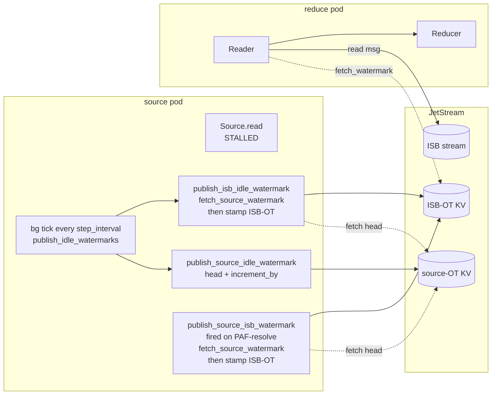
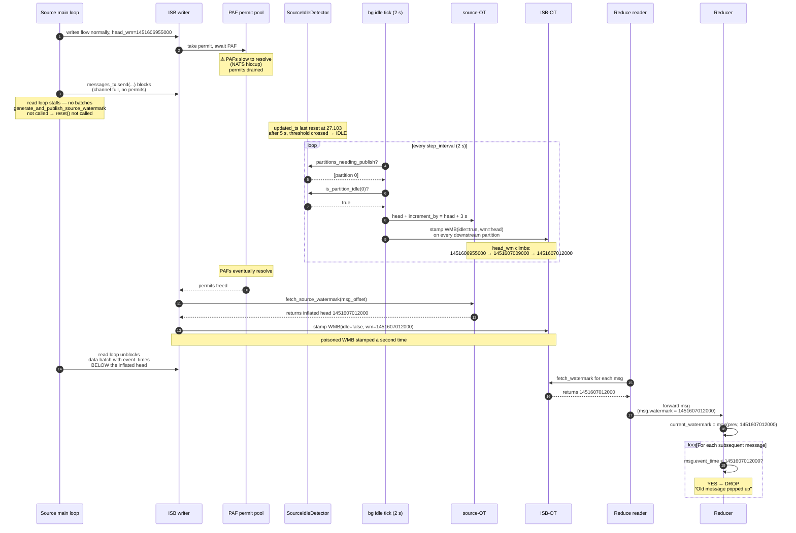
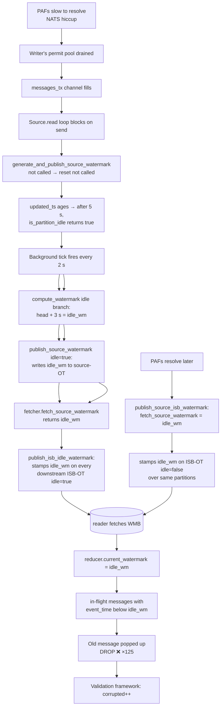

# Source idle watermark progression poisons downstream during PAF stalls

## Executive summary

When the numaflow source vertex's read loop stalls (typically because in-flight PAFs from the JetStream writer are slow to resolve and back-pressure propagates back through the writer's permit pool), the partition's idle threshold is crossed. The **source idle watermark publisher** then begins incrementing the source-OT head by `increment_by` every `step_interval`, even though there are still in-flight messages whose event_times are *below* the head being published. The same idle path also stamps those inflated values directly onto every downstream ISB-OT bucket via `publish_isb_idle_watermark`. When the stall finally clears and the in-flight messages' PAFs resolve, the reducer's reader fetches the poisoned WMBs, advances `current_watermark` past valid in-flight messages, and drops them with `"Old message popped up, Watermark has progressed past event time"`.

In the verification run captured here:

- **125** reducer-side drops, **all** with `current_watermark = 1451607012000`
- That offending watermark was first written to **source-OT** by `tick->publish_source_idle_watermark` (idle=true) at **03:37:35.582**
- It was then written to **ISB-OT** for all 5 downstream partitions by `tick->publish_isb_idle_watermark` (idle=true) at **03:37:35.584–.593**
- The source vertex had **no data batches** between **03:37:27.103** and **03:37:38.625** — an ~11.5 s wall-time stall — long enough to cross the 5 s idle `threshold`
- After the stall, the resumed data batch at 03:37:38.625 emitted messages with event_times **below** 1451607012000; their `publish_source_isb_watermark` (PAF-resolve path) then *also* stamped 1451607012000 onto ISB-OT, but ISB-OT was already poisoned

The configured idle parameters in this pipeline are:

| Parameter | Value |
|---|---|
| `threshold` | 5 s |
| `increment_by` | 3 s |
| `step_interval` | 2 s |

The bug is reproducible, observable with one new log field (`code_path`) on the existing watermark publisher, and addressable by either gating idle progression on inflight state or by clamping the published watermark to the minimum unacked event_time.

---

## The bug, visually

### High-level pipeline view



There are **two** ISB-OT poisoning paths, both rooted in the same source-OT inflation:

1. `tick->publish_isb_idle_watermark` directly stamps the inflated head onto ISB-OT (idle=true)
2. `ISBWriteTask->publish_source_isb_watermark` fetches the inflated head when a delayed PAF resolves and stamps it onto ISB-OT (idle=false)

### The stall, as a sequence diagram



Steps (1)–(4) build up the stall. Steps (5)–(8) are the idle-progression mechanism that inflates source-OT and stamps ISB-OT. Steps (9)–(12) are the post-stall cleanup that *re-stamps* the same poisoned value via the PAF-resolve path. Steps (13)–(16) are the downstream propagation.

---

## Code path walkthrough

### Idle progression in `SourceIdleDetector::compute_watermark`

```rust
// rust/numaflow-core/src/watermark/idle/source.rs

pub(crate) fn compute_watermark(&mut self, partition: u16, computed_wm: i64) -> i64 {
    self.ensure_partition(partition);

    if !self.is_partition_idle(partition) {
        // not idle yet — publish heartbeat with head unchanged
        if let Some(state) = self.partition_states.get_mut(&partition) {
            state.last_wm_published_time = Utc::now();
        }
        return computed_wm;
    }

    // ⬇ THE LINE. Adds increment_by to the fetched head, with no regard
    //   for in-flight unacked messages whose event_times may be below.
    let increment_by = self.config.increment_by.as_millis() as i64;
    if computed_wm == -1 {
        return self.get_partition_idling_from_init_wm(partition);
    }
    let mut idle_wm = computed_wm + increment_by;

    let now = Utc::now().timestamp_millis();
    if idle_wm > now {
        warn!(?idle_wm, partition, "idle config is aggressive ...");
        idle_wm = now;
    }

    if let Some(state) = self.partition_states.get_mut(&partition) {
        state.last_wm_published_time = Utc::now();
    }
    idle_wm
}
```

`is_partition_idle` returns true once `Utc::now() - updated_ts >= threshold` (5 s here). `updated_ts` is reset by `SourceIdleDetector::reset(partition)`, which is only called from `generate_and_publish_source_watermark` after a real-data batch is read. **If the source's read loop is stalled (no batches), there is nothing to reset `updated_ts` and the partition is treated as idle.**

### Two stamping paths to ISB-OT

Both originate in the same background tick:

```rust
// rust/numaflow-core/src/watermark/source.rs

async fn publish_idle_watermarks(&mut self) -> Result<()> {
    self.publish_source_idle_watermark().await?;   // increments source-OT head
    self.publish_isb_idle_watermark().await?;      // stamps current head onto ISB-OT
    Ok(())
}

async fn publish_isb_idle_watermark(&mut self) -> Result<()> {
    // Fetches the JUST-INFLATED source-OT head and stamps it on every
    // downstream ISB-OT bucket. Bypasses message event_time entirely.
    let compute_wm = self.fetcher.fetch_source_watermark(None);
    let streams_needing_publish = self.isb_idle_manager.fetch_streams_needing_publish().await;
    for stream in streams_needing_publish.iter() {
        let offset = self.isb_idle_manager.fetch_idle_offset(stream).await.unwrap_or(-1);
        for partition in self.active_input_partitions.keys() {
            self.publisher.publish_isb_watermark(
                *partition, stream, offset,
                compute_wm.timestamp_millis(),
                true,                         // ← idle=true WMB
            ).await;
        }
        self.isb_idle_manager.update_idle_metadata(stream, offset).await;
    }
    Ok(())
}
```

And the previously-known PAF-resolve path:

```rust
async fn publish_source_isb_watermark(
    &mut self,
    stream: Stream,
    offset: IntOffset,
    input_partition: u16,
    message: Message,
) -> Result<()> {
    // Fires when a PAF resolves. Fetches whatever is the source-OT head
    // *now* — which during the stall has been inflated by the idle ticks above.
    let watermark = self.fetcher.fetch_source_watermark(Some(offset.offset));
    self.publisher.publish_isb_watermark(
        input_partition, &stream, offset.offset,
        watermark.timestamp_millis(),
        false,                                // ← idle=false WMB
    ).await;
    self.isb_idle_manager.reset_idle(&stream).await;
    Ok(())
}
```

### Why the reducer drops the message

```rust
// rust/numaflow-core/src/reduce/reducer/aligned/reducer.rs (existing on main)

current_watermark = current_watermark.max(msg.watermark);
if msg.event_time < current_watermark {
    error!(
        ?current_watermark, ?message_event_time, ?message_watermark,
        "Old message popped up, Watermark has progressed past event time"
    );
    continue; // drop
}
```

The reducer treats `msg.watermark` as authoritative. A poisoned WMB pulls `current_watermark` past valid in-flight messages, and the reducer faithfully drops them. The reducer is not buggy — it's correctly enforcing the watermark contract that was violated upstream.

---

## The diagnostic instrumentation

The single instrumentation change that pinned this bug to the idle path was a `code_path` and `init_watermark` field on the existing `publish_watermark_with_processor_count` log:

```rust
// rust/numaflow-core/src/watermark/isb/wm_publisher.rs

info!(
    idle = idle,
    init_offset = offset,
    publish_offset = publish_offset,
    init_watermark = watermark,                    // input to the publisher
    publish_watermark = publish_watermark,         // value written to KV (after max())
    partition = stream.partition,
    vertex = get_vertex_name(),
    code_path = publisher_code_path,               // who called publish
    "publish_watermark_with_processor_count"
);
```

Each call site threads its identity into the `code_path` field, so the log line tells you which stack invoked the publish:

| code_path | meaning |
|---|---|
| `generate_and_publish_source_watermark->publish_source_watermark->` | real-data batch publishing source-OT |
| `tick->publish_source_idle_watermark->publish_source_watermark->` | idle tick publishing source-OT (idle=true ⇒ incremented) |
| `tick->publish_isb_idle_watermark->publish_isb_watermark->publish_watermark->` | idle tick stamping ISB-OT directly |
| `ISBWriteTask->publish_watermarks_for_offsets->publish_source_isb_watermark->...->publish_watermark->` | PAF-resolve path stamping ISB-OT |

The `init_watermark` vs `publish_watermark` separation also reveals when `LastPublishedState.update`'s `max()` returns a higher cached value than the current input — i.e., when prior idle ticks have accumulated into in-memory state ahead of what `fetch_source_watermark` currently returns.

Together with the existing reducer log `"Old message popped up"`, these three signals are sufficient to attribute every drop to its upstream cause.

---

## What the verification run shows

### Q1 — what wrote the offending watermark `1451607012000` to source-OT?

Filter `vertex=source` from the `publish_watermark_with_processor_count` log, look at the first time `publish_watermark = 1451607012000` was written:

```
03:37:35.582  publish_wm=1451607012000  init_wm=1451607012000  idle=True   part=0
              cp=tick->publish_source_idle_watermark->publish_source_watermark->
```

**Verdict:** the idle source watermark publisher wrote it, with `idle=true`. The input `init_wm` is already 1451607012000, meaning prior idle ticks had accumulated this value into `LastPublishedState.watermark` in memory and this was the first tick to clear `delay_crossed`.

### Q2 — what wrote `1451607012000` to ISB-OT?

```
03:37:35.584  publish_wm=1451607012000  idle=True   part=0  cp=tick->publish_isb_idle_watermark->...
03:37:35.586  publish_wm=1451607012000  idle=True   part=1  cp=tick->publish_isb_idle_watermark->...
03:37:35.589  publish_wm=1451607012000  idle=True   part=2  cp=tick->publish_isb_idle_watermark->...
03:37:35.591  publish_wm=1451607012000  idle=True   part=3  cp=tick->publish_isb_idle_watermark->...
03:37:35.593  publish_wm=1451607012000  idle=True   part=4  cp=tick->publish_isb_idle_watermark->...

03:37:38.598  publish_wm=1451607012000  idle=False  part=4  cp=ISBWriteTask->...->publish_source_isb_watermark->...
03:37:38.636  publish_wm=1451607012000  idle=False  part=0  cp=ISBWriteTask->...->publish_source_isb_watermark->...
... (rest of partitions)
```

**Verdict:** ISB-OT was poisoned **first** by `tick->publish_isb_idle_watermark` at 03:37:35 — across all 5 downstream partitions. Three seconds later, when the PAF for the in-flight messages finally resolved, `publish_source_isb_watermark` re-stamped the same value (idle=false) over the same partitions.

### Q3 — the source-OT head trajectory (from `Source Watermark Summary`)

```
03:37:25.040  fetched_wm=1451606556000   data
03:37:26.046  fetched_wm=1451606763000   data (+207 s event-time in 1 s wall)
03:37:27.058  fetched_wm=1451606763000
03:37:29.578  fetched_wm=1451606955000   data
03:37:31.579  fetched_wm=1451607009000   ← idle path drove head higher
03:37:33.579  fetched_wm=1451607009000
03:37:35.579  fetched_wm=1451607009000
03:37:37.579  fetched_wm=1451607012000   ← idle path bumped to 1451607012000
03:37:38.595  fetched_wm=1451607012000   ← data resumed
03:37:39.596  fetched_wm=1451607012000
```

Note the absence of any `generate_and_publish_source_watermark` entry between 27.103 and 38.625 — the read loop was producing no batches, while the source-OT head climbed via idle ticks alone.

### Q4 — what the reducer dropped

```spl
"Old message popped up" | stats count by current_watermark
```

| current_watermark | count |
|---|---|
| **1451607012000** | **125** |

100% of the drops carry `current_watermark = 1451607012000` — the same value that the idle path wrote to ISB-OT. Sample dropped messages had event_times in `[1451607009162, 1451607011916]`, all below the poisoned watermark.

---

## How the chain connects, end-to-end



---

## Avenues of fix

The previous "Fix 1" (clamping the watermark in `publish_source_isb_watermark` by `min(fetched, message.event_time)`) addresses only the PAF-resolve path. In this incident, ISB-OT was poisoned **first** by `publish_isb_idle_watermark` — which has no `message` to clamp by. So Fix 1 alone is insufficient.

The viable fixes target idle progression itself.

### Fix A (recommended) — gate idle increment on inflight state

In `SourceIdleDetector::compute_watermark`, only enter the idle branch if there are no unacked messages. The source's `Tracker` already knows the inflight set; expose `min_inflight_event_time()` and use it as a hard cap.

```rust
// idle/source.rs — when entering the idle branch
let mut idle_wm = computed_wm + increment_by;
if let Some(min_inflight) = inflight_summary.min_inflight_event_time {
    idle_wm = idle_wm.min(min_inflight);
}
```

**Pros:**
- Eliminates the root cause: the head can never advance past an unacked message.
- Both ISB-OT poisoning paths become safe by construction (the idle path can't write a value above any unacked event_time, and the PAF-resolve path can't fetch one).
- Behaves correctly under genuine idleness: when there are no inflight messages, `idle_wm = computed_wm + increment_by` proceeds normally.

**Cons:**
- Requires plumbing the tracker's inflight summary into the idle detector. ~30–50 lines across 3 files.
- During a long stall, the watermark *stops* advancing rather than racing ahead — which is the correct behavior, but downstream may notice slower watermark progression during stalls.

### Fix B — semantically distinguish "stalled" from "idle"

The bug is a definitional one: `is_partition_idle` returns true when there's *no data flowing through reset()*, but cannot tell whether that's because the source has nothing to read (truly idle) or because back-pressure has stalled the read loop (busy but blocked). Surface a "blocked on writer" signal from the source forwarder; treat that as not-idle.

**Pros:**
- Keeps idle progression aggressive when truly idle (good for downstream watermark liveness).
- Minimal change to the idle math itself.

**Cons:**
- Requires the source forwarder to report block state across an async boundary; non-trivial.
- Doesn't help if the stall is caused by something other than channel back-pressure (e.g., slow user-defined source).

### Fix C — clamp the data-WMB path (the original "Fix 1")

In `publish_source_isb_watermark`, replace:

```rust
let watermark = self.fetcher.fetch_source_watermark(Some(offset.offset));
```

with:

```rust
let watermark_ms = std::cmp::min(
    self.fetcher.fetch_source_watermark(Some(offset.offset)).timestamp_millis(),
    message.event_time.timestamp_millis(),
);
```

**Pros:**
- One-line, no plumbing.
- Eliminates the *PAF-resolve* poison.

**Cons:**
- **Does not stop `publish_isb_idle_watermark`** from writing an inflated head onto ISB-OT — that path has no `message`. Insufficient as a standalone fix for this incident.
- Useful as a defense-in-depth complement to Fix A.

### Fix D (config-only) — tune idle parameters

Raise `threshold` and/or lower `increment_by` so the head advances more conservatively during stalls.

**Pros:**
- Zero code change. Per-pipeline.

**Cons:**
- Doesn't fix the bug; just lowers the probability and magnitude.
- A long enough stall will still poison.
- Trades off liveness vs. correctness in the wrong direction.

### Fix matrix

| Fix | Code scope | Stops idle path? | Stops PAF-resolve path? | Notes |
|---|---|---|---|---|
| **Fix A** (inflight cap) | ~30–50 lines, 3 files | ✓ | ✓ | Recommended |
| Fix B (stall vs idle) | medium | ✓ | partial | Needs new signal across async boundary |
| Fix C (one-line min) | 1 line | ✗ | ✓ | Insufficient alone for this incident |
| Fix D (config) | yaml | mitigation only | mitigation only | Doesn't address root cause |

**Recommendation: ship Fix A**, optionally combined with Fix C as belt-and-braces. Re-run the perfharness validation; the same queries should return zero events for `publish_watermark = 1451607012000` from any `tick->...` path, and the validation harness's `corrupted` count should drop to zero.

---

## Verification after fix

After applying Fix A, the same queries should return:

| Query | Pre-fix | Post-fix expected |
|---|---|---|
| `publish_watermark` value above any unacked `event_time`, idle path | observed (1451607009000, 1451607012000) | none |
| `publish_watermark` above unacked `event_time`, PAF-resolve path | observed at 03:37:38 | none |
| `Old message popped up` count | 125 | 0 (or background only from genuinely late real-world data) |
| `corrupted` count in validation harness | non-zero | 0 |

If non-zero counts persist, there's a different mechanism producing the same symptom — at which point we re-introduce the fuller diagnostic stack from `reduce-bug` to investigate. But based on the evidence here (every drop's `current_watermark` maps to exactly one source-OT idle write, which then propagates through both ISB-OT stamping paths), Fix A should fully close out this bug.

---

## Appendix: file paths touched on `reduce-bug-2`

```
rust/numaflow-core/src/watermark/isb/wm_publisher.rs   (added init_watermark, code_path log fields)
rust/numaflow-core/src/watermark/source.rs             (threaded code_path through call sites)
rust/numaflow-core/src/watermark/source/source_wm_publisher.rs  (threaded code_path)
rust/numaflow-core/src/pipeline/isb/writer.rs          (threaded code_path)
```

The previously-added "Source stamping ISB-OT WMB with watermark ahead of message event_time" log on `publish_source_isb_watermark` is still useful — it caught the *secondary* (PAF-resolve) stamping. But the decisive evidence for this bug came from threading `code_path` through `publish_watermark_with_processor_count`, which made it possible to attribute every poisoned write to its calling stack.
