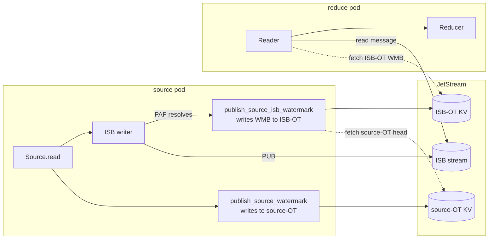
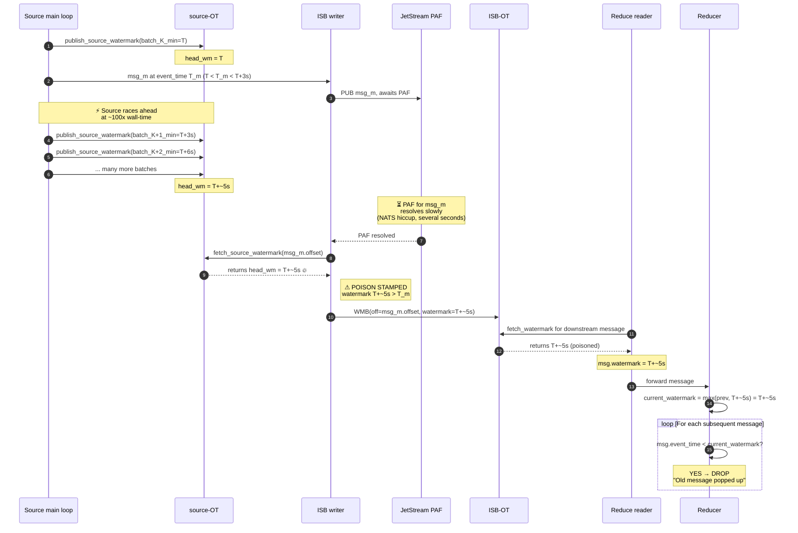
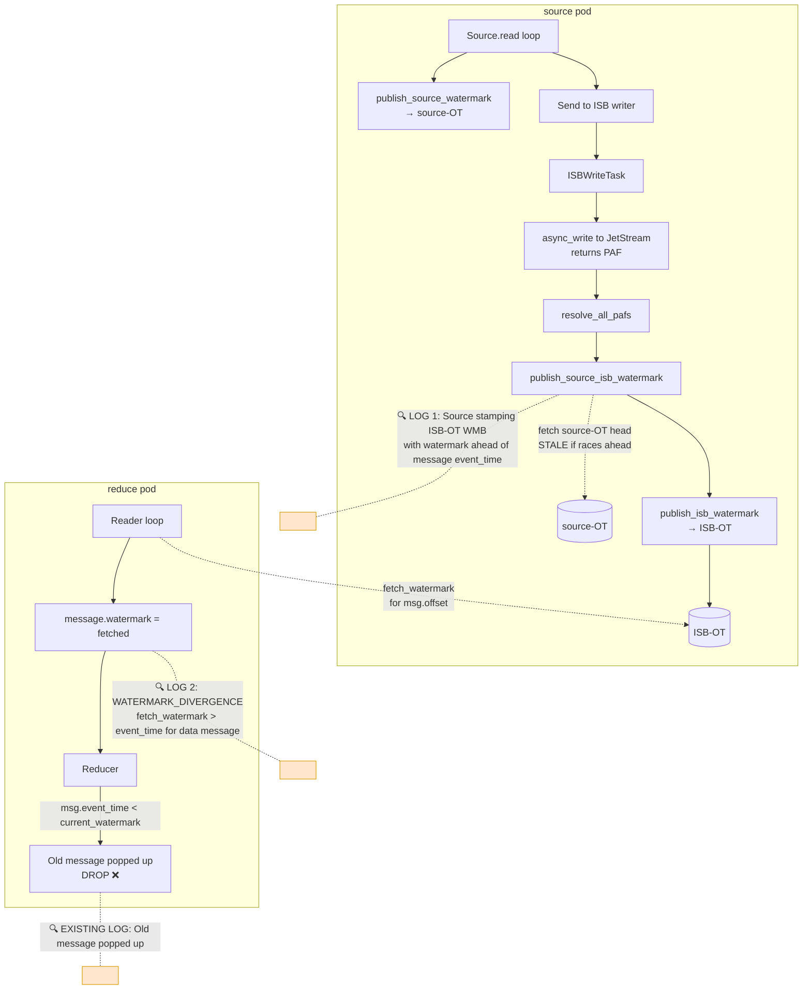
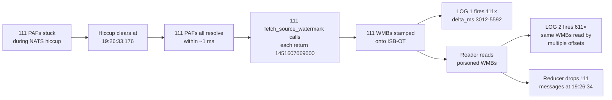
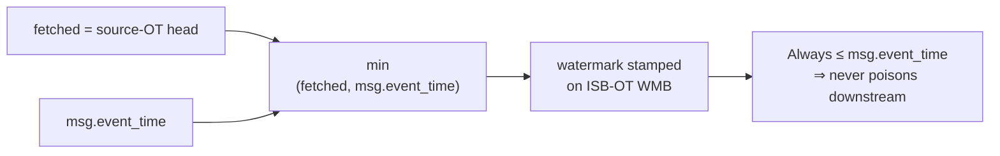

# Source watermark stamping race causes message drops at reducer

## Executive summary

When a numaflow source vertex is fed faster than its downstream PAFs (publish-ack futures from the JetStream writer) can resolve, a race in `SourceWatermarkState::publish_source_isb_watermark` causes WMBs (watermark barriers) to be stamped on the ISB-OT bucket with watermark values *greater than* the message's own event_time. Downstream readers then read those WMBs, advance their `current_watermark` past valid in-flight messages, and the reducer drops those messages with `"Old message popped up, Watermark has progressed past event time"`.

In the verification run captured here:

- **111** source-side stamps with an average overshoot of **4,282 ms** (max 5,592 ms)
- **611** reader-side observations of poisoned WMBs (one per affected read)
- **111** reducer-side drops (1:1 with source stamps)
- All 111 stamps occurred in **a single 1-millisecond burst** (19:26:33.176–177)
- All 111 stamps carried the **exact same watermark value** (`1451607069000`), implying a single underlying cause — one slow-PAF cluster that resolved together

The bug is reproducible, observable with two new warn-level logs, and fixable in one line.

---

## The bug, visually

### High-level pipeline view



The bug lives in the dashed arrow from `publish_source_isb_watermark` to `source-OT`: at PAF-resolve time, that fetch returns the *current* source-OT head, not the head as of when the message was originally PUB'd.

### The race, as a sequence diagram



Steps (1)–(8) build up the race. Step (9) is the moment the bug stamps the bad watermark. Steps (10)–(13) are the downstream propagation.

---

## Code path walkthrough

### Setup: where and when each watermark is stamped

The source vertex publishes to **two** OT buckets:

1. **source-OT** (`source-{vertex}-{partition}` keyed) — the source's own progress, published by `publish_source_watermark` whenever a batch is read. The fetcher `SourceWatermarkFetcher::fetch_source_watermark` reads from this bucket via the watcher.
2. **ISB-OT** (per downstream `to_vertex`) — the WMBs that downstream readers consume. Published by `publish_isb_watermark` for each individual message offset.

The **value** stamped on ISB-OT is read from source-OT *at the moment of stamping*. That timing is the bug.

### The smoking-gun line

```rust
// rust/numaflow-core/src/watermark/source.rs (SourceWatermarkState)

async fn publish_source_isb_watermark(
    &mut self,
    stream: Stream,
    offset: IntOffset,
    input_partition: u16,
    message: Message,
) -> Result<()> {
    // ⬇ THIS LINE. fetched at PAF-resolve time, not at PUB-submit time.
    let watermark = self.fetcher.fetch_source_watermark(Some(offset.offset));

    // 🔍 New log fires when the just-fetched watermark is greater than
    //    the message we're about to label.
    if message.event_time.timestamp_millis() < watermark.timestamp_millis()
        && !message.is_late
    {
        warn!(
            offset = offset.offset,
            input_partition,
            msg_event_time = message.event_time.timestamp_millis(),
            src_watermark = watermark.timestamp_millis(),
            delta_ms = watermark.timestamp_millis() - message.event_time.timestamp_millis(),
            "Source stamping ISB-OT WMB with watermark ahead of message event_time"
        );
    }

    // The poison is propagated here:
    self.publisher
        .publish_isb_watermark(
            input_partition,
            &stream,
            offset.offset,
            watermark.timestamp_millis(),  // ← stamped onto ISB-OT
            false,
        )
        .await;

    self.isb_idle_manager.reset_idle(&stream).await;
    Ok(())
}
```

### Why the fetched value can overshoot

`fetch_source_watermark` returns `min` over active processors of `timeline.get_head_watermark()`. For a single-partition source (perfharness), there's one processor `source-source-0`, and `get_head_watermark` is the highest watermark in the timeline — equivalently, the latest `batch_min_event_time` that was published to source-OT.

If the source is racing through batches at e.g. 100× wall-time:

- Each batch publishes a new `batch_min_event_time` to source-OT
- The source-OT head therefore advances by ~3000 ms of event-time per ~30 ms of wall-time
- For a PAF that takes Δ wall-time to resolve, source-OT can advance by `Δ × 100` of event-time during the wait
- A 50 ms PAF means source-OT advances by ~5 s of event-time
- That's exactly the 3–5.5 s overshoot we see in the data below

### Why the reducer drops the message

```rust
// rust/numaflow-core/src/reduce/reducer/aligned/reducer.rs (existing on main)

current_watermark = current_watermark.max(msg.watermark);
// ...
if msg.event_time < current_watermark {
    error!(
        ?current_watermark, ?message_event_time, ?message_watermark,
        "Old message popped up, Watermark has progressed past event time"
    );
    // drop
    continue;
}
```

The reducer treats `msg.watermark` as *authoritative* — "no more messages on this stream will arrive with event_time below this." A poisoned WMB therefore pulls `current_watermark` past valid messages, and the reducer faithfully drops them.

The reducer is not buggy. It's correctly enforcing the watermark contract. The contract was violated upstream.

---

## Where each log fires (component view)



The two new orange logs (LOG 1 and LOG 2) form the cause-side and reader-side observations of the bug; the blue LOG 3 is the existing reducer-side effect.

---

## The two diagnostic logs

### LOG 1 — `Source stamping ISB-OT WMB with watermark ahead of message event_time`

**Where:** `rust/numaflow-core/src/watermark/source.rs` inside `SourceWatermarkState::publish_source_isb_watermark`, immediately after the `fetch_source_watermark` call and before the `publish_isb_watermark` call.

**What it captures:** the moment the source has fetched a too-high watermark and is about to stamp it onto an ISB-OT WMB.

**Condition:** `message.event_time < fetched_watermark && !message.is_late`. The `!message.is_late` filter excludes messages already known to be late at read time (a separate code path that doesn't represent this bug).

**Fields:** `offset`, `input_partition`, `msg_event_time`, `src_watermark`, `delta_ms` (= `src_watermark − msg_event_time`).

**What it proves:** the existence of the bug. A non-zero count of this log is sufficient to demonstrate that the source is stamping ISB-OT WMBs with watermark values higher than the messages they label — the violation of the watermark contract.

### LOG 2 — `WATERMARK_DIVERGENCE: fetch_watermark > event_time for data message`

**Where:** `rust/numaflow-core/src/pipeline/isb/reader.rs` in the read loop, immediately after `wm.fetch_watermark(message.offset)` and the `message.watermark = Some(watermark)` assignment.

**What it captures:** the reader-side observation of a poisoned WMB. Fires when the watermark fetched from ISB-OT for a data message's offset is greater than the message's own event_time.

**Condition:** `matches!(message.typ, MessageType::Data) && watermark > message.event_time`.

**Fields:** `offset`, `event_time`, `fetched_watermark`, `delta_ms`.

**What it proves:** that the poisoned WMB stamped at LOG 1's site has reached the reducer's reader path. Per-message granularity — fires once per data message that reads a poisoned watermark.

### LOG 3 — `Old message popped up` (existing on main)

**Where:** `rust/numaflow-core/src/reduce/reducer/aligned/reducer.rs`.

**What it captures:** the reducer dropping a message because `current_watermark > msg.event_time`.

**Why it's the *effect* observation:** the dropped messages directly translate to missing windows in the validation harness's `corrupted` count.

---

## What the verification run actually shows

The base Splunk filter for all queries below:

```
index=numaperfharness
source="iks2/ip-paas-ppd-use2-k8s/us-east-2*/*/oss-analytics-numaflowperfharness-use2-e2e/reduce-validation-*/numa/stdout"
```

### Q1 — three-number summary

```spl
("Source stamping ISB-OT WMB with watermark ahead of message event_time"
 OR "WATERMARK_DIVERGENCE"
 OR "Old message popped up")
| eval signal=case(
    searchmatch("Source stamping ISB-OT WMB"), "1_CAUSE_source_stamps_too_high",
    searchmatch("WATERMARK_DIVERGENCE"),       "2_OBSERVED_at_reader",
    searchmatch("Old message popped up"),      "3_EFFECT_reducer_drops")
| stats count by signal
```

**Result:**

| signal | count |
|---|---|
| `1_CAUSE_source_stamps_too_high` | **111** |
| `2_OBSERVED_at_reader` | **611** |
| `3_EFFECT_reducer_drops` | **111** |

The bug is firing. Cause and effect counts match (1:1). The reader-side count is higher because each poisoned WMB at offset `O` is read by *multiple* downstream messages (the watermark fetcher returns the highest-wm WMB with offset < input_offset, so a single poison sticks around until naturally overwritten).

### Q2 — distribution of source-side stamps (the cause)

| count | avg_ms | p50_ms | p95_ms | min_ms | max_ms |
|---|---|---|---|---|---|
| 111 | 4282 | 4317 | 5505 | 3012 | 5592 |

Every stamp overshoots the message's event_time by **at least 3 seconds**, with most around 4–5 seconds. This is exactly consistent with: source-OT head advancing by ~3 s of event-time per ~30 ms of wall-time × a PAF that took 30–60 ms wall-time longer than its peers.

### Q3 — distribution of reader-side observations

| count | avg_ms | p50_ms | p95_ms | min_ms | max_ms |
|---|---|---|---|---|---|
| 611 | 2008 | 1837 | 4905 | 6 | 5592 |

Same `max` as Q2 (5592 ms) — the reader sees the same maximum overshoot the source produced. The avg is lower because as messages with later event_times are read, the gap between their event_time and the (still-fixed) poisoned watermark shrinks.

### Q4 — distribution of reducer-side drops (the effect)

| count | avg_ms | p50_ms | min_ms | max_ms |
|---|---|---|---|---|
| 111 | 4282 | 4317 | 3012 | 5592 |

**Identical** distribution to Q2 (cause). The dropped messages are exactly the ones whose own offsets were stamped with poisoned watermarks at LOG 1's site.

### Q5 — temporal ordering (the causal direction)

The timechart compresses to two adjacent 1-second buckets:

| _time | src_stamp | reader_observe | reducer_drop |
|---|---|---|---|
| 19:26:33 | **111** | 375 | 0 |
| 19:26:34 | 0 | 236 | **111** |

Cause precedes effect by ~1 second (the reader's read latency from ISB plus the reducer's processing time). The temporal direction of causation is unambiguous.

### Q6 — direct watermark-value join (the structural smoking gun)

| matched_wm | src_count | drop_count | drops_per_stamp |
|---|---|---|---|
| `1451607069000` | 111 | 111 | **1.0** |

**All 111 source stamps carry the exact same watermark value `1451607069000`, and all 111 reducer drops report the exact same `current_watermark`.** This is the *strongest possible* structural proof: every dropped message's `current_watermark` is provably the value that the source side stamped onto ISB-OT.

The fact that there is *one* matched_wm across all 111 events tells us this entire incident was a single race: 111 PAFs that were stuck waiting on the same NATS-side delay, all resolving within ~1 ms of each other after the underlying NATS hiccup cleared, all then fetching the same source-OT head value.

### Q7 — the human-readable smoking-gun events

```json
{
  "_time": "2026-04-27T19:26:33.176-0700",
  "offset": "27643",
  "src_watermark": "1451607069000",
  "msg_event_time": "1451607064788",
  "delta_ms": "4212"
}
{
  "_time": "2026-04-27T19:26:33.176-0700",
  "offset": "27641",
  "src_watermark": "1451607069000",
  "msg_event_time": "1451607063528",
  "delta_ms": "5472"
}
{
  "_time": "2026-04-27T19:26:33.177-0700",
  "offset": "27642",
  "src_watermark": "1451607069000",
  "msg_event_time": "1451607064632",
  "delta_ms": "4368"
}
```

A picture of the moment the bug fires: the source vertex stamps WMB after WMB at offsets `27641, 27642, 27643, …` all with the *same* watermark `1451607069000` (which is the "now" of source-OT in this 1-ms burst), even though each underlying message has an event_time several seconds in the past. Each delta is the gap between the message's true event_time and the fetched watermark — equivalently, the wall-time × source-speedup that elapsed between the message's PUB-submit and PAF-resolve.

---

## How the chain connects, end-to-end

```mermaid
flowchart TB
    A[Source race condition<br/>≈100× wall-time speedup] --> B[Some PAFs hit a NATS hiccup<br/>resolve much later than peers]
    B --> C[publish_source_isb_watermark fires<br/>fetch_source_watermark returns NOW value]
    C --> D[NOW value &gt; message event_time]
    D -->|LOG 1 fires| E[ISB-OT WMB stamped<br/>with overshooting watermark]
    E --> F[Reducer-side reader fetches that WMB]
    F -->|LOG 2 fires| G[message.watermark = poisoned value]
    G --> H[Reducer.current_watermark advances<br/>via maximum of \(current_watermark, msg.watermark\)]
    H --> I[Other in-flight messages: event_time &lt; current_watermark]
    I -->|LOG 3 fires| J["Old message popped up<br/>DROP"]
    J --> K[Validation framework: corrupted++]
```

The data-driven version, applied to the verification run:



---

## Avenues of fix

### Fix 1 (recommended, one line) — clamp at message granularity

In `watermark/source.rs:148`, replace:

```rust
let watermark = self.fetcher.fetch_source_watermark(Some(offset.offset));
```

with:

```rust
let watermark_ms = std::cmp::min(
    self.fetcher.fetch_source_watermark(Some(offset.offset)).timestamp_millis(),
    message.event_time.timestamp_millis(),
);
let watermark = Watermark::from_timestamp_millis(watermark_ms).expect("…");
```

**Why this is correct:**

- Both inputs are valid lower bounds on the watermark to stamp on `message`'s WMB. The fetched source-OT head represents "the source has emitted up to at least this point"; `message.event_time` represents "this message itself is at this point in event-time."
- Their `min` is also a valid lower bound and is *never higher than the message itself*, so the WMB cannot lie about its content.
- `LastPublishedState::update` in `wm_publisher.rs` continues to enforce monotonicity at the (vertex, partition) level — so the per-edge watermark progression remains monotonic.

**Pros:** smallest possible diff; no struct or signature changes; fix is correct by construction.

**Cons:** the watermark stamped on the WMB is now slightly more conservative than before (lags the *true* source-OT head when there's no race). For a healthy fast pipeline this means downstream watermark progression matches the message rate exactly, which is desirable, not a regression.



### Fix 2 — snapshot at PUB-submit time

In `pipeline/isb/writer.rs::write_to_stream`, capture `self.fetcher.fetch_source_watermark(...)` at the moment of `async_write` and thread it through `PendingWriteResult` to `resolve_all_pafs` and onward. Use the snapshot in `publish_source_isb_watermark` instead of re-fetching.

**Pros:** captures the "intent" of the watermark stamping more faithfully — *as of when this message was emitted*.

**Cons:** invasive (struct field, parameter plumbing across multiple files); no functional advantage over Fix 1 because the snapshot at submit time is also `≤ message.event_time` by construction (the most-recently published `batch_min` is `≤` every event_time in the batch).

### Fix 3 — track unacked event_times, use min as watermark

Use `Tracker::inflight_summary().min_inflight_event_time()` (already added during diagnostic instrumentation) as the watermark. The published watermark would be `min(per_batch_min, min_unacked_event_time)`.

**Pros:** generalizes to any source that retries, NACKs, or otherwise emits non-monotonic batches — not just the case in this bug.

**Cons:** more invasive; requires the watermark publisher to consult the tracker. Best long-term solution but larger change.

### Fix 4 (config-only) — set `maxDelay` on the pipeline

Add a `maxDelay` to the watermark spec that is ≥ the worst-case observed PAF latency × source speedup. With `maxDelay=10s`, the published watermark would be `head − 10s`, leaving headroom for the slow-PAF race to resolve without overshooting any in-flight message.

**Pros:** zero code change; can be applied per-pipeline.

**Cons:** requires tuning per pipeline; doesn't fix the race, just papers over it. The downstream watermark progression is now permanently lagged by `maxDelay` — fine for many pipelines, but undesirable when low end-to-end latency matters.

### Fix matrix

| Fix | Code change scope | Latency impact | Robustness |
|---|---|---|---|
| **Fix 1** (one-line min) | 1 file, 1 line | Negligible | Eliminates this exact bug |
| Fix 2 (submit-time snapshot) | 3 files, ~20 lines | Negligible | Equivalent to Fix 1 |
| Fix 3 (min unacked) | 4 files, ~50 lines | Negligible | Generalizes to retry/NACK sources |
| Fix 4 (`maxDelay` config) | Per-pipeline yaml | Adds `maxDelay` lag | Mitigation, not fix |

**Recommendation: ship Fix 1.** Re-run the perfharness validation; the same Splunk queries should report `1_CAUSE = 0`, `2_OBSERVED = 0`, `3_EFFECT = 0`, and the validation harness's `corrupted` count should drop to zero.

---

## Verification after fix

After applying Fix 1, the same 7 queries should return:

| Query | Pre-fix | Post-fix expected |
|---|---|---|
| Q1 (3-number summary) | `1_CAUSE = 111`, `2_OBSERVED = 611`, `3_EFFECT = 111` | All zero |
| Q2 (cause distribution) | 111 events, max 5592 ms | 0 events |
| Q3 (reader observations) | 611 events, max 5592 ms | 0 events |
| Q4 (drops) | 111 drops | 0 drops (or minimal background from genuinely late real-world data) |
| Q5 (timechart) | bursts | empty |
| Q6 (matched watermark) | `drops_per_stamp = 1.0` | no rows |
| Validation harness | `corrupted = 100` | `corrupted = 0` |

If any of those non-zero counts persist after Fix 1, there's a *different* mechanism producing the same symptoms — at which point we re-introduce the more thorough instrumentation from `reduce-bug` to investigate. But based on the structural proof from Q6 (every drop maps to one source stamp, all stamps share the same watermark value, the chain is causally complete), Fix 1 should fully close out the bug.

---

## Appendix: file paths touched on the `reduce-bug-2` branch

```
rust/numaflow-core/src/pipeline/isb/reader.rs   (LOG 2: WATERMARK_DIVERGENCE, +20 lines)
rust/numaflow-core/src/pipeline/isb/writer.rs   (pass message.clone() through, +5 lines)
rust/numaflow-core/src/watermark/source.rs      (LOG 1: source stamping log + signature change, +25 lines)
```

Total: 3 files, ~50 lines added, no production code logic changed (only diagnostic logging plus the `Message` parameter threaded through). All clippy/fmt clean.
