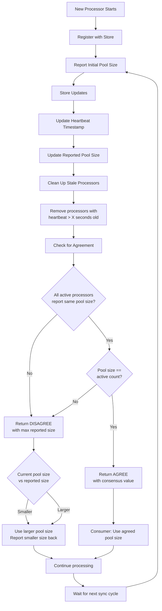

# Distributed Throttling (DT) in Numaflow

DT in Numaflow is a feature that allows Numaflow to limit number of message concurrently processed by a pipeline at any
UDF. Users can configure DT at pipeline level and it will be applied to all the UDFs in the pipeline or at each vertex
level.

## Use Cases

* Limit number of messages read from Source (useful
  for [MonoVertex](https://numaflow.numaproj.io/core-concepts/monovertex/))
* Limit number of messages processed by a UDF (e.g., calling a critical resource like LLM)
* Limit number of messages written to Sink (e.g., calling external endpoints that does not have rate limiting)

## Requirements

* Should be able to support ramp up (say from X to Y in t seconds)
* `to_drop` need not (optional) affect the throttle limit (rationale: to_drop might not hit the critical resource)
* Throughput should not be affected if DT is not enabled
* Should support external store (e.g., Redis, etc.)
* Users might combine DT with libraries
  like [bucket4j](https://github.com/bucket4j/bucket4j), [pyratelimiter](https://pyratelimiter.readthedocs.io/en/latest/),
  etc.
* Avoid querying external store for every message (use background task).
* Optionally remove external store (use pod count to throttle)

## Non-Requirements

* Key space is limited by the number of vertices in the pipeline, need not have to solve too many keys
* Retrying is not required to be solved by DT
* Managing external store is not in scope of DT

## Assumptions

* Since Numaflow throttling is a client-side throttler, we do not have to implement realtime reconfiguration
* UDF is considered as a black-box and as a single critical resource
* All UDFs processes at the same rate, tokens are evenly distributed across all the pods in the vertex

## Open Issues

* What should happen if the external store is unavailable?

## Closed Issues

* Use Background thread to update the current token which is dependent on the pool-size
* Total tokens are distributed across all the pods in the vertex, to detect dead pods, we use stale heartbeats
* The initial tokens are evenly distributed across all the pods in the vertex by dividing it by the pool-size. This will
  not cause any issues because for a new pod to join, it has to wait for the pool-size to be agreed upon. By that time
  all the consumers will be using the new pool-size.

# Design Details

To achieve high TPS, during happy path the decisions are made locally and all the information is available locally.

## High Level Design

* The distributed state stores only the pool-size and tokens are calculated locally based on the pool-size.
* Local store (using pool-size) will have enough information to decide if the request should be throttled or not.
* Local store if not updated by the background thread will be considered as unavailable and will be forced to query the
  external store. This should not happen during happy path.
* Background thread will update the local store (from the external store) every X ms and there will be at least Y
  seconds worth of data in the local store.

### Consensus on Active Candidates (consumers of tokens)

When a new Candidate (aka Consumer/Pod) is brought up, we have to make sure that the token pool is equally distributed
across all the active candidates. The **tricky bit** is to make sure that all the candidates agree on the active
candidates.

The algorithm's main goal is to track a group of processors and determine if they all agree on a shared value (the pool
size), while automatically removing any processors that have gone silent.

#### On the Store

* Update Status: When a processor checks in, the algorithm updates two lists. The first list tracks the processor's
  heartbeat with the current time, and the second tracks its reported pool size.
* Clean Up Stale Processors: It then checks the heartbeat list for any processors that haven't sent an update in the
  last X seconds. Any processor that is considered "stale" is removed from both the heartbeat list and the pool size
  list.
* Check for Agreement: Finally, it looks at the remaining active processors.
    * If the smallest reported pool size is the same as the largest reported pool size, it means everyone agrees.
      The algorithm returns **AGREE** with the consensus value (provided it matches with active processor count).
    * If the sizes don't match, it returns **DISAGREE** along with the largest size reported.

#### On the Consumer

* If there is AGREEMENT, the consumer can use the agreed upon pool size.
* If there is DISAGREEMENT
    * if the pool size is smaller, then it goes ahead with larger pool size it had but will report back the smaller pool
      size.
    * if the pool size is larger, then it goes ahead with larger pool size it had and reports back the smaller pool
      size.

The reason for sending the fake pool size is to be on the conservative side but wants everyone to make progress and
AGREE.

#### Consensus Flow

## Autoscaling

# min = max and rampup = 1s

max sure autoscaler won't scale/add once the processing rate of vertex >= max

# QBAA_400 (guaranteed quota) < QBAA_3000 (maximum quota), rampup > 1s (600 secs)

it will take t sec to reach max and to have sustained processing rate.

# min = 0, max = 900, rampup = 1s (meaningless)

after a second, min = max = 900
same as above

# min = 0, max = 900, rampup = 900s

in 900secs you will have 900 RPS 