# Distributed Throttling (DT) in Numaflow

DT in Numaflow is a feature that allows Numaflow to limit number of message concurrently processed by a pipeline at any
UDF. Users can configure DT at pipeline level and it will be applied to all the UDFs in the pipeline or at each vertex
level.

## Use Cases

* Limit number of messages read from Source (useful
  for [MonoVertex](https://numaflow.numaproj.io/core-concepts/monovertex/))
* Limit number of messages processed by a UDF (e.g., calling a critical resource like LLM)
* Limit number of messages written to Sink (e.g., calling external endpoints that does not have rate limiting)

## Requirements

* Should be able to support ramp up (say from X to Y in t seconds)
* `to_drop` need not (optional) affect the throttle limit (rationale: to_drop might not hit the critical resource)
* Throughput should not be affected if DT is not enabled
* Should support external store (e.g., Redis, etc.)
* Users might combine DT with libraries
  like [bucket4j](https://github.com/bucket4j/bucket4j), [pyratelimiter](https://pyratelimiter.readthedocs.io/en/latest/),
  etc.
* Avoid querying external store for every message (use background task).
* Optionally remove external store (use pod count to throttle)

## Non-Requirements

* Key space is limited by the number of vertices in the pipeline, need not have to solve too many keys
* Retrying is not required to be solved by DT
* Managing external store is not in scope of DT

## Assumptions

* Since Numaflow throttling is a client-side throttler, we do not have to implement realtime reconfiguration
* UDF is considered as a black-box and as a single critical resource
* All UDFs processes at the same rate, tokens are evenly distributed across all the pods in the vertex

## Open Issues

* What should happen if the external store is unavailable?

## Closed Issues

* Use Background thread to update the current token which is dependent on the pool-size
* Total tokens are distributed across all the pods in the vertex, to detect dead pods, we use stale heartbeats
* The initial tokens are evenly distributed across all the pods in the vertex by dividing it by the pool-size. This will
  not cause any issues because for a new pod to join, it has to wait for the pool-size to be agreed upon. By that time
  all the consumers will be using the new pool-size.

## Throttling Modes

The different throttling modes that the rate limiter can be configured with, allows the user the control the behaviour of the rate-limiter during/post ramp-up from min to max tokens. 

|    Modes     |                                                                                                Description                                                                                                |                          Notes                          |
|:------------:|:---------------------------------------------------------------------------------------------------------------------------------------------------------------------------------------------------------:|:-------------------------------------------------------:|
|  SCHEDULED   |                                                                   If we will release/increase tokens on a schedule even if it not used                                                                    | (least restrictive) This has side effects on the callee |   
|   RELAXED    |                                                                      If there is some traffic, then release the max possible tokens                                                                       |                                                         |
| ONLY_IF_USED |                                                     If the tokens used are within +/- threshold % of max (user defined), then we’ll increase by slope                                                     |    +- threshold % (user defined), need not be exact     |
|  GO_BACK_N   | If the user doesn’t query in the last n seconds then we go back the slope of n seconds. <br/>If the user doesn’t utilize upto threshold% of tokens in the pool, then we reduce the total tokens by slope. |    Token increase strategy is same as ONLY_IF_USED.     |

### SCHEDULED
Most unrestrictive mode amongst the available options.  
The number of tokens available in the token pool are increased at a fixed rate irrespective of how many tokens are used or when are the tokens requested.

#### Spec

Scheduled full spec example:

```yaml
modes:
  scheduled: {}
```

#### Examples

Following chart shows how token pool is increased at a fixed rate irrespective of the token usage:

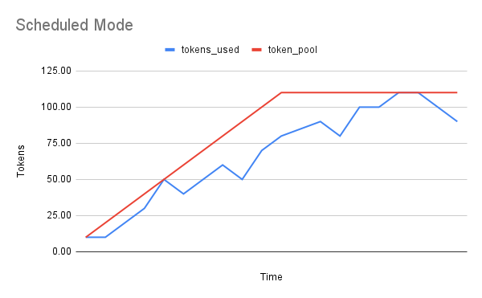

<details>

<summary>
Example datapoints
</summary>

|         Parameter          |                 Value                  |
|:--------------------------:|:--------------------------------------:|
|         max_tokens         |                  110                   |         
|         min_tokens         |                   10                   |   
|          duration          |                   10                   | 
|           slope            | `(max_tokens - min_tokens) / duration` |
| usage_threshold_percentage |                  100                   |

#### Sample Data
| token_pool | tokens_used |
|------------|-------------|
| 10.00      | 10.00       |
| 20.00      | 10.00       |
| 30.00      | 20.00       |
| 40.00      | 30.00       |
| 50.00      | 50.00       |
| 60.00      | 40.00       |
| 70.00      | 50.00       |
| 80.00      | 60.00       |
| 90.00      | 50.00       |
| 100.00     | 70.00       |
| 110.00     | 80.00       |
| 110.00     | 85.00       |
| 110.00     | 90.00       |
| 110.00     | 80.00       |
| 110.00     | 100.00      |
| 110.00     | 100.00      |
| 110.00     | 110.00      |
| 110.00     | 110.00      |
| 110.00     | 100.00      |
| 110.00     | 90.00       |
</details>

Following chart shows how token pool is increased at a fixed rate irrespective of whether there are gaps in requesting additional tokens:

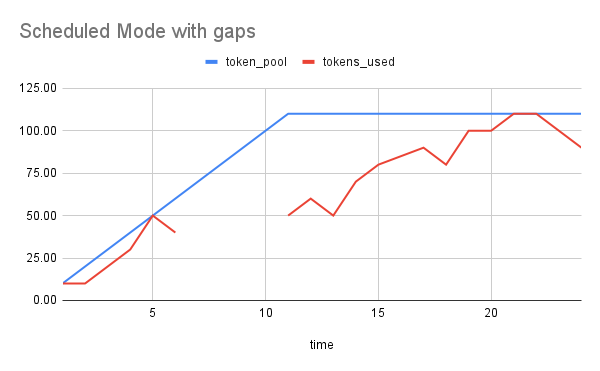

<details>
<summary>
Example datapoints
</summary>

|         Parameter          |                 Value                  |
|:--------------------------:|:--------------------------------------:|
|         max_tokens         |                  110                   |         
|         min_tokens         |                   10                   |   
|          duration          |                   10                   | 
|           slope            | `(max_tokens - min_tokens) / duration` |
| usage_threshold_percentage |                  100                   |

#### Sample Data
| time | token_pool | tokens_used |
|------|------------|-------------|
| 1    | 10.00      | 10.00       |
| 2    | 20.00      | 10.00       |
| 3    | 30.00      | 20.00       |
| 4    | 40.00      | 30.00       |
| 5    | 50.00      | 50.00       |
| 6    | 60.00      | 40.00       |
| 7    | 70.00      |             |
| 8    | 80.00      |             |
| 9    | 90.00      |             |
| 10   | 100.00     |             |
| 11   | 110.00     | 50.00       |
| 12   | 110.00     | 60.00       |
| 13   | 110.00     | 50.00       |
| 14   | 110.00     | 70.00       |
| 15   | 110.00     | 80.00       |
| 16   | 110.00     | 85.00       |
| 17   | 110.00     | 90.00       |
| 18   | 110.00     | 80.00       |
| 19   | 110.00     | 100.00      |
| 20   | 110.00     | 100.00      |
| 21   | 110.00     | 110.00      |
| 22   | 110.00     | 110.00      |
| 23   | 110.00     | 100.00      |
| 24   | 110.00     | 90.00       |

</details>


### RELAXED
If there is some traffic, then release the max possible tokens

When ramp-up is requested in this mode then the token pool size is “ramped-up” only when there is active traffic/actual calls are made to request additional tokens.
If any calls are made to get additional tokens then the token pool size is increased irrespective of the token utilization in the previous epoch.

Relaxed mode full spec example:

```yaml
modes:
  relaxed: {}       # This is the default mode utilized when no mode is specified.
```

#### Examples

For example, in the following chart, the token pool ramp-up looks similar to Scheduled mode ramp-up since calls are being made every epoch:

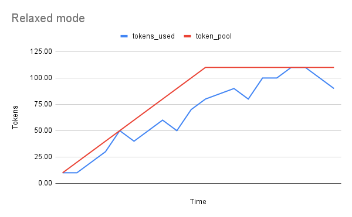

<details>
<summary>
Example datapoints
</summary>

|         Parameter          |                 Value                  |
|:--------------------------:|:--------------------------------------:|
|         max_tokens         |                  110                   |         
|         min_tokens         |                   10                   |   
|          duration          |                   10                   | 
|           slope            | `(max_tokens - min_tokens) / duration` |
| usage_threshold_percentage |                  100                   |

#### Sample Data
| token_pool | tokens_used |
|------------|-------------|
| 10.00      | 10.00       |
| 20.00      | 10.00       |
| 30.00      | 20.00       |
| 40.00      | 30.00       |
| 50.00      | 50.00       |
| 60.00      | 40.00       |
| 70.00      | 50.00       |
| 80.00      | 60.00       |
| 90.00      | 50.00       |
| 100.00     | 70.00       |
| 110.00     | 80.00       |
| 110.00     | 85.00       |
| 110.00     | 90.00       |
| 110.00     | 80.00       |
| 110.00     | 100.00      |
| 110.00     | 100.00      |
| 110.00     | 110.00      |
| 110.00     | 110.00      |
| 110.00     | 100.00      |
| 110.00     | 90.00       |
</details>

But, in the following example, the token pool ramp-up is stalled if no calls are made for some time and resumes where it left off:

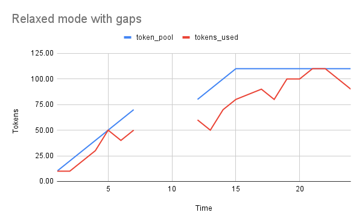

<details>
<summary>
Example datapoints
</summary>

|         Parameter          |                 Value                  |
|:--------------------------:|:--------------------------------------:|
|         max_tokens         |                  110                   |         
|         min_tokens         |                   10                   |   
|          duration          |                   10                   | 
|           slope            | `(max_tokens - min_tokens) / duration` |
| usage_threshold_percentage |                  100                   |

#### Sample Data
| time | token_pool | tokens_used |
|------|------------|-------------|
| 1    | 10.00      | 10.00       |
| 2    | 20.00      | 10.00       |
| 3    | 30.00      | 20.00       |
| 4    | 40.00      | 30.00       |
| 5    | 50.00      | 50.00       |
| 6    | 60.00      | 40.00       |
| 7    | 70.00      | 50.00       |
| 8    |            |             |
| 9    |            |             |
| 10   |            |             |
| 11   |            |             |
| 12   | 80.00      | 60.00       |
| 13   | 90.00      | 50.00       |
| 14   | 100.00     | 70.00       |
| 15   | 110.00     | 80.00       |
| 16   | 110.00     | 85.00       |
| 17   | 110.00     | 90.00       |
| 18   | 110.00     | 80.00       |
| 19   | 110.00     | 100.00      |
| 20   | 110.00     | 100.00      |
| 21   | 110.00     | 110.00      |
| 22   | 110.00     | 110.00      |
| 23   | 110.00     | 100.00      |
| 24   | 110.00     | 90.00       |


</details>

### ONLY_IF_USED
Increase the max_ever_refilled only when the caller utilizes more tokens than the specified threshold.

Similar to relaxed mode, the token pool size increase stalls during ramp-up if no calls are being made to the rate-limiter, 
but its size also stalls when the token utilization is less than the user specified utilization threshold percentage in the previous epoch.

The token utilization is calculated using the number of tokens left over in the token pool vs the total size of the token pool:
Token utilization % = (1 - tokens left in token pool / total size of the token pool) * 100

#### Spec

`onlyIfUsed` mode full spec example:
```yaml
modes:
  onlyIfUsed:
    thresholdPercentage: 10     # at least 10% of tokens should be used before token pool is increased (default is 50)
```
#### Example

For example, in the following chart, the token pool size ramp-up stalls whenever the token utilization % dips below 100%

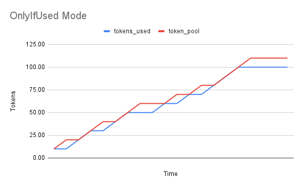

<details>
<summary>
Example datapoints
</summary>

|         Parameter          |                 Value                  |
|:--------------------------:|:--------------------------------------:|
|         max_tokens         |                  110                   |         
|         min_tokens         |                   10                   |   
|          duration          |                   10                   | 
|           slope            | `(max_tokens - min_tokens) / duration` |
| usage_threshold_percentage |                  100                   |

#### Sample Data
| token_pool | tokens_used |
|------------|-------------|
| 10.00      | 10.00       |
| 20.00      | 10.00       |
| 20.00      | 20.00       |
| 30.00      | 30.00       |
| 40.00      | 30.00       |
| 40.00      | 40.00       |
| 50.00      | 50.00       |
| 60.00      | 50.00       |
| 60.00      | 50.00       |
| 60.00      | 60.00       |
| 70.00      | 60.00       |
| 70.00      | 70.00       |
| 80.00      | 70.00       |
| 80.00      | 80.00       |
| 90.00      | 90.00       |
| 100.00     | 100.00      |
| 110.00     | 100.00      |
| 110.00     | 100.00      |
| 110.00     | 100.00      |
| 110.00     | 100.00      |
</details>

### GO_BACK_N

Unlike the previously discussed modes this mode has penalty for underutilization of tokens and penalty for gaps between
subsequent calls made to the rate limiter. The penalty is reduction in the size of the token pool by slope.
Slope is calculated as follows, using the user specified values of max tokens, min tokens and ramp-up duration:

Slope = (max - min)/ramp-up duration

So, similar to OnlyIfUsed mode, if the token utilization % is greater than the user specified threshold %, then the token
pool size increases by slope as usual, but if it falls below the user specified threshold %, then the token pool size is 
decreased by slope in the next epoch:

#### Spec

`goBackN` mode full spec example:

```yaml
modes:
  goBackN:
    thresholdPercentage: 50     # at least 50% of tokens should be used before token pool is increased, otherwise decreased
    coolDownPeriod: "5s"        # After more than 5s of no calls to the rate limiter, the token pool size is reduced
    rampDownPercentage: 50      # The % of slope by which the token pool size is reduced 
```

#### Examples

For example, in the following chart, we’re taking the user specified threshold as 100%, so any time the token utilization
falls below 100%, the token pool size is reduced in the next epoch:

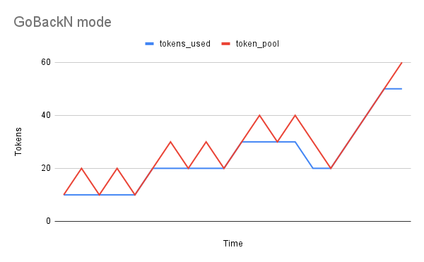

<details>
<summary>
Example datapoints
</summary>

|         Parameter          |                 Value                  |
|:--------------------------:|:--------------------------------------:|
|         max_tokens         |                  110                   |         
|         min_tokens         |                   10                   |   
|          duration          |                   10                   | 
|           slope            | `(max_tokens - min_tokens) / duration` |
| usage_threshold_percentage |                  100                   |

#### Sample Data
| token_pool | tokens_used |
|------------|-------------|
| 10         | 10          |
| 20         | 10          |
| 10         | 10          |
| 20         | 10          |
| 10         | 10          |
| 20         | 20          |
| 30         | 20          |
| 20         | 20          |
| 30         | 20          |
| 20         | 20          |
| 30         | 30          |
| 40         | 30          |
| 30         | 30          |
| 40         | 30          |
| 30         | 20          |
| 20         | 20          |
| 30         | 30          |
| 40         | 40          |
| 50         | 50          |
| 60         | 50          |

</details>

Furthermore, if there are gaps in calls being made to the rate-limiter, i.e., if there is a delay between subsequent 
calls being made to the rate-limiter then the token pool size is reduced by slope amount for every subsequent epoch second
that was missed.

In the following example, the calls stopped being made around t=18 and resumed at t=20. The time for which we missed 
making these calls, the token pool size was reduced.

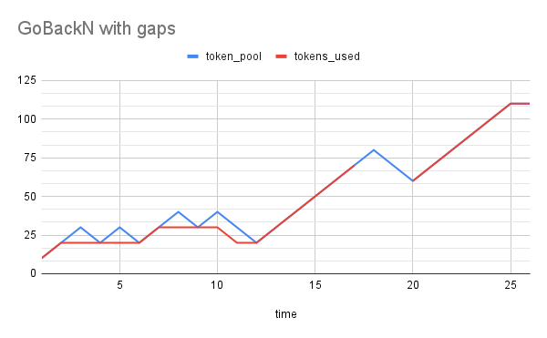

<details>
<summary>
Example datapoints
</summary>

|         Parameter          |                 Value                  |
|:--------------------------:|:--------------------------------------:|
|         max_tokens         |                  110                   |         
|         min_tokens         |                   10                   |   
|          duration          |                   10                   | 
|           slope            | `(max_tokens - min_tokens) / duration` |
| usage_threshold_percentage |                  100                   |

#### Sample Data
| time | token_pool | tokens_used |
|------|------------|-------------|
| 1    | 10         | 10          |
| 2    | 20         | 20          |
| 3    | 30         | 20          |
| 4    | 20         | 20          |
| 5    | 30         | 20          |
| 6    | 20         | 20          |
| 7    | 30         | 30          |
| 8    | 40         | 30          |
| 9    | 30         | 30          |
| 10   | 40         | 30          |
| 11   | 30         | 20          |
| 12   | 20         | 20          |
| 13   | 30         | 30          |
| 14   | 40         | 40          |
| 15   | 50         | 50          |
| 16   | 60         | 60          |
| 17   | 70         | 70          |
| 18   | 80         |             |
| 19   | 70         |             |
| 20   | 60         | 60          |
| 21   | 70         | 70          |
| 22   | 80         | 80          |
| 23   | 90         | 90          |
| 24   | 100        | 100         |
| 25   | 110        | 110         |
| 26   | 110        | 110         |

</details>

## Immediate ramp up during re-deployments

This is a toggleable feature that allows a pipeline that is using the rate limiter for controlled ramp-up and has already 
ramped-up from the min to max tokens to immediately ramp up to max tokens when a re-deployment is triggered instead of 
restarting from min tokens again. 

Scenario:
* Pipeline has a large ramp-up duration and a wide gap between the min and max tokens.
* The pipeline is in steady state with current throughput at max tokens.
* A re-deployment is triggered/pods are rotated.
* With `resumedRampUp` disabled, the pipeline will ramp up from min tokens again, and we'll have to wait until 
  the pipeline ramps-up to max tokens.
* With `resumedRampUp` enabled, the pipeline will directly restart from max tokens if the disruption is brief (< TTL)

#### Spec

```yaml
rateLimit:
  resumedRampUp: false      # By default resumedRampUp is disabled
  ttl: "180s"               # The default ttl is 180s. This is the time within which, if the pipeline restarts, it will be considered as a re-deployment and 
                            # the pipeline will resume where it left off in case resumedRampUp is enabled.
```


<details> 
<summary>

#### Examples

</summary>

* With `resumedRampUp` disabled, the pipeline ramps up from min tokens again, after brief re-deployment, and we'll have 
to wait until ramp-up duration reach max-tokens again. 
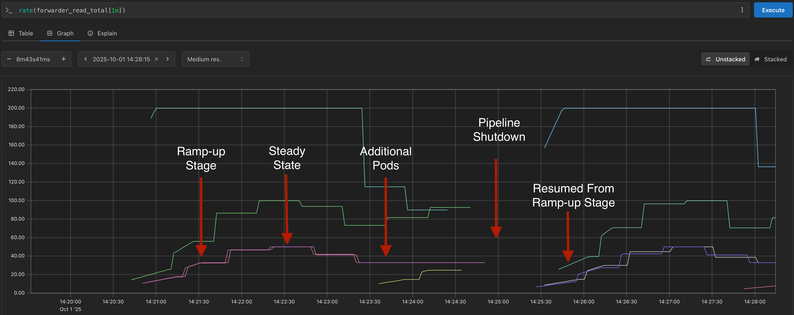


* With `resumedRampUp` enabled, the pipeline resumes from max tokens if the re-deployment is brief (< TTL). 
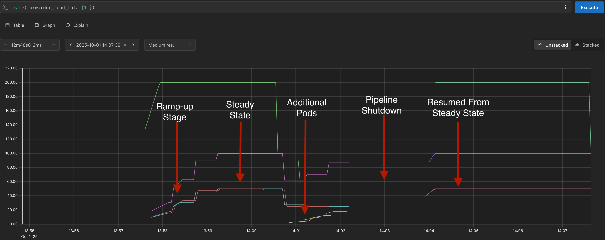


* But even with `resumedRampUp` enabled, the pipeline ramps up from min tokens again if the re-deployment is not brief (>= TTL). 
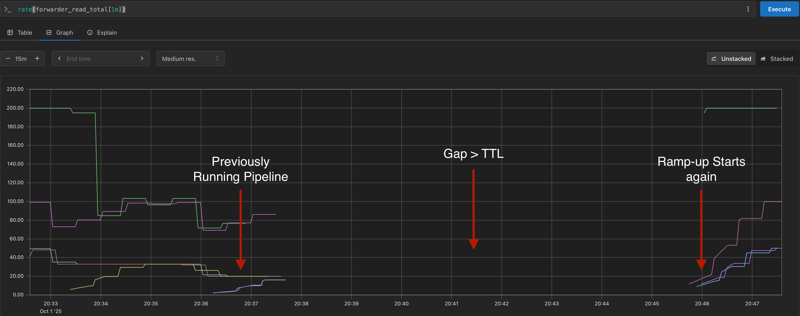


</details>


---

# Design Details

To achieve high TPS, during happy path the decisions are made locally and all the information is available locally.

## High Level Design

* The distributed state stores only the pool-size and tokens are calculated locally based on the pool-size.
* Local store (using pool-size) will have enough information to decide if the request should be throttled or not.
* Local store if not updated by the background thread will be considered as unavailable and will be forced to query the
  external store. This should not happen during happy path.
* Background thread will update the local store (from the external store) every X ms and there will be at least Y
  seconds worth of data in the local store.

### Consensus on Active Candidates (consumers of tokens)

When a new Candidate (aka Consumer/Pod) is brought up, we have to make sure that the token pool is equally distributed
across all the active candidates. The **tricky bit** is to make sure that all the candidates agree on the active
candidates.

The algorithm's main goal is to track a group of processors and determine if they all agree on a shared value (the pool
size), while automatically removing any processors that have gone silent.

#### On the Store

* Update Status: When a processor checks in, the algorithm updates two lists. The first list tracks the processor's
  heartbeat with the current time, and the second tracks its reported pool size.
* Clean Up Stale Processors: It then checks the heartbeat list for any processors that haven't sent an update in the
  last X seconds. Any processor that is considered "stale" is removed from both the heartbeat list and the pool size
  list.
* Check for Agreement: Finally, it looks at the remaining active processors.
    * If the smallest reported pool size is the same as the largest reported pool size, it means everyone agrees.
      The algorithm returns **AGREE** with the consensus value (provided it matches with active processor count).
    * If the sizes don't match, it returns **DISAGREE** along with the largest size reported.

#### On the Consumer

* If there is AGREEMENT, the consumer can use the agreed upon pool size.
* If there is DISAGREEMENT
    * if the pool size is smaller, then it goes ahead with larger pool size it had but will report back the smaller pool
      size.
    * if the pool size is larger, then it goes ahead with larger pool size it had and reports back the smaller pool
      size.

The reason for sending the fake pool size is to be on the conservative side but wants everyone to make progress and
AGREE.

#### Consensus Flow

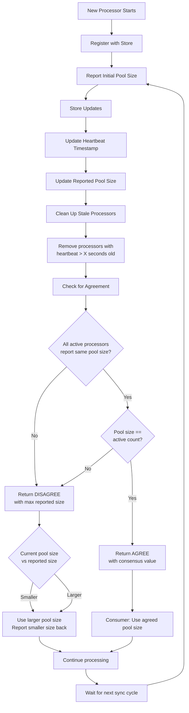

## Token Deposit Logic

Whenever a caller/processor requests for the number of messages they’re allowed to read, we want to keep track of whether
they were successfully able to read the messages they were greenlit to read. The messages/tokens that were not read/not
used should be returned back to the rate limiter so that the rate limiter can accurately keep track of the token
utilization of each processor against the total token pool size.

Tracking the token utilization allows the rate limiter to determine whether it should expand or contract the total token
pool size based on the rate limiting mode chosen.

Usage:
- Primarily used for OnlyIfUsed and GoBackN modes
- After token acquisition from token bucket:
    - Keep track of how many messages were successfully read. Count these as used tokens
    - Deposit any unused tokens back to the token bucket.
    - Used to calculate the token utilization percentage of the processor at any given epoch, i.e., `(1 - tokens left in bucket/Total token bucket capacity) * 100`
- During token bucket refill:
    - OnlyIfUsed Mode:
        - If the token utilization is less than the user specified threshold then, during ramp-up phase, do not increase
        - the token bucket size for the next epoch.
    - GoBackN Mode:
        - If the token utilization is less than the user specified threshold then, during ramp-up phase, decrease the size of the token bucket.


## Autoscaling

Autoscaling is performed as long as the total TPS < ~max bound.   
Currently, autoscaling policy during ramp up isn't supported.  
Issue [#2976](https://github.com/numaproj/numaflow/issues/2976)
