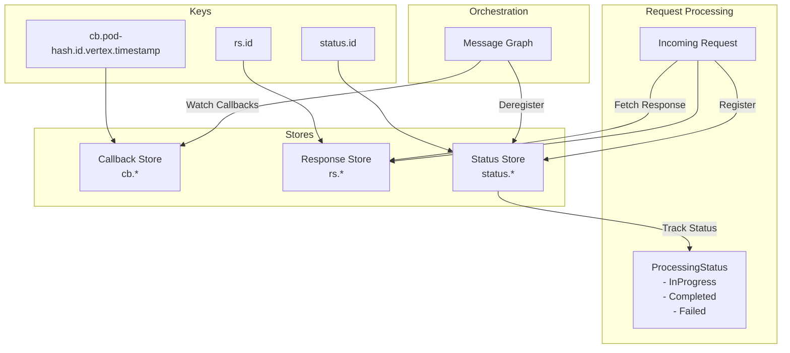

# Serving

Serving is the HTTP endpoint for [Numaflow](https://numaflow.numaproj.io/) which is a distributed scalable
general-purpose
async processing platform. Unlike the normal HTTP endpoint, here we get the response from the DCG (Directed Compute
Graph) directly.

## High Level Data Movement

